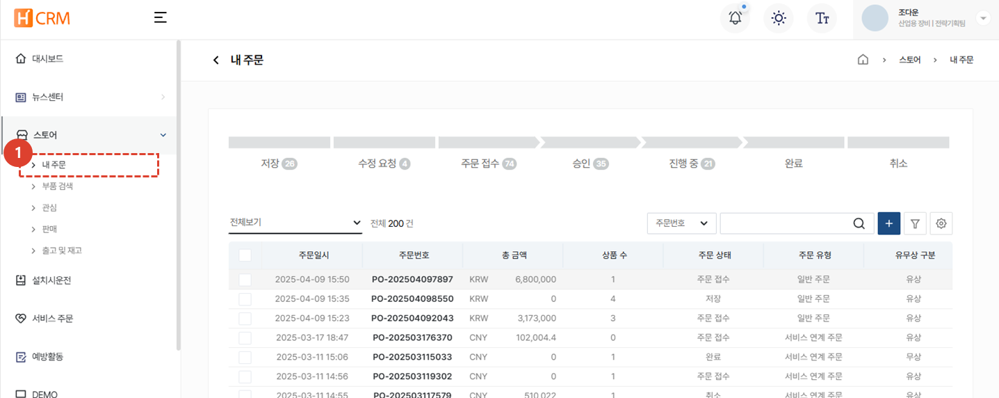
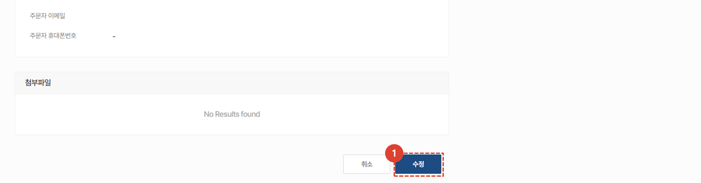

import ValidateTextByToken from "/src/utils/getQueryString.js";

# 주문서 수정

<ValidateTextByToken dispTargetViewer={true} dispCaution={true} validTokenList={['head', 'branch', 'agent']}>
구매하고자 하는 서비스 부품의 주문서 수정 절차에 대해 안내합니다.
 
 

## 주문서 목록

1. **스토어** - **내 주문** 메뉴를 선택합니다.
1. 주문 목록을 조회합니다.
 
 

## 주문서 목록 - 주문서 상태

- 저장: 주문서가 임시저장된 상태입니다.
- 수정 요청: 판매자가 주문자에게 수정할 것을 요청한 상태의 주문서입니다.
- 주문 접수: 주문자가 주문서를 생성하여 판매자에게 접수된 상태의 주문서입니다.
- 승인: 판매자에 의해 승인된 상태의 주문서입니다.
- 진행중: 승인된 주문서가 주문자에게 납품되는 중에 있는 상태의 주문서입니다.
- 완료: 주문자에게 납품이 완료된 상태의 주문서입니다.
- 취소: 주문자에 의해 취소된 상태의 주문서입니다.
 
 

## 주문서 수정

1. 수정이 필요한 **주문번호**를 선택합니다. 주문서 수정은 저장 및 주문 접수 상태에서만 가능합니다.
 
 

1. 주문 수정을 위해 상세 페이지 하단의 **수정** 버튼을 선택하여 작성 내용을 **수정**, **저장** 할 수 있습니다. 
    :::warning
        수정된 주문서는 반드시 "**주문**" 버튼을 클릭해야만 주문이 진행됩니다. 
    ::: 
</ValidateTextByToken>

