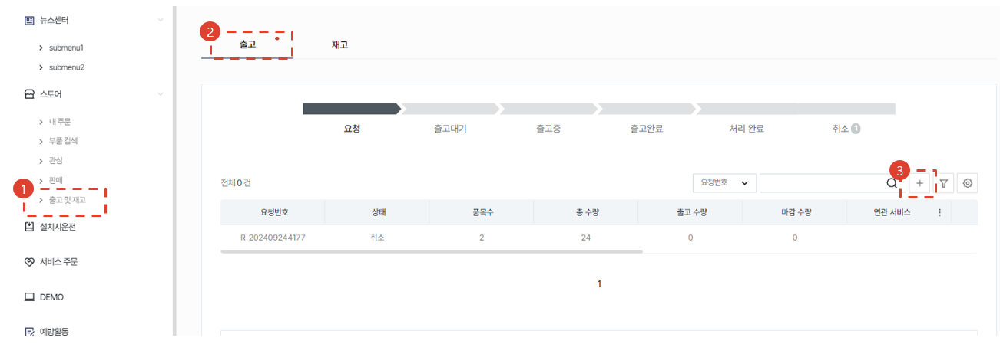

import ValidateTextByToken from "/src/utils/getQueryString.js";

# 서비스부품 출고 요청
서비스부품 입출고 요청과 승인 절차가 필요한 경우 사용절차에 대해 안내합니다.

<ValidateTextByToken dispTargetViewer={true} dispCaution={true} validTokenList={['head', 'branch']}>
    :::info
    부품 출고 서비스와 관계가 있는 다른 메뉴에서 서비스에 필요한 부품을 출고 요청할 수 있습니다.
    ※ 관련된 서비스 메뉴
    - 서비스 주문
    - 설치시운전
    :::
 
 

## 요청서 등록

1. [스토어] → [출고 및 재고] 메뉴를 클릭합니다.
1. [출고] 탭을 클릭합니다.
1. [+] 버튼을 클릭합니다.
    :::info 프로그레스바 상태
    - **요청**: 출고 요청서를 작성하여 요청된 직후의 상태입니다.
    - **출고대기**: 출고 담당자/관리자에 의해 출고 요청건이 승인된 상태입니다.
    - **출고중**: 출고 담당자/관리자에 의해 요청된 부품의 일부가 출고 처리된 상태입니다.
    - **출고완료**: 출고 담당자/관리자에 의해 요청된 부품의 전부가 출고 처리된 상태입니다.
    - **처리완료**: 출고처리된 모든 부품의 상태가 아래와 같이 후속 처리가 된 상태입니다.
        - **고객판매**: 출고된 부품이 판매처리된 것을 의미합니다.
        - **무상공급**: 출고된 부품이 무상공급처리된 것을 의미합니다.
        - **반납**: 다시 창고로 재반납 처리한 것을 의미합니다.
    :::
 
 

## 요청내용 작성

1. 요청사항과 관련된 내용을 비고란에 입력합니다.
1. [+] 버튼을 눌러서 부품을 검색창을 오픈합니다.
1. 부품을 검색합니다.
1. 추가할 부품을 선택합니다.
1. 수량을 입력합니다.
1. [저장] 버튼을 클릭합니다.
1. 추가된 부품을 삭제하기 위해 사용합니다.
1. [추가] 버튼을 눌러 출고 요청서를 생성합니다.
    - 요청서 생성과 동시에 **출고 승인 담당자** 에게 알림 메일이 발송됩니다.
</ValidateTextByToken>