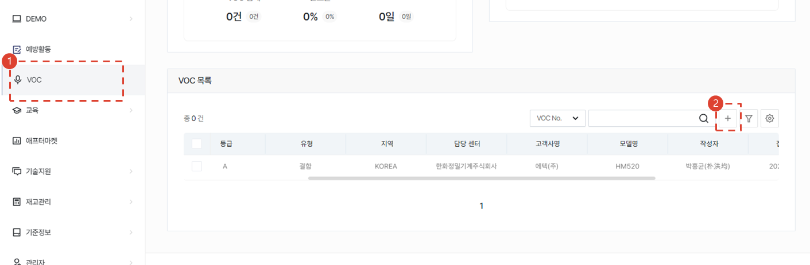
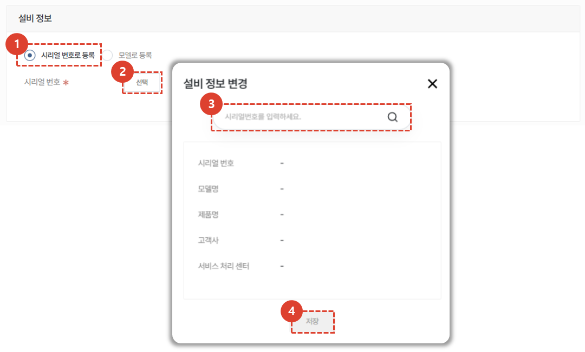
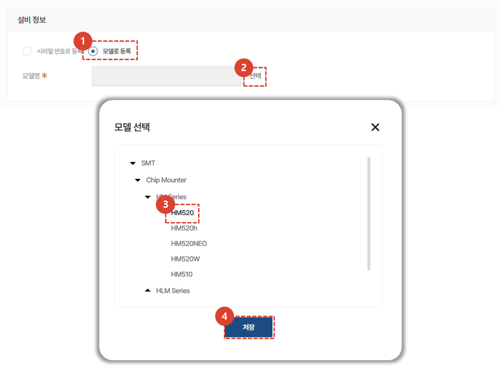
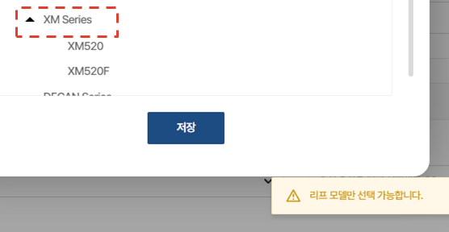
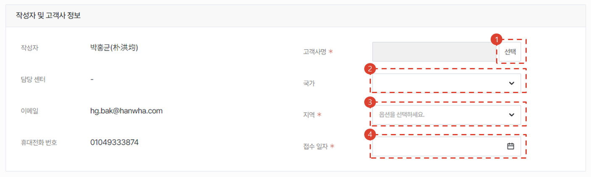
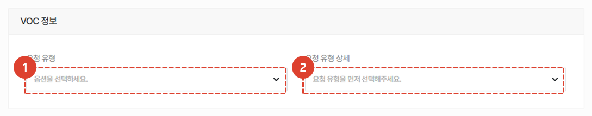
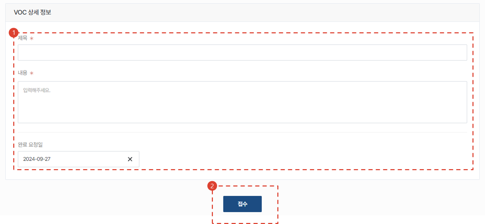
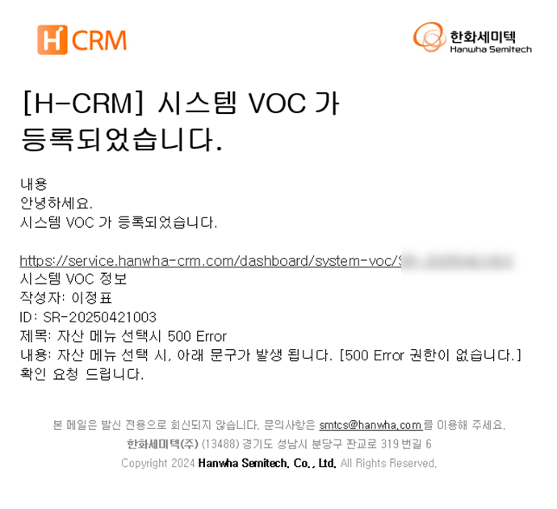

import ValidateTextByToken from "/src/utils/getQueryString.js";

# VOC 등록

<ValidateTextByToken dispTargetViewer={true} dispCaution={true} validTokenList={['head', 'branch', 'seller', 'agent']}>

VOC로 등록하고자 하는 이슈를 VOC 메뉴에서 등록하는 절차에 대해 안내합니다.

## VOC 목록

1. 사이드바의 [VOC]를 클릭합니다.
2. 하단의 VOC 목록에서 [+] 버튼을 클릭합니다.
 
 

## VOC 상세
### 설비 정보 입력
설비 정보 입력 방법은 두가지가 있습니다. 
시리얼 번호로 등록하기와 모델로 등록하기가 가능합니다. 

1. 시리얼 번호로 등록을 클릭합니다. 
1. 선택 버튼을 눌러 시리얼 번호 입력 창을 띄웁니다. 
1. 시리얼 번호를 입력합니다. 
1. 저장 버튼을 클릭합니다. 
 
 

1. 모델로 등록을 클릭합니다. 
1. 선택 버튼을 눌러 모델 선택 모달을 오픈합니다.
1. 모델 트리의 가장 끝단의 **리프 모델** 만 선택이 가능합니다.
    :::warning
      
    하위 모델을 가지고 있는 모델명 클릭하게 되면 에러가 발생합니다.
    :::
1. [저장] 버튼을 클릭합니다.
 
 

### 등록자 및 고객사 정보 입력
 
1. [선택] 버튼을 눌러 고객사를 등록합니다.
1. VOC 등록 고객사의 [국가] 를 선택합니다.
1. [지역] 을 선택합니다. **지표관리용**
 
 

### VOC 정보 입력
 
1. 유형을 선택합니다. 유형에는 아래 3가지의 유형이 있습니다.
    - 결함
        - 고장성(H/W)
        - 고장성(S/W)
        - 제조불량
        - 인쇄/표기불량
        - ISV 결함
        - 운영S/W 결함
        - 제어S/W 결함
        - T/P 결함
        - 기구 결함
        - 제어기 결함
    - 개선
        - ISV 개선
        - 기타 개선
        - 서비스성 확보
        - SW 개선
        - 기구 개선
    - 기타
        - 기타
        - 영업 VOC
        - 품질 VOC
        - 개발 VOC
        - 서비스 VOC
1. 선택한 유형에 따라 상세 유형 항목을 선택합니다.
 
 

### VOC 상세정보 입력 및 접수
 

1. 검토에 필요한 내용을 입력합니다.
    - 제목 및 구체적인 VOC 관련 내용을 입력합니다.
    - 요청하는 VOC 건의 완료 희망일자를 입력합니다.
    - 필요시 첨부파일을 추가합니다. 
1. [접수] 버튼을 클릭합니다.
 
 

### VOC 접수건 이메일 자동 발송
 
VOC 접수 완료와 동시에 관리자에게 이메일로 이미지와 같이 알림 메일이 발송됩니다.
</ValidateTextByToken>