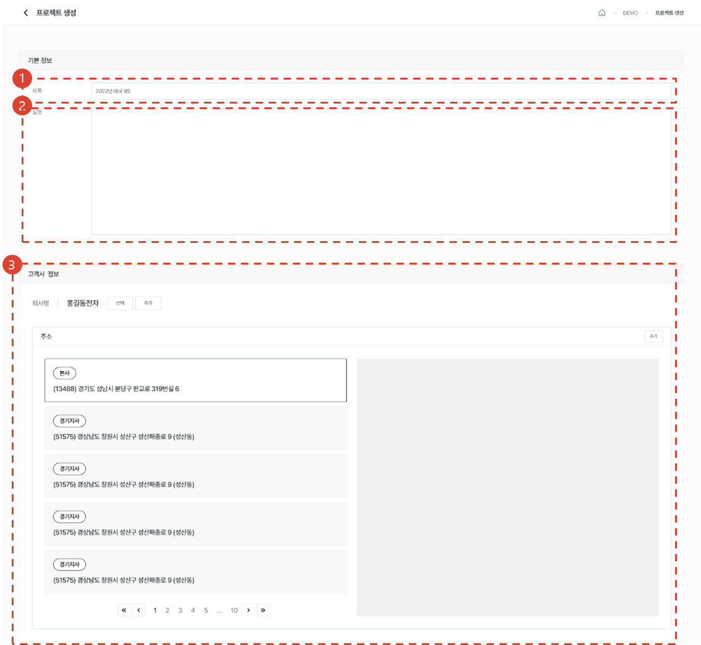
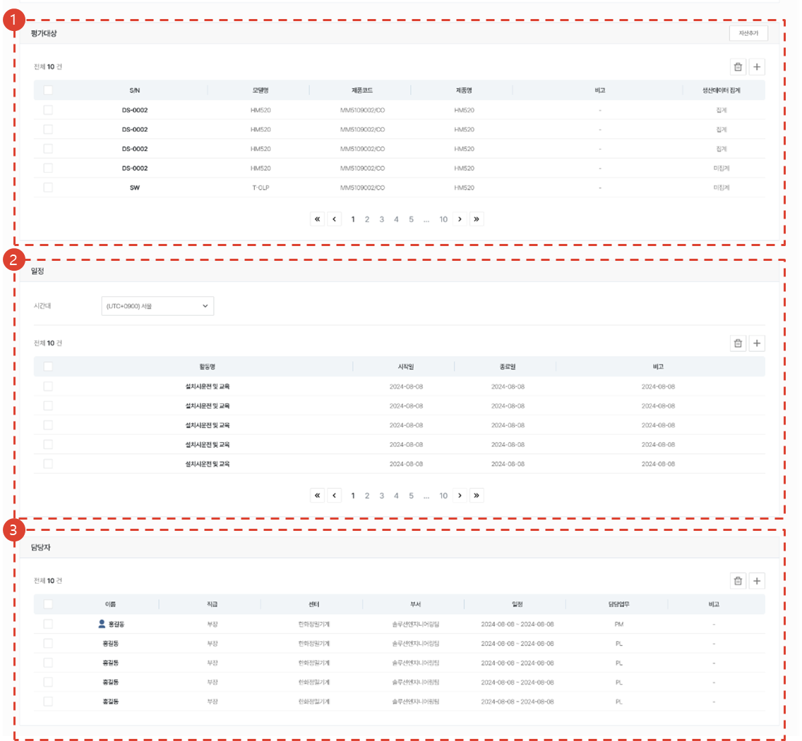
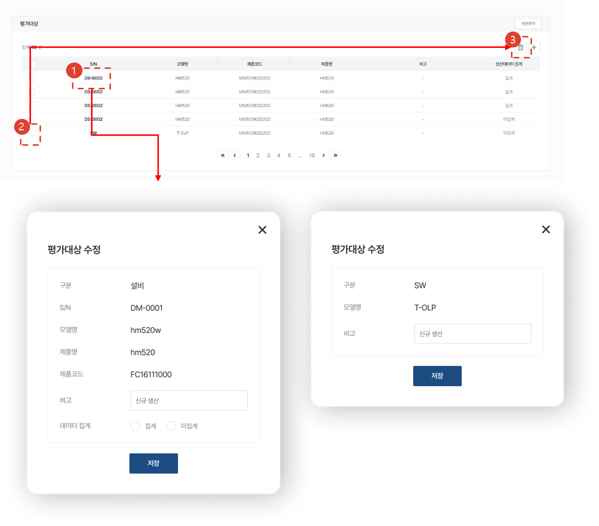
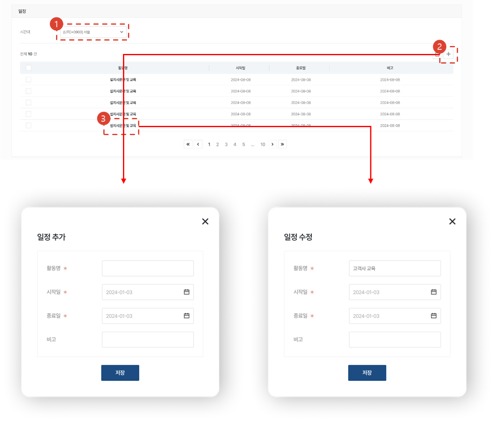
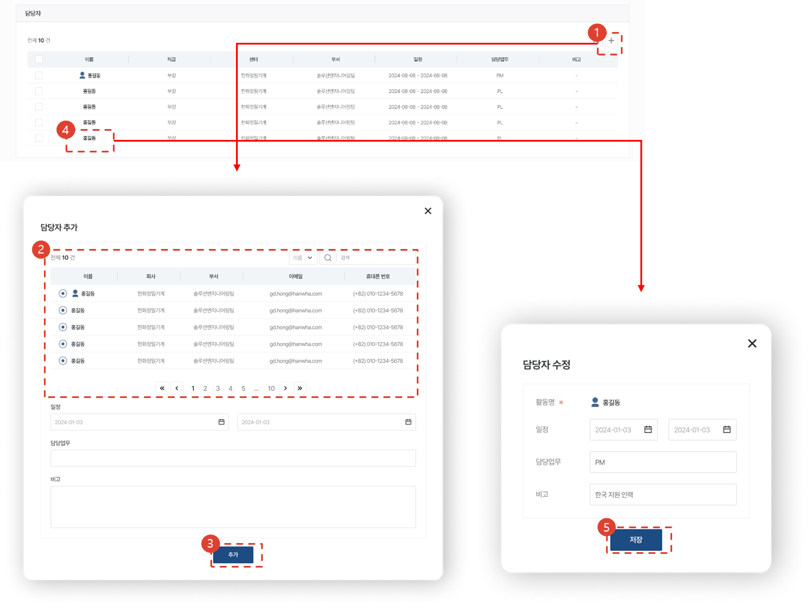
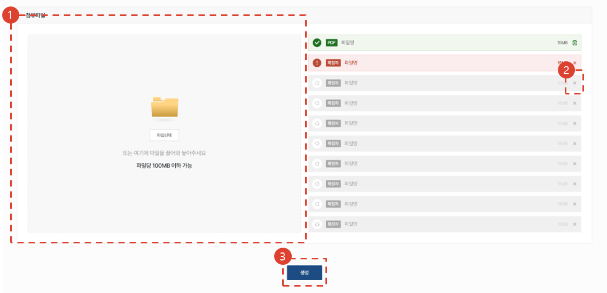

import ValidateTextByToken from "/src/utils/getQueryString.js";

# 프로젝트 생성

<ValidateTextByToken dispTargetViewer={true} dispCaution={true} validTokenList={['head', 'branch']}>

데모평가 프로젝트를 생성하는 절차를 안내합니다.

## 기본정보 입력

1. 프로젝트명을 입력합니다. (최대 32자)
1. 프로젝트 관련 설명을 입력하거나 이미지를 첨부합니다.
1. 프로젝트의 대상 고객사와 주소를 선택합니다.
    :::note
    - 등록되지 않은 고객사 또는 주소일 경우 [추가] 버튼을 눌러 추가할 수 있습니다.
    - 주소는 고객사 선택 시 표시됩니다.
    :::
1. 프로젝트를 진행할 주소를 선택합니다.
    :::note
    - 신규 주소일 경우 [추가]를 눌러신규 주소를 추가합니다.
    - 주소는 고객사 선택 시 표시됩니다.
    :::
 
 

## 평가대상 & 일정 & 담당자 입력

1. 평가를 진행할 설비나 S/W를 선택합니다.
1. 프로젝트 일정을 등록합니다.
1. 한화 서클 사용자를 프로젝트의 담당자로 추가합니다.
    :::info
    사용자 검색시에는 CRM 계정이 없는 서클 임직원들도 조회가 됩니다.
    :::
 
 

### 평가대상 추가

1. [+] 버튼을 눌러 평가대상 추가 화면을 엽니다.
1. 설비와 S/W 중에 추가할 유형을 선택합니다.
1. 목록에서 추가할 설비 또는 S/W를 선택합니다.
    - S/N등으로 검색 할 수 있습니다.
1. 추가 안내가 필요한 내용을 비고에 입력하고 데이터 집계 여부를 선택합니다.
    - S/W는 데이터 집계를 선택할 수 없습니다.
 
 

### 평가대상 수정 / 삭제

1. S/N을 클릭해 등록한 비고와 데이터 집계 여부를 수정할 수 있습니다.
1. 삭제할 평가대상을 선택합니다.
1. 삭제 버튼을 누릅니다.
 
 

### 일정 등록

1. 기준이 될 시간대를 선택해 주세요. 
1. + 버튼을 눌러 프로젝트의 일정을 등록합니다.
1. 일정명을 눌러 등록한 일정을 수정합니다.
    :::warning 주의사항
    - 등록된 일정에 따라 프로젝트의 상태가 변경됩니다. (준비 중 ⇒ 진행 중 ⇒ 완료)
    - 선택한 시간대를 기준으로 변경될 시각이 정해집니다.
    :::
 
 

### 담당자 등록

1. [+] 버튼을 누릅니다.
1. 검색 등을 통해 담당자를 선택합니다.
1. 일정, 담당업무, 비고를 입력하고 추가 버튼을 누릅니다.
1. 이름을 클릭합니다.
1. 수정하고 저장 버튼을 누릅니다.
 
 

### 파일 첨부 및 프로젝트 생성

1. 첨부할 파일을 해당 영역에 끌어다 놓거나 파일선택을 눌러 파일을 선택합니다.
1. X 버튼을 누르면 첨부할 파일을 삭제할 수 있습니다.
1. 생성 버튼을 누르면 프로젝트가 생성됩니다.
</ValidateTextByToken>