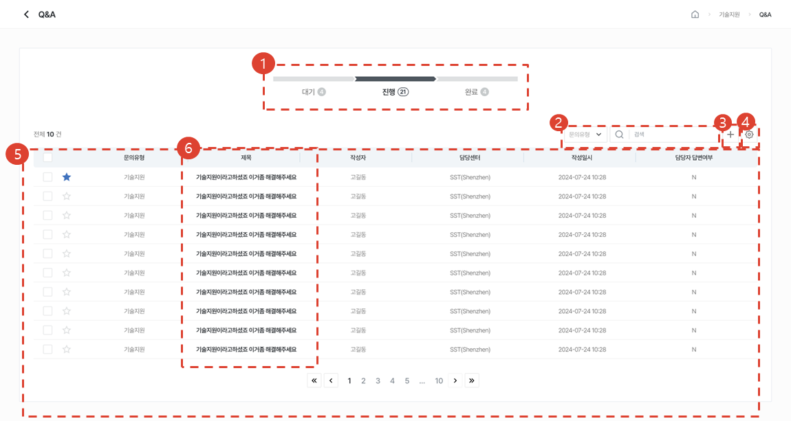
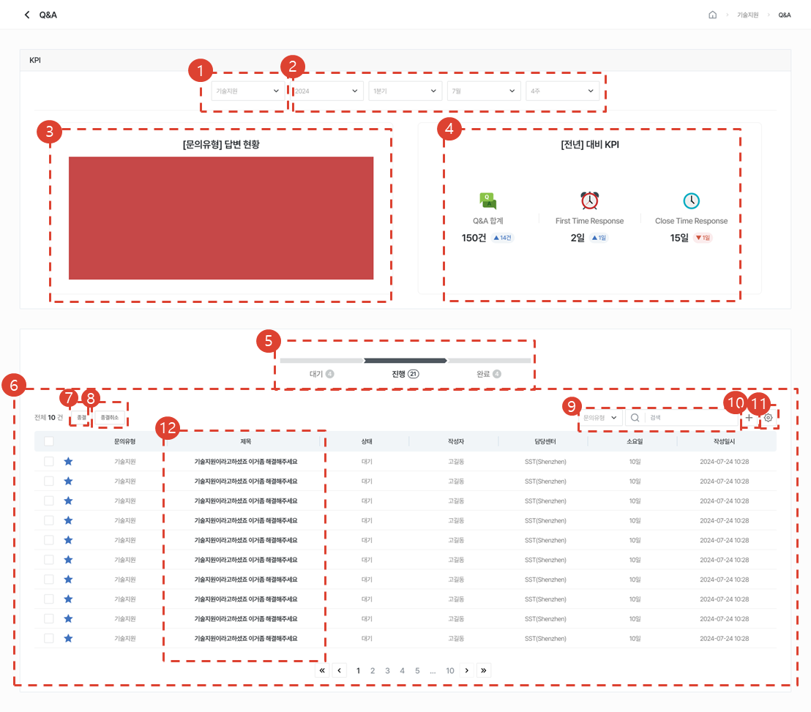
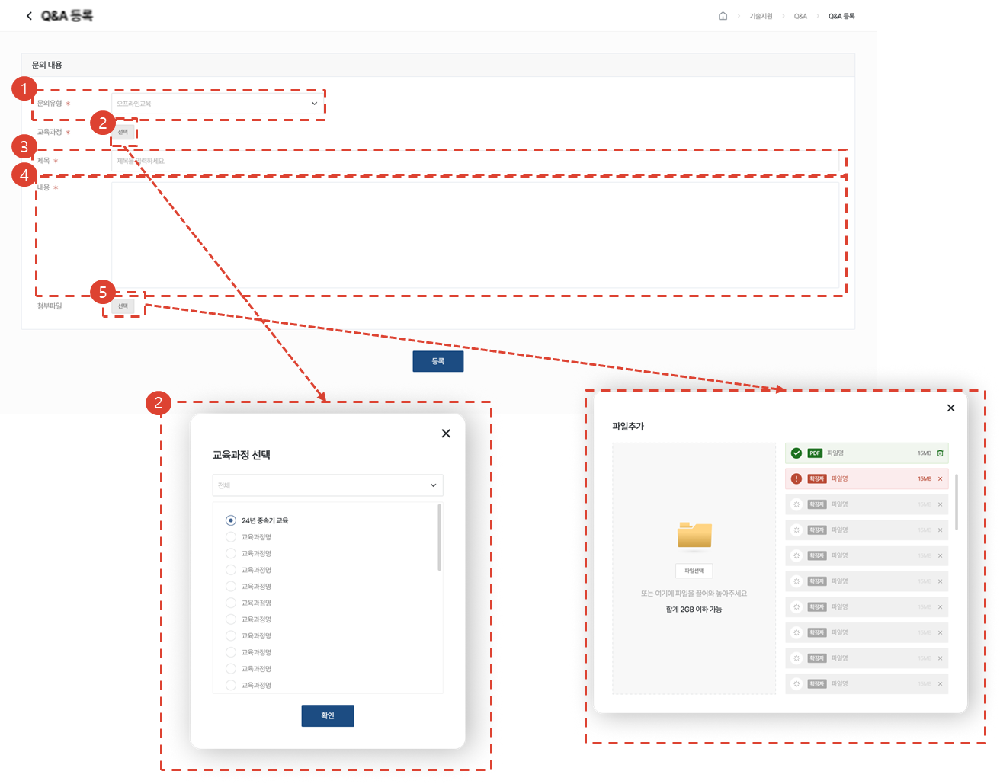
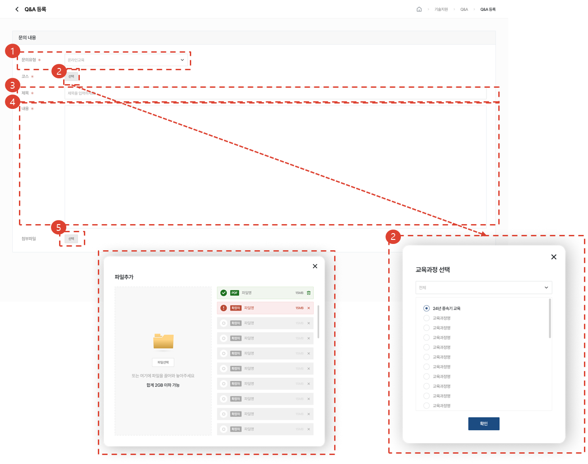
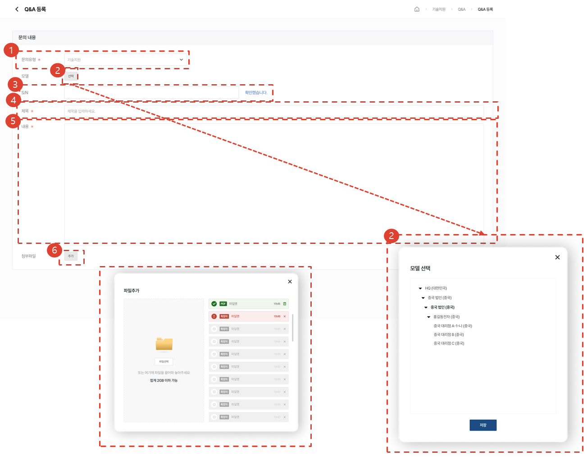
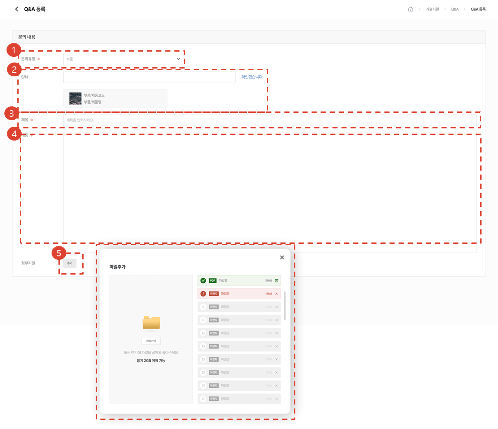
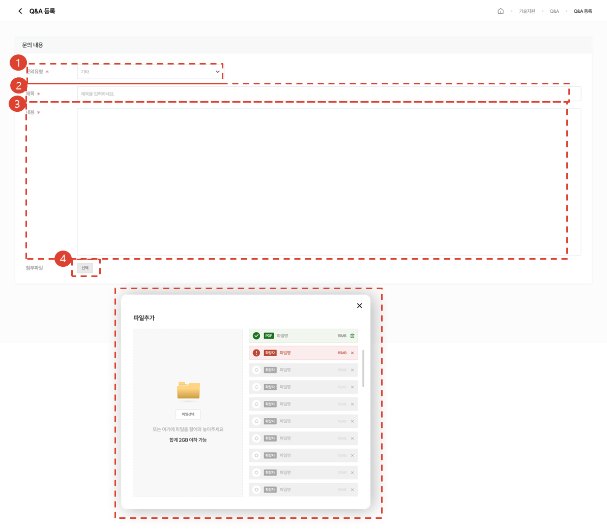
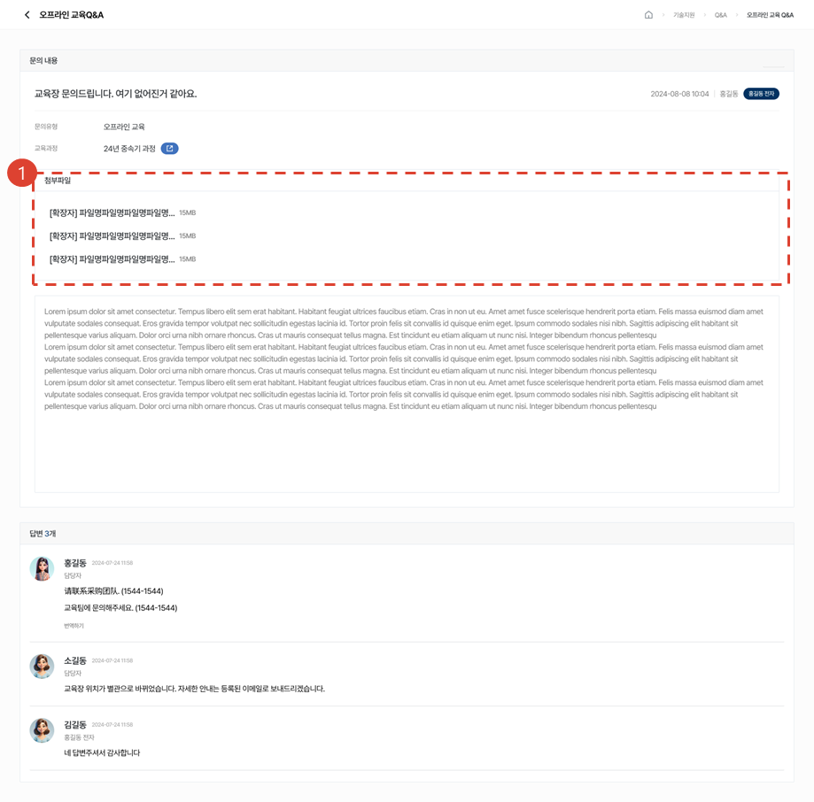
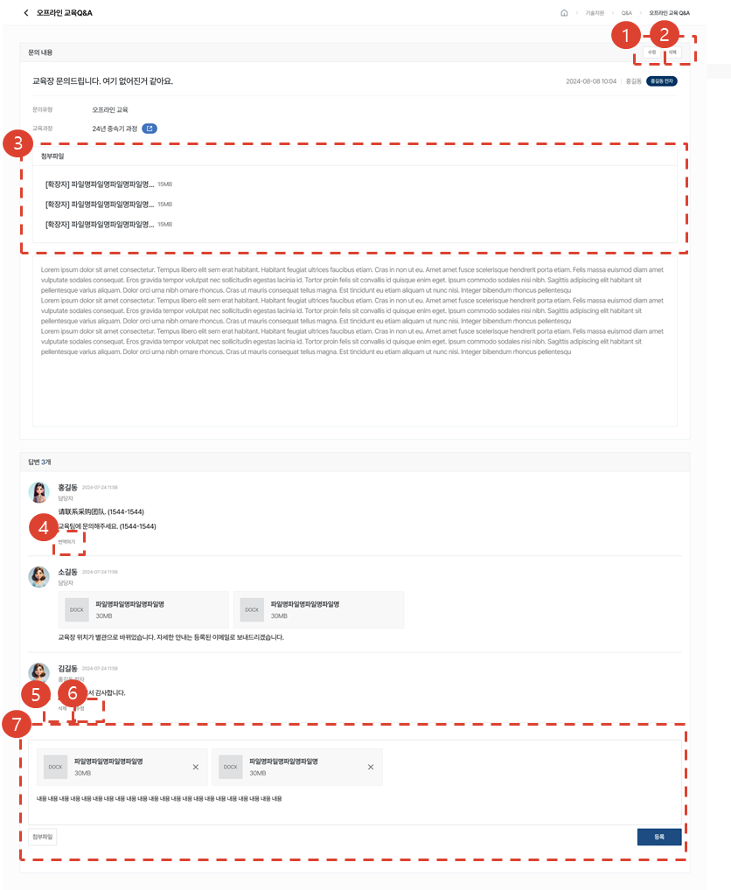
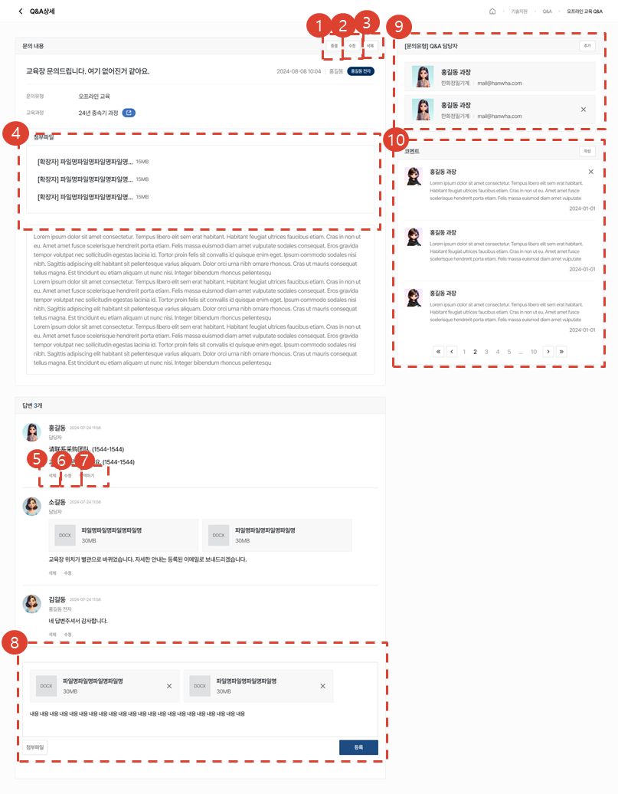

import ValidateTextByToken from "/src/utils/getQueryString.js";

# Q&A

<ValidateTextByToken dispTargetViewer={true} dispCaution={false} validTokenList={['head', 'branch', 'seller', 'agent']}>
서비스와 관련된 질문과 응답을 작성하고 관리하는 메뉴에 대한 안내입니다.

 
 

## 목록 페이지
### 조회 / 작성 권한 보유 시

1. 대기/진행/완료 진행률을 선택해 목록을 조회할 수 있습니다.
1. Selectbox의 유형을 선택 후, 원하는 검색어로 검색할 수 있습니다.
1. [추가] 버튼을 클릭하여 Q&A를 작성할 수 있습니다.
1. [톱니바퀴] 버튼을 클릭하여 Q&A 삭제, 테이블 관리를 할 수 있습니다.
1. 등록된 Q&A 목록을 볼 수 있습니다.
1. [제목]를 클릭하여 [Q&A 상세]페이지로 이동합니다.

</ValidateTextByToken>
 
 

### 관리 권한 보유 시
<ValidateTextByToken dispTargetViewer={false} dispCaution={true} validTokenList={['head', 'branch']}>

1. 문의유형별 답변현황을 조회할 수 있습니다.
1. 문의유형별 & 기간별 답변현황을 조회할 수 있습니다.
1. 1 & 2 에서 선택한 값에 따라 문의유형/기간별 답변 현황 그래프가 나타납니다.
1. 1 & 2 에서 선택한 값에 따라 **기간**대비 KPI를 확인할 수 있습니다.
    :::info
    Q&A개수, 문의가 등록되고 담당자가 첫번째 답변을 작성하기까지의 일수, 문의가 등록되고 담당자가 답변을 종결하기까지의 일수가 나타납니다.
    :::
1. 대기/진행/완료 진행률을 선택해 목록을 조회할 수 있습니다.
1. 등록된 Q&A 목록을 볼 수 있습니다.
1. 진행 상태인 Q&A를 선택하여 [종결]버튼 클릭시, 문의를 종결할 수 있습니다.
1. 완료 상태인 Q&A를 선택하여 [종결취소]버튼 클릭시, 문의를 종결취소 할 수 있습니다.
1. Selectbox의 유형을 선택 후, 원하는 검색어로 검색할 수 있습니다.
1. [추가] 버튼을 클릭하여 Q&A를 작성할 수 있습니다.
1. [톱니바퀴] 버튼을 클릭하여 Q&A 삭제, 테이블 관리를 할 수 있습니다.
1. [제목]를 클릭하여 [Q&A 상세]페이지로 이동합니다.
</ValidateTextByToken>
 
 

## 등록 페이지

<ValidateTextByToken dispTargetViewer={false} dispCaution={true} validTokenList={['head', 'branch', 'seller', 'agent']}>

### 오프라인 교육

1. 문의유형을 선택해주세요. (현재 : 오프라인교육 선택)
1. 교육과정을 선택해주세요. 교육장별로 교육과정을 볼 수 있습니다. 
1. 제목을 입력해주세요.
1. 문의 내용을 입력해주세요.
1. 첨부파일을 추가할 수 있습니다. 
 
 

### 온라인 교육

1. 문의유형을 선택해주세요. (현재 : 온라인교육 선택)
1. 코스를 선택해주세요. 교육과정별로 코스를 볼 수 있습니다. 
1. 제목을 입력해주세요.
1. 문의 내용을 입력해주세요.
1. 첨부파일을 추가할 수 있습니다. 
 
 

### 기술지원

1. 문의유형을 선택해주세요. (현재 : 기술지원 선택)
1. 모델을 선택해 문의할 수 있습니다.
1. S/N을 입력해 문의할 수 있습니다.
1. 제목을 입력해주세요.
1. 문의 내용을 입력해주세요.
1. 첨부파일을 추가할 수 있습니다.
 
 

### 서비스 부품

1. 문의유형을 선택해주세요. (현재 : 부품 선택)
1. S/N을 입력해 문의할 수 있습니다. 일치하는 부품정보가 나타납니다. 
1. 제목을 입력해주세요.
1. 문의 내용을 입력해주세요.
1. 첨부파일을 추가할 수 있습니다. 
 
 

### 기타

1. 문의유형을 선택해주세요. (현재 : 기타 선택)
1. 제목을 입력해주세요.
1. 문의 내용을 입력해주세요.
1. 첨부파일을 추가할 수 있습니다. 
 
 

## 상세 페이지
### 조회 권한 보유 시

1. 첨부파일을 클릭하여 자료를 다운받을 수 있습니다.
 
 

### 작성 권한 보유 시

1. [수정] 버튼을 클릭시, 문의를 수정할 수 있습니다. 
1. [삭제] 버튼을 클릭 시, 문의를 삭제할 수 있습니다.
1. 첨부파일을 클릭하여 자료를 다운받을 수 있습니다.
1. 로그인 시 설정한 언어 외 언어로 답변을 받을 시, [번역하기]버튼을 클릭하여 로그인 시 설정한 언어로 번역을 제공받을 수 있습니다.
1. [수정] 버튼 클릭시, 답변을 수정할 수 있습니다.
1. [삭제] 버튼 클릭시, 답변을 삭제할 수 있습니다.
1. 신규 답변을 작성할 수 있습니다. 답변 작성시, 첨부파일을 추가할 수 있습니다.
</ValidateTextByToken>
 
 

### 관리 권한 보유 시
<ValidateTextByToken dispTargetViewer={false} dispCaution={true} validTokenList={['head', 'branch']}>

1. 종결 버튼을 클릭하여 문의를 종결시킬 수 있습니다. 
1. 수정 버튼을 클릭시, 문의를 수정할 수 있습니다. 
1. 삭제 버튼을 클릭 시, 문의를 삭제할 수 있습니다.
1. 첨부파일을 클릭하여 자료를 다운받을 수 있습니다.
1. 삭제 버튼 클릭시, 답변을 삭제할 수 있습니다.
1. 수정 버튼 클릭시, 답변을 수정할 수 있습니다.
1. 로그인 시 설정한 언어 외 언어로 답변을 받을 시, 번역하기 버튼을 클릭하여 로그인 시 설정한 언어로 번역을 제공받을 수 있습니다.
1. 신규 답변을 작성할 수 있습니다. 답변 작성시, 첨부파일을 추가할 수 있습니다.
1. 해당 Q&A건에 한하여 담당자를 추가할 수 있습니다. 
1. 관리권한을 가진 사용자는 코멘트를 조회/작성할 수 있습니다. 

</ValidateTextByToken>