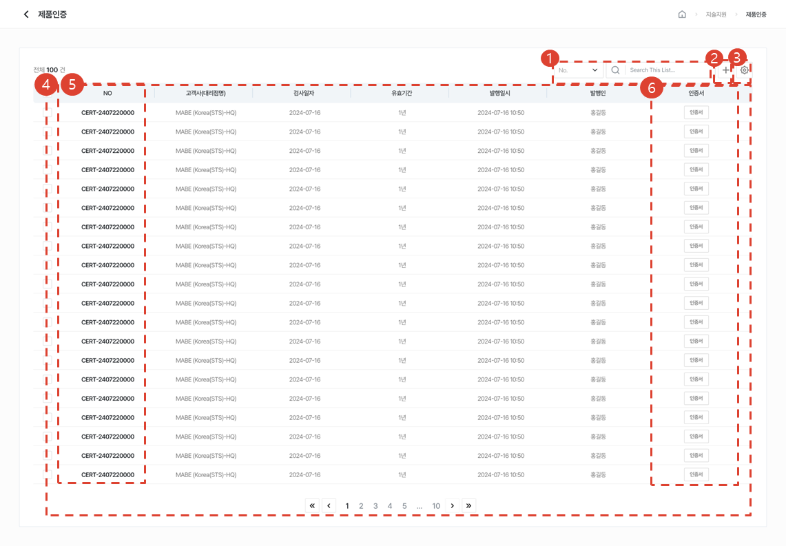
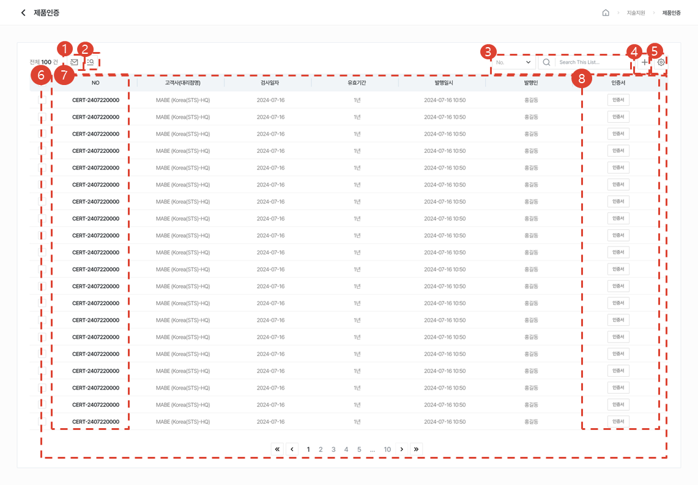
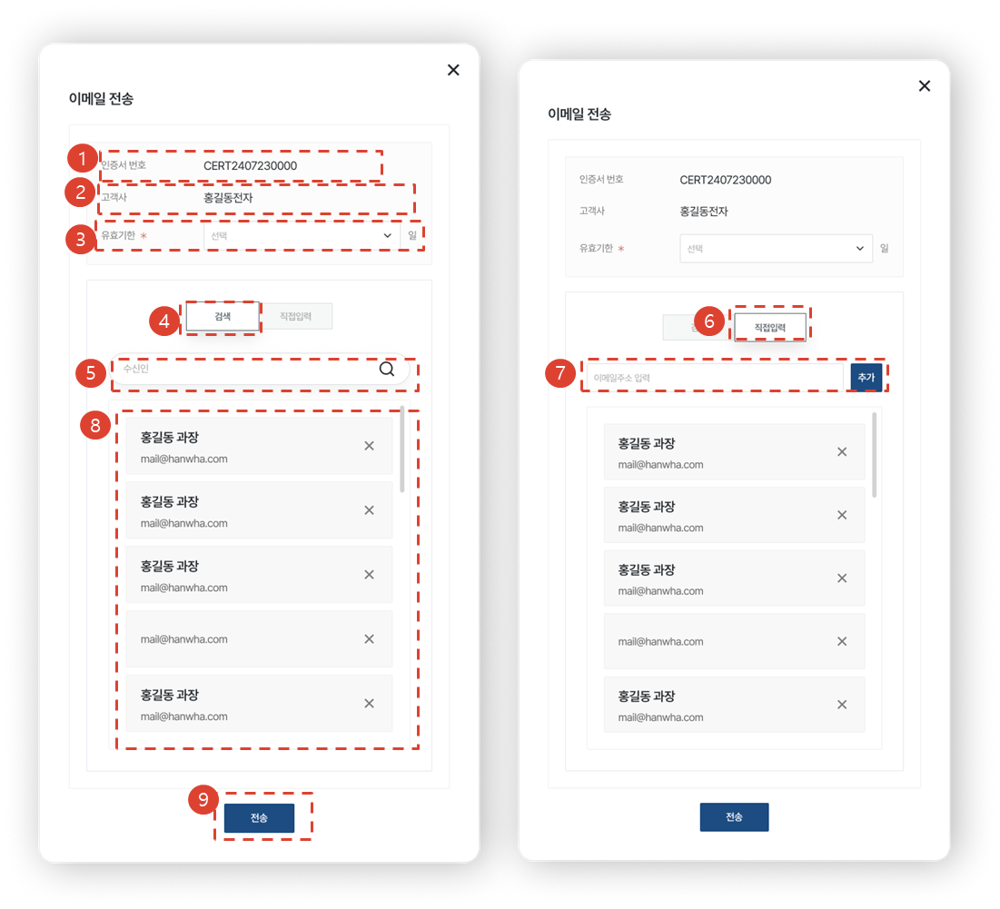
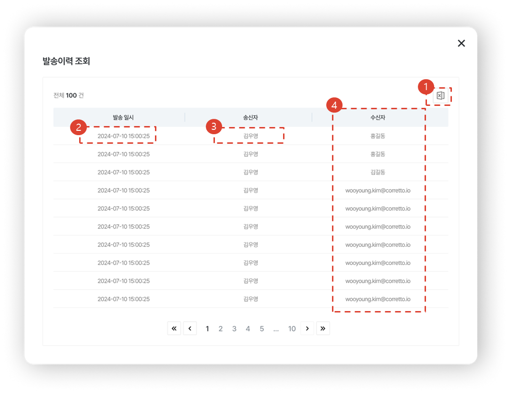
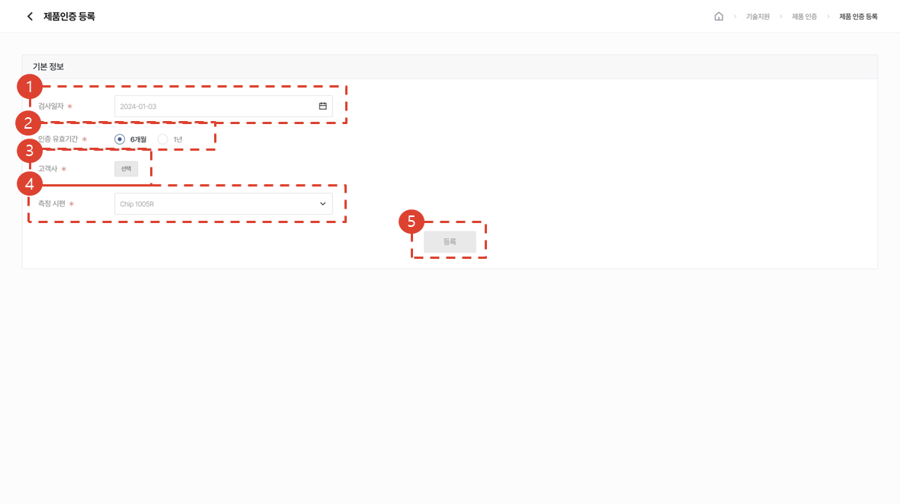
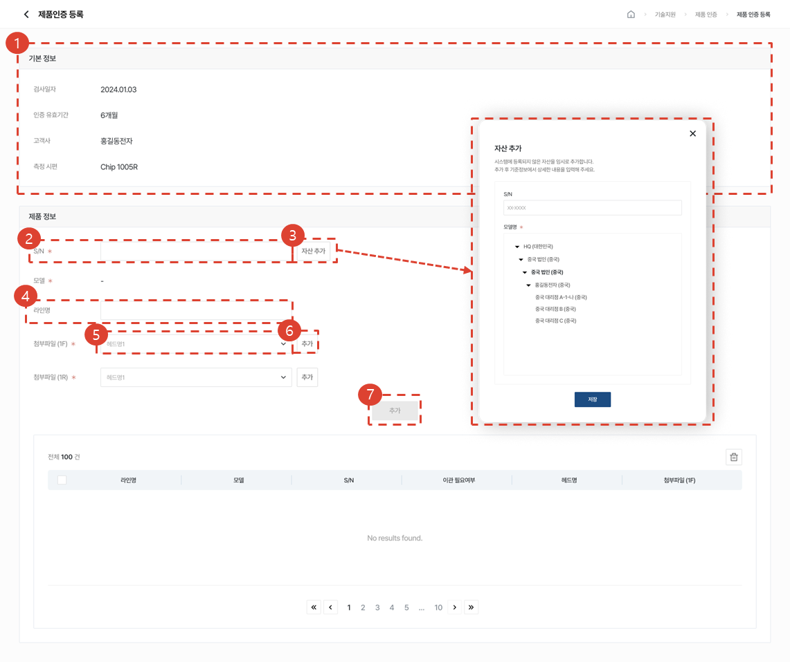
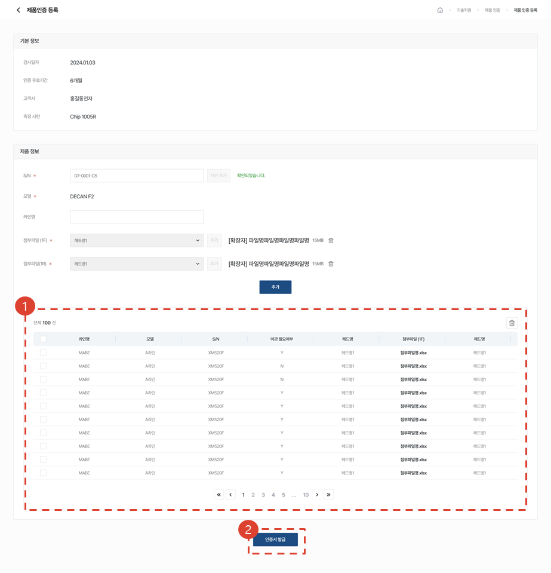
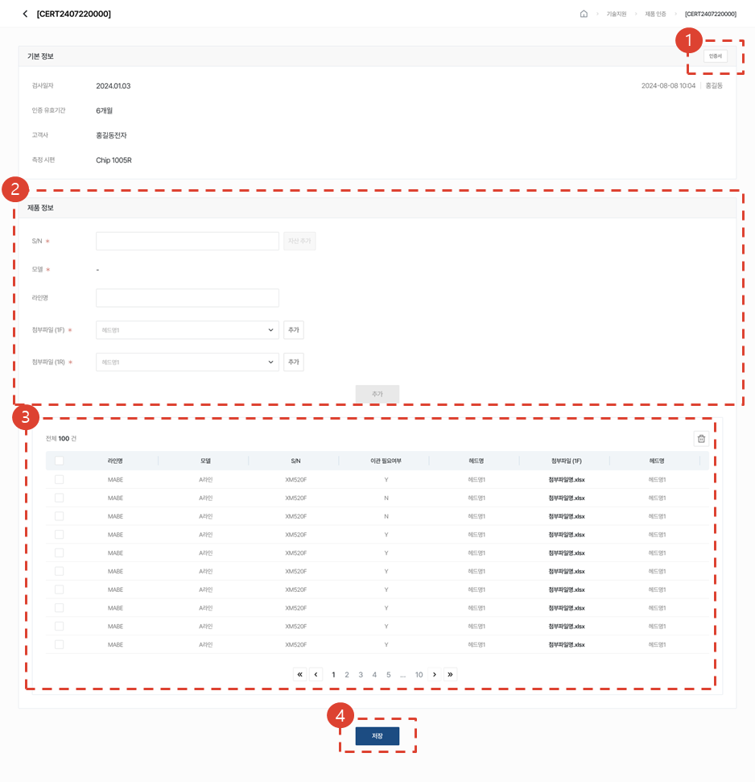

import ValidateTextByToken from "/src/utils/getQueryString.js";

# 장착 정도 인증서

<ValidateTextByToken dispTargetViewer={true} dispCaution={true} validTokenList={['head', 'branch', 'seller', 'agent']}>

칩마운터 설비의 장착정도 측정 결과에 대한 인증서 발행 서비스 업무 절차에 대해 안내합니다.
 
 

## 목록 페이지
### 조회 권한 보유 시

1. Selectbox의 유형을 선택 후, 원하는 검색어로 검색할 수 있습니다.
1. 추가 버튼을 클릭하여 제품인증을 등록할 수 있습니다.
1. 톱니바퀴 버튼을 클릭하여 삭제, 테이블 관리를 할 수 있습니다.
1. 등록된 제품인증 목록을 볼 수 있습니다.
1. NO를 클릭하여 [제품인증 상세]페이지로 이동합니다.
1. 인증서 버튼을 클릭하여 인증서를 볼 수 있습니다. 
 
 

### 작성 / 관리 권한 보유 시

1. 제품인증을 1개 선택 후, [이메일 전송] 버튼을 클릭하여 인증서를 이메일로 전송할 수 있습니다.
1. [이력 조회]버튼을 클릭하여 인증서 발송이력을 확인할 수 있습니다.
1. Selectbox의 유형을 선택 후, 원하는 검색어로 검색할 수 있습니다.
1. [추가] 버튼을 클릭하여 제품인증을 등록할 수 있습니다.
1. [톱니바퀴] 버튼을 클릭하여 삭제, 테이블 관리를 할 수 있습니다.
1. 등록된 제품인증 목록을 볼 수 있습니다.
1. [NO]를 클릭하여 [제품인증 상세]페이지로 이동합니다.
1. [인증서] 버튼을 클릭하여 인증서를 볼 수 있습니다. 
 
 

#### 이메일 전송

1. 인증서 번호가 표시됩니다.
1. 인증서를 발급하는 고객사명이 표시됩니다. 
1. 유효기간을 선택 할 수 있습니다. 링크를 전송받은 사용자는 유효기간 내에 [인증서]를 다운로드할 수 있습니다.
1. [검색] 탭을 선택 시, 한화 그룹웨어 내에 존재하는 이름, 이메일을 검색할 수 있습니다. 
1. 이름 또는 이메일 검색하면 일치하는 항목이 드롭다운에 표시됩니다. 선택 시, 하단 목록에 추가됩니다. 
1. [직접입력] 탭을 선택 시, 링크를 공유하고 싶은 이메일을 자유롭게 입력할 수 있습니다. 
1. 이메일을 입력 후, [추가] 버튼 클릭 시, 하단 목록에 추가됩니다. 
1. 이메일을 전송받을 사용자 목록이 표시됩니다. 그룹웨어에서 검색한 사용자는 이름, 직책, 이메일이 표시되고 직접입력한 경우 이메일만 표시됩니다. X를 클릭하여 1. 사용자를 삭제할 수 있습니다. 
1. [전송] 버튼 클릭 시, 사용자들에게 이메일이 전송됩니다. 
 
 

#### 이메일 발송 이력 조회

1. [엑셀 다운로드] 버튼 클릭 시, 이메일 발송이력을 다운로드할 수 있습니다.
1. 사용자 브라우저 기준(UTC적용)으로 이메일 발송일시가 표시됩니다. 
1. 송신자(CRM로그인자)의 이름이 표시됩니다.
1. [이메일전송] 링크를 통해 인증서에 접근한 사용자가 비회원일 시, 이름 대신 이메일이 표시됩니다.
 
 

## 등록 페이지
### 기본정보 입력

1. 검사일자를 선택해주세요. 오늘보다 이후의 날짜는 선택할 수 없습니다. 
1. 인증 유효기간을 선택해주세요.
1. 고객사를 선택해주세요. 자신의 고객사만 검색이 가능합니다. 
1. 측정시편을 선택해주세요. 
1. 모두 선택했을 시, 버튼이 활성화됩니다. [등록] 버튼 클릭하여 제품 정보를 입력해주세요.
 
 

### 제품정보 입력

1. 선택한 기본 정보로 인증서 발행이 진행됩니다.
1. S/N를 입력해주세요.
    1. 입력한 S/N이 기본정보에서 선택한 고객사의 자산과 일치하고, 선택한 측정시편을 사용하는 자산일 시 모델명이 자동 표기됩니다.
    1. 입력한 S/N이 기본정보에서 선택한 측정시편과 일치하지 않는 경우 => 스펙아웃되어 인증서 발급이 불가합니다.
    1. 입력한 S/N이 기본정보에서 선택한 고객사와 일치하지 않는 경우 => 마지막에 인증서발급 버튼을 누를 때, 선택한 고객사로 입력한 S/N의 자산이관이 진행됩니다.
    1. 입력한 S/N이 시스템에 등록되어 있지 않은 자산일 경우, 3번의 [자산추가] 버튼이 활성화가 됩니다.
1. [자산추가] 버튼을 클릭시, 자산추가 모달이 출력됩니다. S/N에 해당되는 모델을 선택해주세요.
1. 선택값입니다. 라인명을 입력할 시, 같은 라인명을 입력한 모델끼리 매핑됩니다.
1. 첨부파일은 모델의 Gantry Count 개수에 따라 생성됩니다. 첨부파일 내용에 해당되는 헤드명을 Selectbox에서 선택해주세요.
1. 첨부파일을 추가해주세요. 추가한 첨부파일 내 **Head No** 행의 개수와 선택한 헤드의 Spindle Count의 개수가 다를 시, 업로드가 실패됩니다.
1. 필수값을 모두 입력시, [추가] 버튼이 활성화됩니다. 클릭시, 목록에 인증서를 발행하고자 하는 제품정보가 추가됩니다. 제품은 여러 번 등록이 가능합니다.
 
 

### 제품정보 입력 후

1. 추가된 제품정보가 목록에 표시됩니다. 체크박스로 선택하여 추가된 제품정보를 삭제할 수 있습니다. 
1. [인증서 발급] 버튼 클릭 시, 상세페이지로 이동됩니다. 상세페이지 내의 [인증서] 버튼을 클릭하여 웹PDF로 인증서를 볼 수 있습니다. 
1. 자산이관이 필요한 자산이 포함된 경우 => [인증서발급] 버튼을 클릭 시, 자산이관 동의여부를 묻는 컨펌창이 출력됩니다. 동의할 시, 이관이 진행됩니다. 이관 완료 토스트가 뜨면 [인증서 발급] 버튼을 재클릭해주세요.
 
 

## 상세 페이지
### 조회 권한 보유 시
    :::warning 수정이 불가한 상세페이지 입니다.
    - 조회 권한을 가진 사용자가 목록에서 NO를 클릭하여 상세페이지 진입
    :::

1. [인증서] 버튼 클릭시, 인증서를 볼 수 있습니다.
1. 첨부파일을 클릭하여 다운로드 할 수 있습니다. 
 
 

### 작성 / 관리 권한 보유 시
    :::warning 수정 가능한 상세페이지는 2가지 방법으로 접근이 가능합니다. 
    - 작성/관리 권한을 가진 사용자가 제품인증 등록 페이지에서 [인증서발급]버튼을 클릭하여 상세페이지 진입
    - 작성/관리 권한을 가진 사용자가 목록에서 NO를 클릭하여 상세페이지 진입
    :::

1. [인증서] 버튼 클릭시, 인증서를 볼 수 있습니다. 
1. 제품정보를 입력해서 추가 등록할 수 있습니다. 
1. 등록된 제품을 체크박스로 선택해 삭제할 수 있으며 첨부파일을 클릭하여 다운로드 할 수 있습니다. 
1. [저장] 버튼 클릭 시, 목록으로 이동되며 변경사항이 있을 시 변경사항을 반영한 인증서로 업데이트가 됩니다. 

</ValidateTextByToken>

