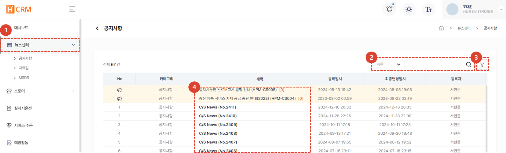
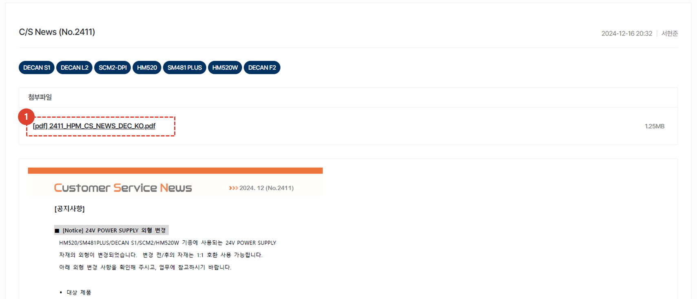
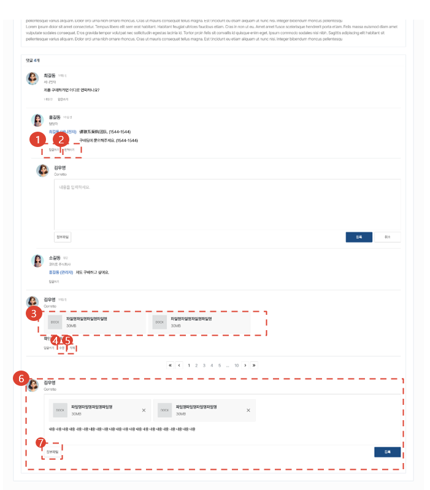

import ValidateTextByToken from "/src/utils/getQueryString.js";

# 공지사항

제품 서비스 정책 및 각종 안내사항을 공지하는 메뉴입니다.

<ValidateTextByToken dispTargetViewer={true} dispCaution={true} validTokenList={['head', 'branch', 'seller', 'agent', 'customer']}>

## 공지사항 목록

1. 뉴스센터의 공지사항을 클릭합니다. 
1. Selectbox의 유형을 선택 후, 원하는 검색어로 검색할 수 있습니다.
1. [필터] 버튼을 클릭하여 상세 검색을 할 수 있습니다. 
1. 등록된 공지사항 목록을 볼 수 있으며, [제목]를 클릭하여 [공지사항 상세]페이지로 이동합니다.
 
 

## 공지사항 상세

1. 첨부파일을 클릭하여 자료를 다운받을 수 있습니다.
 
 

1. [답글쓰기]버튼 클릭 시, 대댓글을 작성할 수 있습니다. 
1. 로그인 시 설정한 언어 외, 언어로 댓글이 작성될 시 [번역하기]버튼을 클릭하여 로그인 시 설정한 언어로 번역을 제공받을 수 있습니다.
1. 첨부파일을 클릭하여 자료를 다운받을 수 있습니다.
1. [수정] 버튼 클릭시, 댓글을 수정할 수 있습니다.
1. [삭제] 버튼 클릭시, 댓글을 삭제할 수 있습니다.
1. 신규 댓글을 작성할 수 있습니다.
1. 댓글 작성시, 첨부파일을 추가할 수 있습니다.

</ValidateTextByToken>