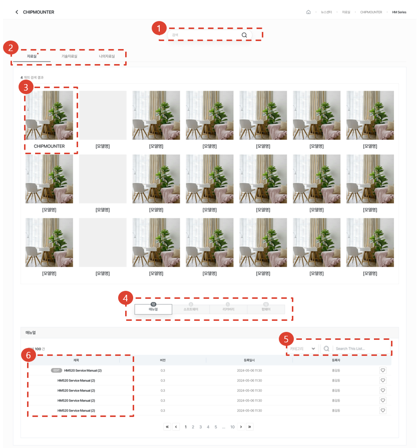
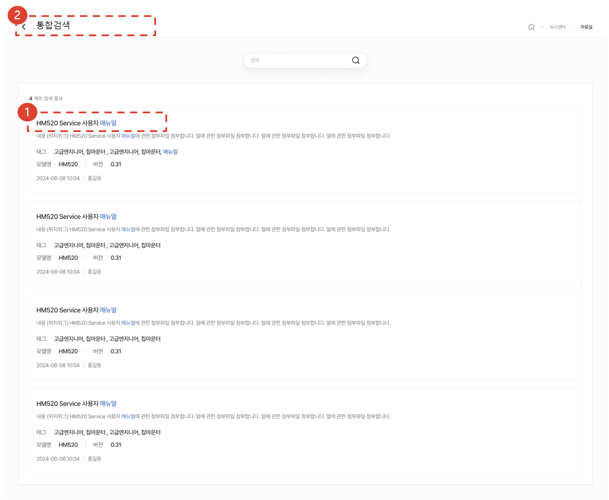
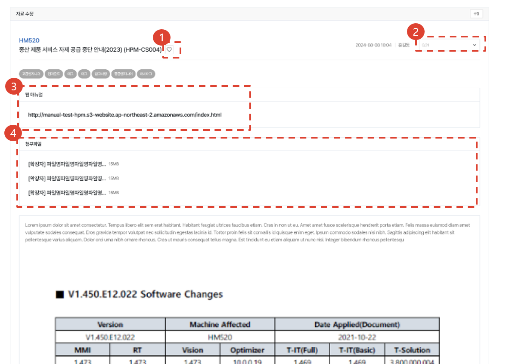
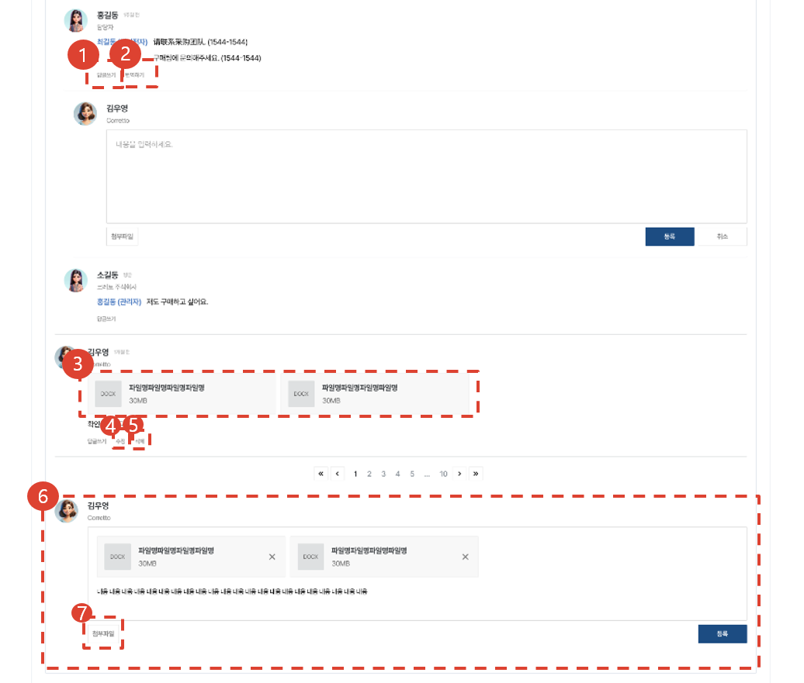
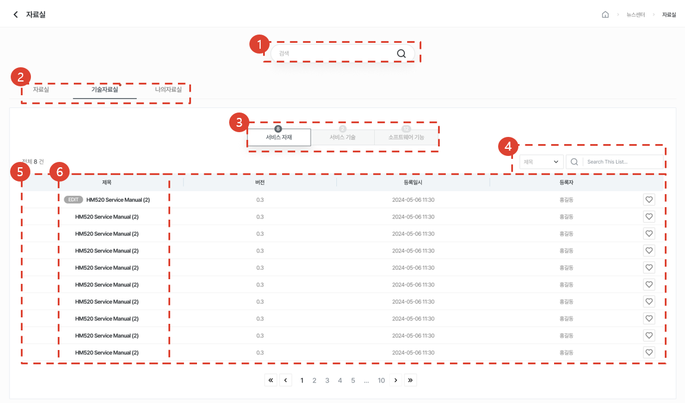
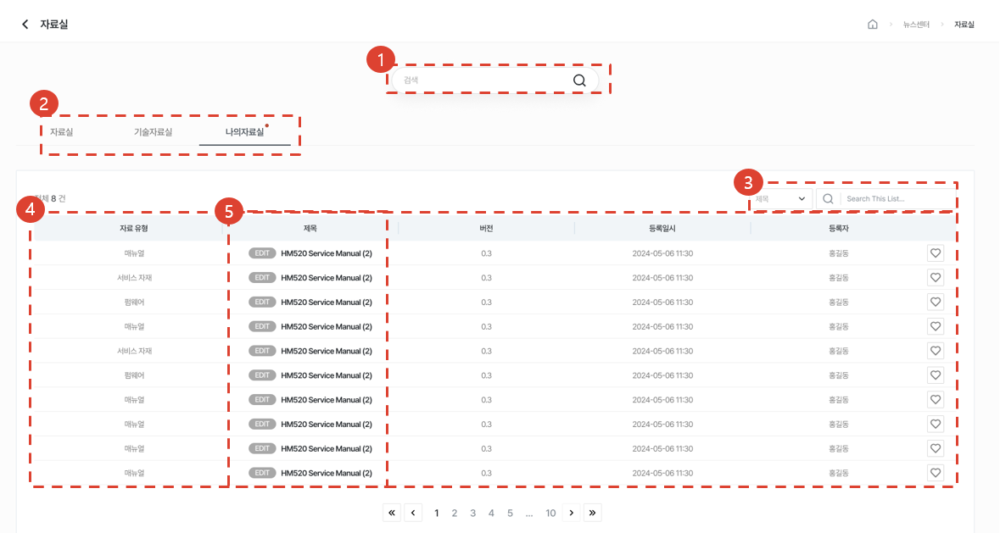

import ValidateTextByToken from "/src/utils/getQueryString.js";

# 기술자료실

서비스 부품 및 제품의 기술 자료를 게시하는 메뉴입니다.

<ValidateTextByToken dispTargetViewer={true} dispCaution={false} validTokenList={['head', 'branch', 'seller', 'agent', 'customer']}>

## 목록

1. 통합검색을 이용하여 모델명, 제목, 내용, 태그, 첨부파일을 검색할 수 있습니다.
1. 자료실 / 기술자료실 / 나의 자료실을 탭을 선택해 이동할 수 있습니다.
1. 모델을 클릭 시, 하위 모델일 경우 아래에 자료 목록이 나타납니다.
1. 매뉴얼/소프트웨어/리버커리/펌웨어 탭을 선택해 자료목록을 조회할 수 있습니다.
1. Selectbox의 유형을 선택 후, 원하는 검색어로 검색할 수 있습니다.
1. [제목]를 클릭하여 [자료 상세]페이지로 이동합니다.
 
 

### 통합 검색

1. [제목]를 클릭하여 [자료 상세]페이지로 이동합니다.
1. 뒤로가기를 클릭하여 이전 페이지로 이동 가능합니다.
 
 

## 자료실
### 자료 상세

1. 찜한 자료는 [나의 자료실]에서 확인할 수 있습니다.
1. 자료의 버전을 변경할 수 있습니다. 선택한 버전의 자료화면으로 전환됩니다.
1. 링크 클릭 시, 웹 매뉴얼을 볼 수 있습니다.
1. 첨부파일을 클릭하여 자료를 다운받을 수 있습니다.
 
 

1. [답글쓰기]버튼 클릭 시, 대댓글을 작성할 수 있습니다. 
1. 로그인 시 설정한 언어 외, 언어로 댓글이 작성될시 [번역하기]버튼을 클릭하여 로그인 시 설정한 언어로 번역을 제공받을 수 있습니다.
1. 첨부파일을 클릭하여 자료를 다운받을 수 있습니다.
1. [수정] 버튼 클릭시, 댓글을 수정할 수 있습니다.
1. [삭제] 버튼 클릭시, 댓글을 삭제할 수 있습니다.
1. 신규 댓글을 작성할 수 있습니다.
1. 댓글 작성시, 첨부파일을 추가할 수 있습니다.
</ValidateTextByToken>
 
 

## 기술자료실

<ValidateTextByToken dispTargetViewer={false} dispCaution={true} validTokenList={['head', 'branch', 'seller', 'agent']}>

1. 통합검색을 이용하여 모델명, 제목, 내용, 태그, 첨부파일을 검색할 수 있습니다.
1. 자료실 / 기술자료실 / 나의 자료실을 탭을 선택해 이동할 수 있습니다.
1. 서비스자재 / 서비스기술 / 소프트웨어기능 탭을 선택해 자료목록을 조회할 수 있습니다.
1. Selectbox의 유형을 선택 후, 원하는 검색어로 검색할 수 있습니다.
1. 등록된 기술자료 목록을 볼 수 있습니다.
1. [제목]를 클릭하여 [기술자료 상세]페이지로 이동합니다.
</ValidateTextByToken>
 
 

## 나의 자료실

<ValidateTextByToken dispTargetViewer={false} dispCaution={true} validTokenList={['head', 'branch', 'seller', 'agent', 'customer']}>

1. 통합검색을 이용하여 모델명, 제목, 내용, 태그, 첨부파일을 검색할 수 있습니다.
1. 자료실 / 기술자료실 / 나의 자료실을 탭을 선택해 이동할 수 있습니다.
1. 서비스자재 / 서비스기술 / 소프트웨어기능 탭을 선택해 자료목록을 조회할 수 있습니다.
1. Selectbox의 유형을 선택 후, 원하는 검색어로 검색할 수 있습니다.
1. 등록된 기술자료 목록을 볼 수 있습니다.
1. [제목]를 클릭하여 [기술자료 상세]페이지로 이동합니다.

</ValidateTextByToken>