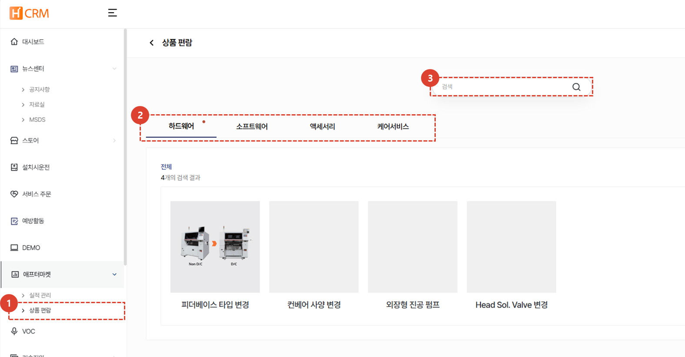
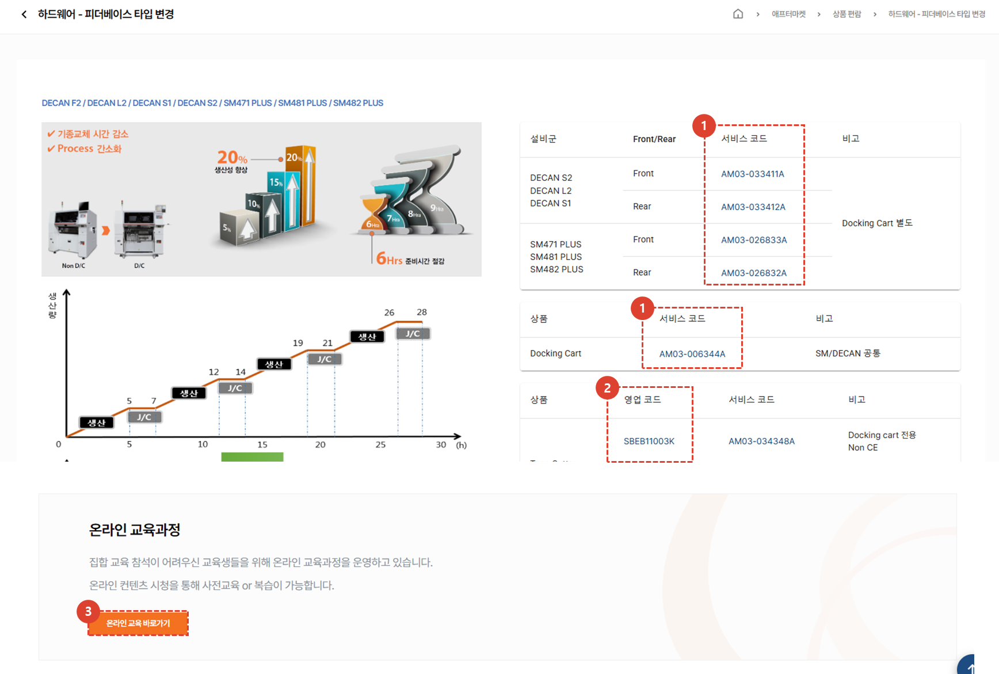

import ValidateTextByToken from "/src/utils/getQueryString.js";

# 상품 편람

하드웨어 및 소프트웨어 등 애프터마켓 상품 편람 페이지를 안내합니다.

<ValidateTextByToken dispTargetViewer={true} dispCaution={true} validTokenList={['head']}>

## 상품 편람 목록

1. 애프터마켓 목록의 상품 편람을 선택합니다. 
1. 조회할 상품의 대분류를 선택하면 해당되는 상품 편람을 확인 할 수 있습니다. 
1. 검색 기능을 통해 원하는 상품 편람을 조회 할 수 있습니다. 
 
 

1. 상품에 대한 관련 내용 뿐만 아니라 해당 설비군과 상품에 대한 서비스 코드를 확인 할 수 있습니다. 
    :::tip
    - 서비스 코드를 클릭하여 서비스코드에 대한 상세 정보를 확인 할 수 있습니다.
    :::
1. 상품과 관련된 영업 코드를 확인할 수 있습니다. 
    :::tip
    - 서비스 코드와 마찬가지로 영업코드에 대한 상세 정보를 확인 할 수 있습니다.
    :::
1. 온라인 교육 바로가기를 통해 상품과 관련된 교육을 수강할 수 있습니다. 

</ValidateTextByToken>