import ValidateTextByToken from "/src/utils/getQueryString.js";

# 뉴스센터 관리

공지사항, 자료실, 기술자료실 관리 방법을 안내합니다.

<ValidateTextByToken dispTargetViewer={true} dispCaution={true} validTokenList={['head']}>

## 공지사항

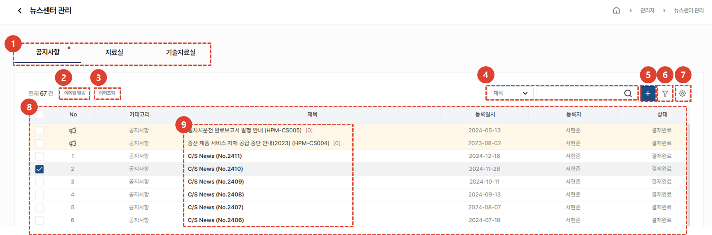

1. 공지사항 / 자료실 / 기술자료실을 탭을 선택해 이동할 수 있습니다.
1. 공지사항을 1개 선택 후, [이메일 발송] 버튼을 클릭하여 공지사항 상세 링크를 이메일로 전송할 수 있습니다.
1. 이력조회 튼을 클릭하여 공지사항 접속이력을 확인할 수 있습니다.
1. Selectbox의 유형을 선택 후, 원하는 검색어로 검색할 수 있습니다.
1. 추가 버튼을 클릭하여 공지사항을 작성할 수 있습니다.
1. 필터 버튼을 클릭하여 상세 검색을 할 수 있습니다. 
1. 톱니바퀴 버튼을 클릭하여 공지사항 삭제, 테이블 관리를 할 수 있습니다.
1. 등록된 공지사항 목록을 볼 수 있습니다.
1. 제목를 클릭하여 공지사항 상세페이지로 이동합니다.
 
 

### 이메일 발송

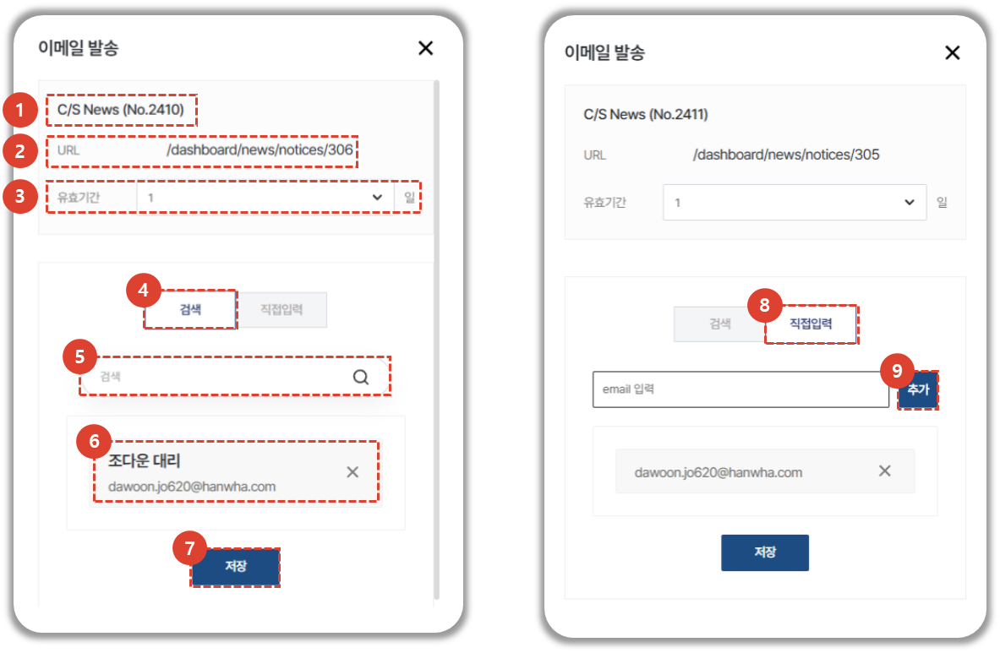

1. 공지사항 제목이 표시됩니다.
1. 공유할 공지사항 링크가 표시됩니다
1. 유효기간을 선택 할 수 있습니다. 링크를 전송받은 사용자는 유효기간 내에 링크를 통해 [공지사항 상세]에 접근할 수 있습니다.
1. 검색 탭을 선택 시, 한화 그룹웨어 내에 존재하는 이름, 이메일을 검색할 수 있습니다. 
1. 이름 또는 이메일 검색하면 일치하는 항목이 드롭다운에 표시됩니다. 선택 시, 하단 목록에 추가됩니다. 
1. 이메일을 전송받을 사용자 목록이 표시됩니다. 그룹웨어에서 검색한 사용자는 이름, 직책, 이메일이 표시되고 직접입력한 경우 이메일만 표시됩니다. X를 클릭하여 사용자를 삭제할 수 있습니다. 
1. 전송 버튼 클릭 시, 사용자들에게 이메일이 전송됩니다. 
1. 직접입력 탭을 선택 시, 링크를 공유하고 싶은 이메일을 자유롭게 입력할 수 있습니다. 
1. 이메일을 입력 후, 추가 버튼 클릭 시, 하단 목록에 추가됩니다. 
 
 

### 이력 조회

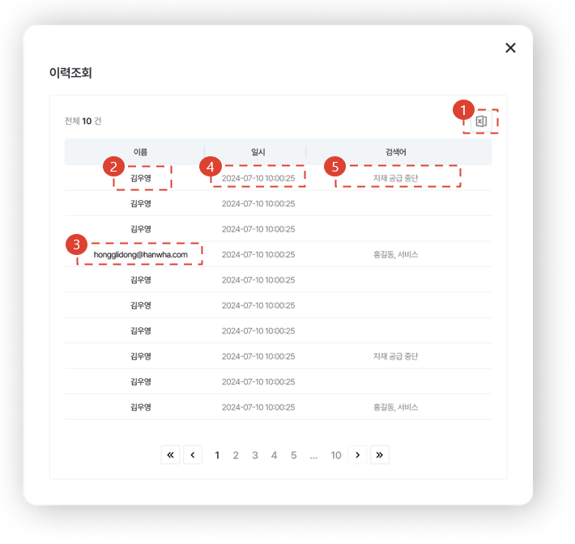

1. excel 버튼 클릭시, 이력이 엑셀로 다운로드 됩니다.
1. CRM사용자의 이름이 표시됩니다.
1. [이메일 발송] 링크를 통해 공지사항에 접근한 사용자가 비회원일 시, 이름 대신 이메일이 표시됩니다.
1. 사용자 브라우저 기준(UTC적용)으로 [공지사항 상세]의 유입일시가 표시됩니다. 
1. 목록에서 검색어를 입력하여 [공지사항 상세]에 접근한 경우 검색어를 표시합니다. 
 
 

### 공지사항 생성

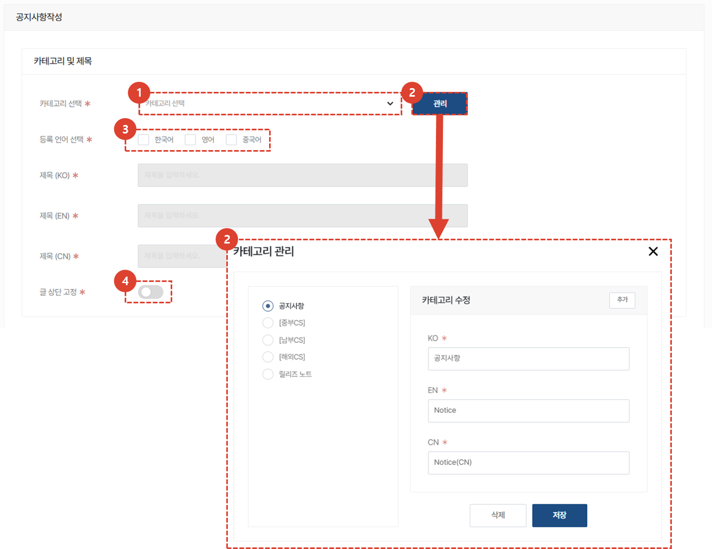

1. 공지사항 카테고리를 선택할 수 있습니다.
1. 카테고리를 등록/수정 할 수 있습니다.
1. 한/중/영 중 등록하고자 하는 언어를 선택할 수 있습니다. 선택하지 않은 언어는 제목, 내용, 첨부파일 등록이 Disabled 되어 입력할 수 없습니다. 
1. 토글을 움직여 공지사항 목록에 상단 고정할 수 있습니다. 
 
 

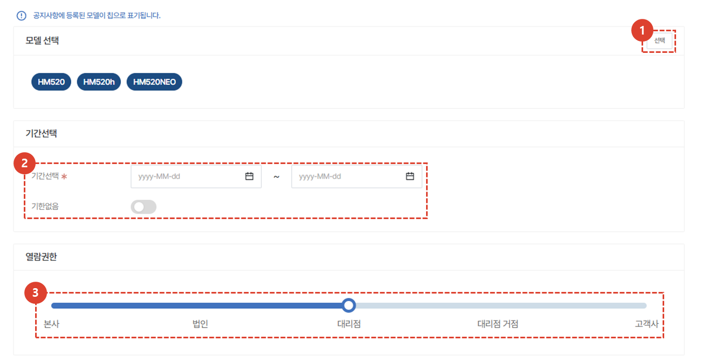
1. 공지사항과 관련되어 참고하면 좋을 모델을 선택할 수 있습니다. 
1. 모델을 선택 후, +버튼 클릭시 묶여있는 하위 모델들이 함께 추가됩니다. -버튼을 클릭하여 모델을 제거할 수 있습니다. 체크박스에 선택된 모델들만 등록됩니다. 
1. 게시기간을 설정할 수 있습니다. 기한없음을 선택한 경우 공지사항이 마감기한 없이 게시됩니다. 
1. 공지사항을 열람할 수 있는 열람권한을 선택할 수 있습니다. 
 
 

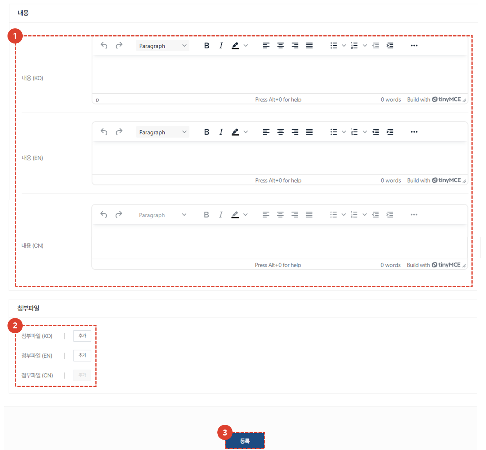
1. 공지사항 내용을 작성할 수 있습니다.
1. 첨부파일을 추가할 수 있습니다.
    :::tip
    - **등록 언어 선택** 체크박스에 체크 된 언어만 첨부파일 버튼이 활성화 됩니다. 
    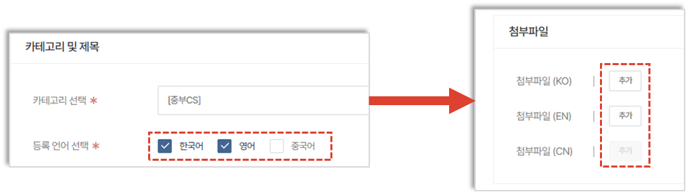
    :::

1. 공지사항 등록시, 결재모듈에 올라갑니다.
 
 

### 공지사항 상세

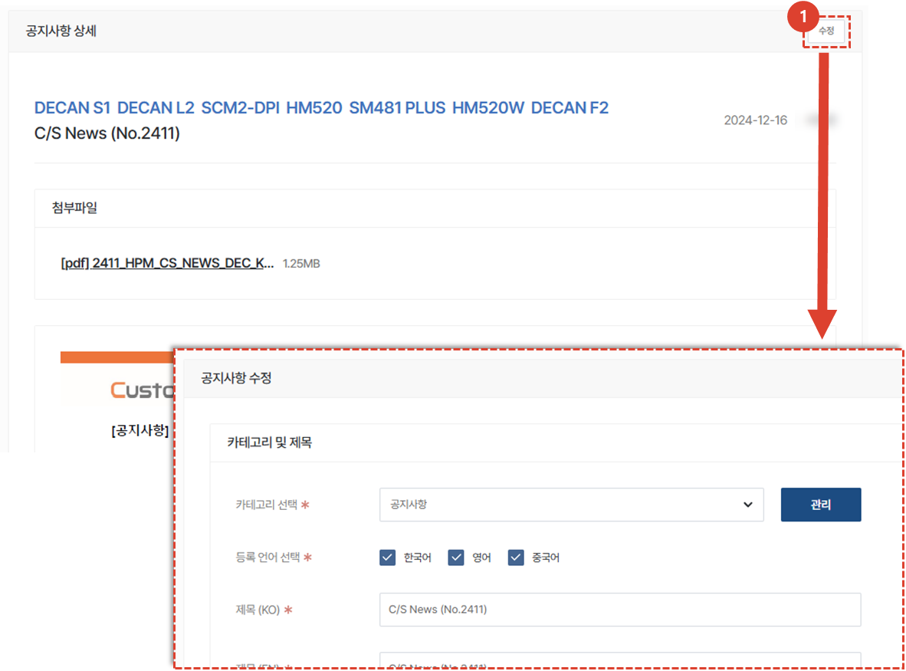

1. 수정 버튼을 클릭하여 공지사항을 수정할 수 있습니다. 
 
 

## 자료실
### 자료실 관리
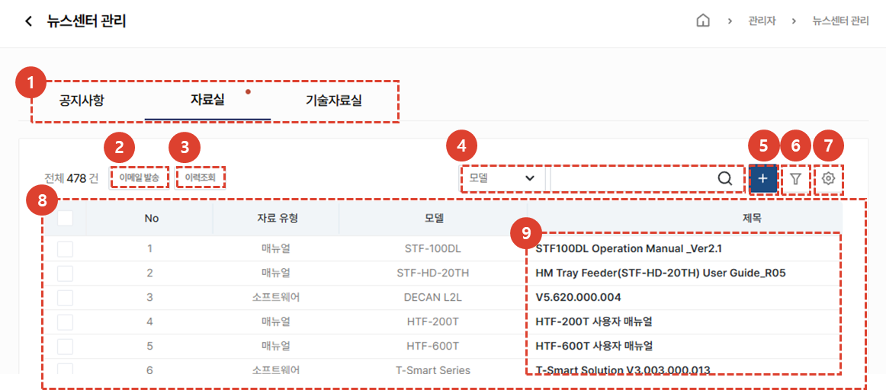

1. 공지사항 / 자료실 / 기술자료실을 탭을 선택해 이동할 수 있습니다.
1. 자료를 1개 선택 후, 이메일 발송 버튼을 클릭하여 자료 상세 링크를 이메일로 전송할 수 있습니다.
1. 자료를 1개 선택 후, 이력조회 버튼을 클릭하여 자료 접속이력을 확인할 수 있습니다. 
1. Selectbox의 유형을 선택 후, 원하는 검색어로 검색할 수 있습니다.
1. 추가 버튼을 클릭하여 자료를 작성할 수 있습니다.
1. 필터 버튼을 클릭하여 상세 검색을 할 수 있습니다. 
1. 톱니바퀴 버튼을 클릭하여 자료 삭제, 테이블 관리를 할 수 있습니다.
1. 등록된 자료 목록을 볼 수 있습니다.
1. 제목를 클릭하여 자료 상세 페이지로 이동합니다.
 
 

### 이메일 전송

1. 자료 제목이 표시됩니다.
1. 공유할 자료의 링크가 표시됩니다
1. 유효기간을 선택 할 수 있습니다. 링크를 전송받은 사용자는 유효기간 내에 링크를 통해 [자료 상세]에 접근할 수 있습니다.
1. 검색 탭을 선택 시, 한화 그룹웨어 내에 존재하는 이름, 이메일을 검색할 수 있습니다. 
1. 이름 또는 이메일 검색하면 일치하는 항목이 드롭다운에 표시됩니다. 선택 시, 하단 목록에 추가됩니다. 
1. 직접입력 탭을 선택 시, 링크를 공유하고 싶은 이메일을 자유롭게 입력할 수 있습니다. 
1. 이메일을 입력 후, 추가 버튼 클릭 시, 하단 목록에 추가됩니다. 
1. 이메일을 전송받을 사용자 목록이 표시됩니다. 그룹웨어에서 검색한 사용자는 이름, 직책, 이메일이 표시되고 직접입력한 경우 이메일만 표시됩니다. X를 클릭하여 사용자를 삭제할 수 있습니다. 
1. 전송 버튼 클릭 시, 사용자들에게 이메일이 전송됩니다. 
 
 

### 이력 조회

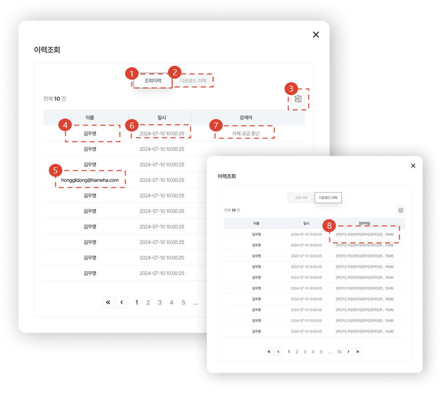

1. 조회이력 탭을 선택 시, 자료 상세를 조회한 사용자들의 이력을 볼 수 있습니다. 
1. 다운로드이력 탭을 선택시, 자료를 다운로드한 사용자들의 이력을 볼 수 있습니다.
1. 엑셀 다운로드 버튼 클릭시, 이력이 엑셀로 다운로드 됩니다.
1. 사용자들의 CRM사용자의 이름이 표시됩니다.
1. 이메일전송 링크를 통해 공지사항에 접근한 사용자가 비회원일 시, 이름 대신 이메일이 표시됩니다.
1. 사용자 브라우저 기준(UTC적용)으로 [공지사항 상세]의 유입일시가 표시됩니다. 
1. 목록에서 검색어를 입력하여 [공지사항 상세]에 접근한 경우 검색어를 표시합니다. 
1. 첨부파일 클릭 시, 다운로드가 됩니다.
 
 

### 자료 등록

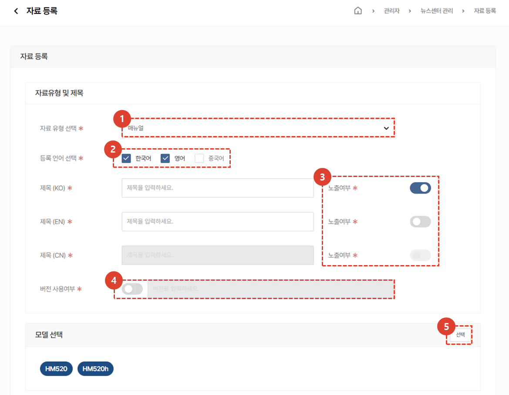
1. 자료유형을 선택할 수 있습니다.
1. 한/중/영 중 등록하고자 하는 언어를 선택할 수 있습니다. 선택하지 않은 언어는 제목, 태그, 내용, 첨부파일 등록이 Disabled 되어 입력할 수 없습니다. 
1. 사용자단에 자료 노출여부를 선택할 수 있습니다. 임시저장 기능입니다.
1. 버전을 사용할 시, 자료의 버전을 입력할 수 있습니다. 버전을 사용하는 자료는 자료 수정 화면에서, 최신버전으로 업데이트하여 등록할 수 있습니다.
1. 사용자단에는 모델을 선택하여 자료를 볼 수 있습니다. 해당 자료를 어떤 모델에 등록하고 싶은지 선택할 수 있습니다. (1개의 자료를 여러 모델에 등록 가능합니다.) 
 
 

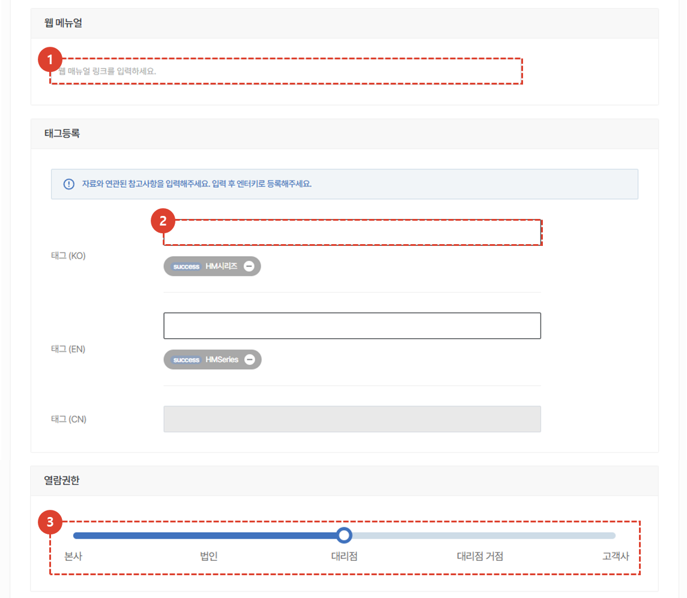
1. 웹 매뉴얼 링크를 입력할 수 있습니다.
1. 자료와 관련되어 참고하면 좋을 내용을 자유롭게 입력할 수 있습니다.  **Ex) 고급 엔지니어, 필수자료 등**
1. 자료를 열람할 수 있는 열람권한을 선택할 수 있습니다. 
 
 

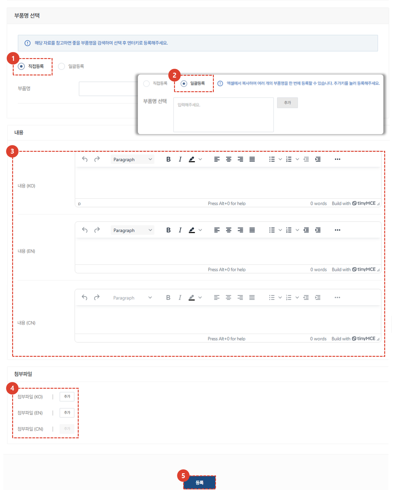
1. 직접등록 선택 시, 자료와 관련되어 참고하면 좋을 제품을 직접 입력할 수 있습니다.
1. 일괄등록 선택 시, 자료와 관련되어 참고하면 좋을 제품을 복사하여 여러 개의 제품명을 한 번에 추가할 수 있습니다.
1. 자료 내용을 작성할 수 있습니다.
1. 첨부파일을 추가할 수 있습니다.
1. 자료 등록시, 결재모듈에 올라갑니다.
 
 

### 자료 상세

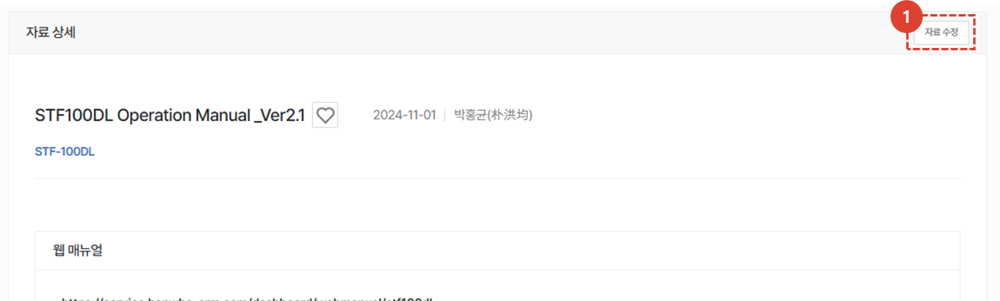
1. 수정 버튼을 클릭하여 자료를 수정할 수 있습니다. 
 
 

### 자료 수정 (버전 업데이트 전 자료)
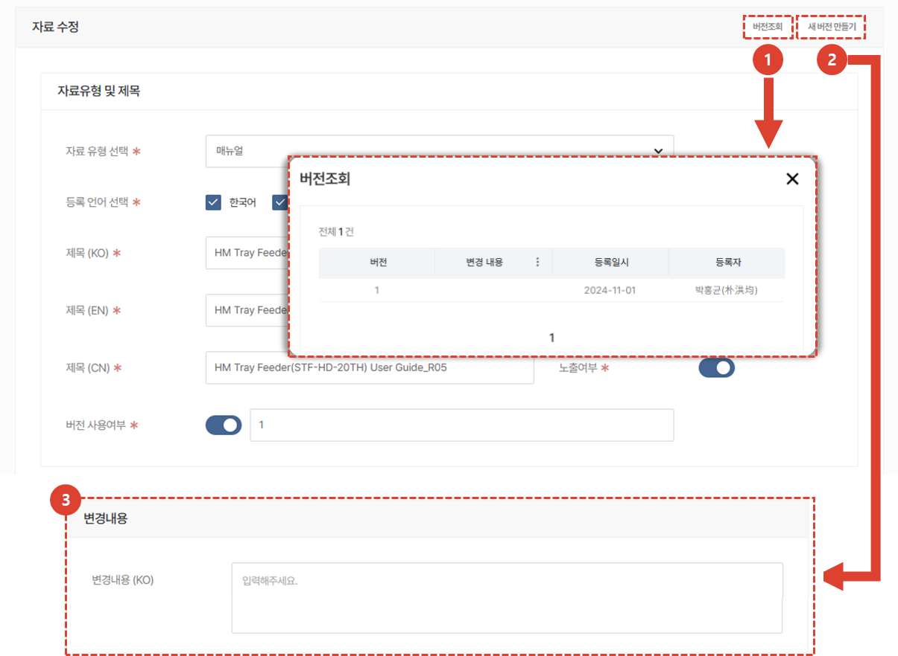
1. 버전조회 버튼 클릭 시, 해당 자료의 버전이력을 조회할 수 있습니다.
1. 새버전만들기 버튼 클릭 시, 해당 자료수정 페이지가 복사되어 새탭으로 띄워집니다. 필요한 내용을 수정하고 기존 버전이 아닌 새로 운 버전을 입력 후 등록해주세요.
1. 새버전만들기로 생성된 페이지에는 변경내용을 입력할 수 있습니다. 기존버전과 비교하여 달라진 점을 입력해주세요.
 
 

### 자료 수정 (버전 업데이트 후 자료)

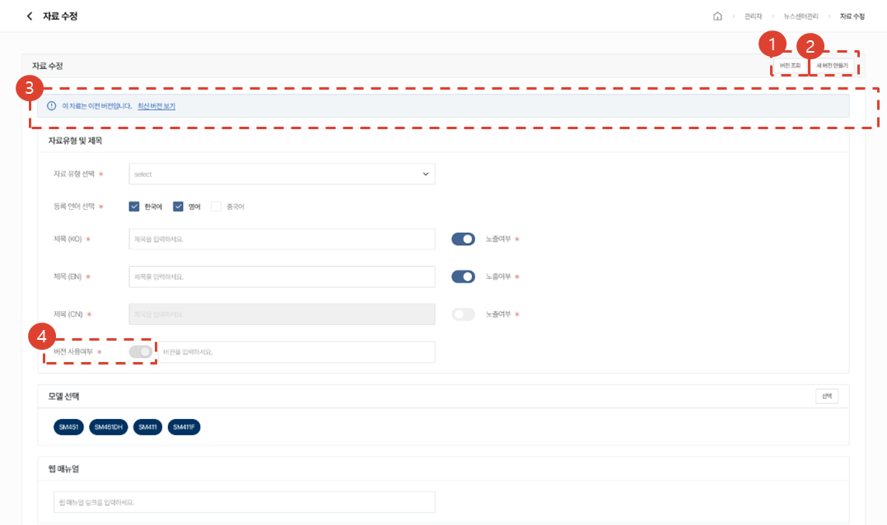

1. 버전조회 버튼 클릭 시, 해당 자료의 버전이력을 조회할 수 있습니다.
1. 새버전만들기 버튼 클릭 시, 해당 자료수정 페이지가 복사되어 새탭으로 띄워집니다. 필요한 내용을 수정하고 기존 버전이 아닌 새로 운 버전을 입력 후 등록해주세요.
1. 최신버전이 아닌 자료의 수정 페이지에만 나타나는 문구입니다. 최신버전보기 클릭시, 최신버전의 자료 수정 페이지로 이동됩니다.
1. 자료에서 한 번 이상 새버전만들기가 실행된 경우는(=버전 업데이트 후의 자료) 버전사용여부를 해제할 수 없습니다. 
 
 

## 기술자료실

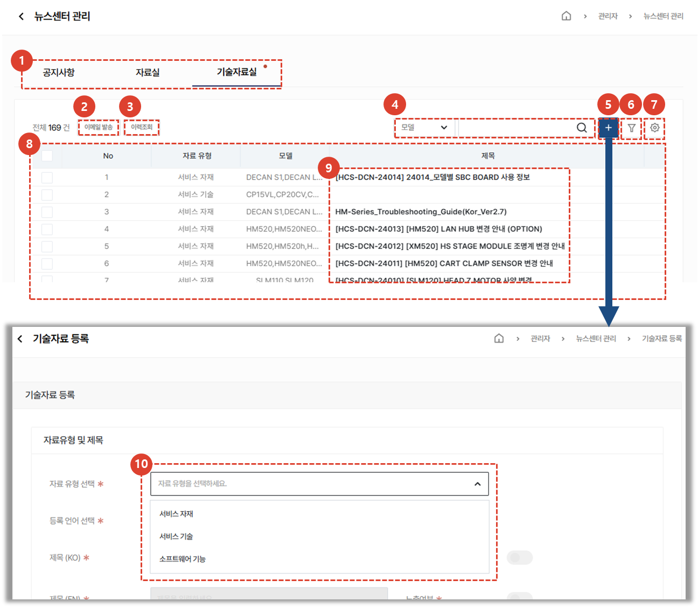

1. 공지사항 / 자료실 / 기술자료실을 탭을 선택해 이동할 수 있습니다.
1. 자료를 1개 선택 후, 이메일 발송 버튼을 클릭하여 기술자료 상세 링크를 이메일로 전송할 수 있습니다.
1. 자료를 1개 선택 후, 이력조회버튼을 클릭하여 기술자료 접속이력을 확인할 수 있습니다. 
1. Selectbox의 유형을 선택 후, 원하는 검색어로 검색할 수 있습니다.
1. 추가 버튼을 클릭하여 기술자료를 작성할 수 있습니다.
1. 필터 버튼을 클릭하여 상세 검색을 할 수 있습니다. 
1. 톱니바퀴 버튼을 클릭하여 기술자료 삭제, 테이블 관리를 할 수 있습니다.
1. 등록된 기술자료 목록을 볼 수 있습니다.
1. 제목를 클릭하여 기술자료 상세 페이지로 이동합니다.
1. 기술자료와 자료의 차이점은 자료 유형으로, 그 외 등록 플로우는 동일합니다.

</ValidateTextByToken>