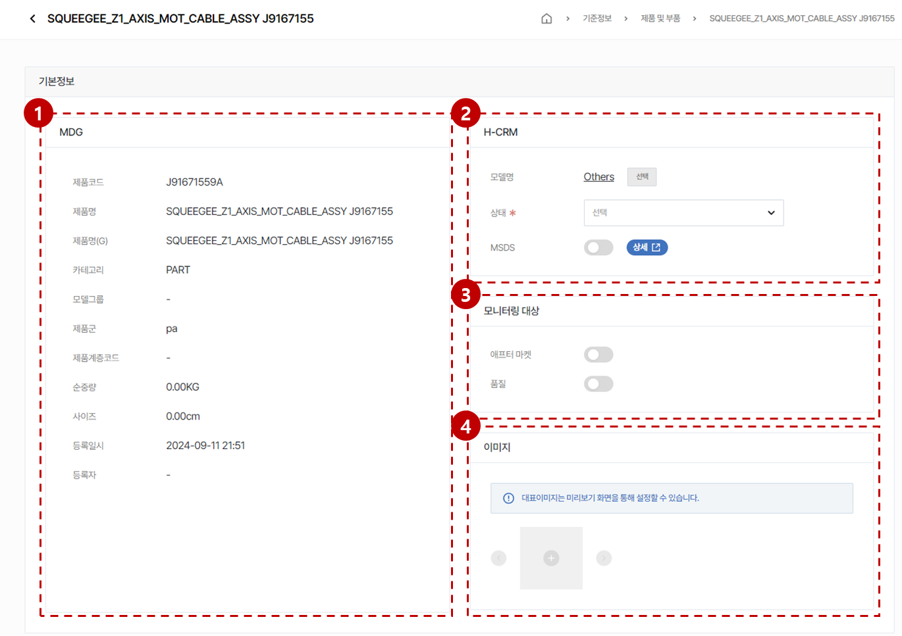
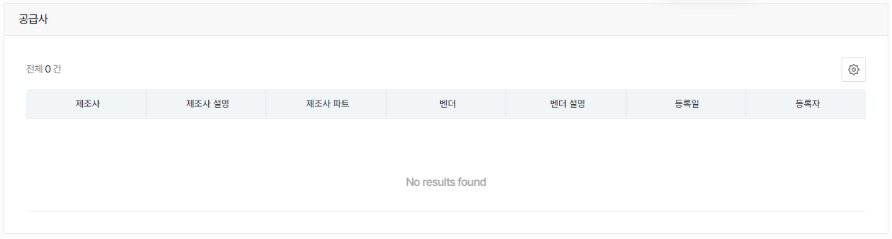

import ValidateTextByToken from "/src/utils/getQueryString.js";
import filterList from "./img/002.png";
import searchList from "./img/003.png";
import tableFilter from "./img/006.png";
import createLabor from "./img/013.png";

# 제품 및 부품 데이터 관리

제품 및 부품 데이터 관리에 대한 안내입니다.

<ValidateTextByToken dispTargetViewer={true} dispCaution={true} validTokenList={['head', 'branch', 'seller', 'agent']}>

## 목록 페이지
    :::tip 
        아래의 데이터들이 목록에 표시됩니다.
        - MDG에서 채번된 제품 및 부품코드 데이터
        - H-CRM에서 시스템 매핑을 위해 자동으로 생성된 데이터
    :::

1. [기준정보] - [제품 및 부품] 메뉴를 클릭합니다.
    :::info 메뉴 접근을 위해 필요한 권한
        - TBD
    :::
1. 목록 필터링
    - 아래의 항목을 기준으로 데이터를 필터링할 수 있습니다.
        

1. 전체 **제품 및 부품 데이터**의 개수를 표시합니다.
1. 검색어를 입력해서 원하는 데이터를 검색할 수 있습니다.
    - 아래의 항목을 기준으로 데이터를 검색할 수 있습니다.
        

1. 상세 필터링 기능을 수행합니다.
        

        1. 필터링 헤드를 선택합니다.
        1. 검색어를 입력합니다.
        1. 필터 조건을 추가합니다.
        1. 입력된 내용을 초기화합니다.
        1. [검색] 버튼을 눌러 결과를 확인합니다.
1. 미리 설정된 데이터 목록의 커스텀 기능을 수행합니다.
    

    - **엑셀 출력**: 현재 필터링된 결과의 데이터 목록을 엑셀파일로 출력합니다.
    - **테이블 관리**: 테이블 보기 옵션을 설정합니다.
        

        <ol style={{listStyleType:"number"}}>
            <li>테이블의 컬럼 보기를 토글할 수 있습니다.</li>
            <li>테이블의 컬럼의 위치를 드래그앤드롭으로 조절할 수 있습니다.</li>
        </ol>
1. [제품 상세 페이지](#상세-페이지)로 이동합니다.
 
 

## 상세 페이지

### 기본 정보

1. MDG에서 인터페이스된 정보를 표시합니다. 이곳의 정보는 수정할 수 없습니다.
1. H-CRM에서 활용하기 위해 가공할 수 있는 추가 정보를 표시합니다.
    - **모델명**: [선택] 버튼을 눌러 모델을 선택합니다.
        :::info
            모델은 [**모델관리 페이지**](../tutorial-12-system-management/01-model-manage.md)에서 관리합니다.
        :::
    - **상태**: 제품/부품의 서비스 가능 상태를 설정합니다.
        - **SA**: 서비스가 가능한 상태입니다.
        - **DNA**: 각 지점별로 보유하고 있는 재고로 서비스 대응이 가능하지만, 더이상 본사로의 추가 주문은 불가능한 상태입니다.
        - **SNA**: 서비스 대응이 불가능한 상태입니다. 대체가능한 서비스 부품을 사용하여 서비스 대응을 해주세요.
            :::warning
                상태가 표기되지 않은 제품 및 부품이 있을 수 있습니다. 이 경우, 서비스 주문의 신청이 가능하지만 관리자에 의해 상태가 변경될 수 있는 부분 참고 부탁드립니다.
            :::
    - **MSDS**🚧 : Material Safety Data Sheet의 약자로, 물질 안전 보건자료에 대한 공시가 필요한 부품에 한해 사용합니다.
        :::info
            - 토글 스위치를 ON 으로 위치시키면 MSDS 상세 페이지로 이동하는 버튼이 생성됩니다.
            - [상세] 버튼을 눌러 [**MSDS 자료의 상세 설정(TBD)**](#)으로 이동할 수 있습니다.
        :::
1. 모니터링 대상 🚧
    - 제품 및 부품 데이터의 특정 속성에 대한 모니터링이 필요한 경우 사용합니다.
    - 세부 기능은 TBD
1. 이미지
    - 제품 및 부품 데이터의 실물 사진 또는 관련한 이미지를 첨부합니다.
        :::info
            - 첫번째로 표시되는 이미지가 대표 이미지로 활용됩니다.
            - 이미지의 미리보기 화면에서 대표이미지를 설정할 수 있습니다.
        :::

</ValidateTextByToken>
 
 

### 추가 정보 - Plant

<ValidateTextByToken dispTargetViewer={false} dispCaution={true} validTokenList={['head', 'branch']}>

- 각 사업부에 해당되는 제품이 H-CRM에서 사용됩니다.
    - **PK21 / VK21**: 산업용장비 사업부 Plant
    - **PK22 / VK22**: 공작기계 사업부 Plant
    - **PK23 / VK23**: 반도체장비 사업부(전공정) Plant
    - **PK24 / VK24**: 반도체장비 사업부(후공정) Plant
    :::tip
        Plant를 타 사업부로 확장하여 사용하고 싶을 때는 MDG의 기준정보를 변경해주시기 바랍니다.
    :::

</ValidateTextByToken>
 
 

### 추가 정보 - 재고

<ValidateTextByToken dispTargetViewer={false} dispCaution={true} validTokenList={['head', 'branch']}>

- 선택된 제품/부품 데이터의 재고 보유 현황을 표시합니다.
    :::info
        - 본사 소속의 사용자는 모든 창고의 재고가 표시됩니다.
        - 그 외 회사 소속의 사용자는 아래의 재고가 표시됩니다.
            - [**센터 - 저장위치**](./04-centers.md)에서 설정된 창고위치의 재고
            - [**스토어 - 재고**](../tutorial-04-store/stock-manage.md)에서 수기로 등록하고 관리하는 저장위치의 재고
            - [**센터 - 자재승인센터**](./04-centers.md)에서 설정된 창고위치의 재고 
    :::
    
    :::warning
        - 등록경로 컬럼의 값이 **SAP**의 경우에는 데이터 수정이 불가능합니다.
    :::

</ValidateTextByToken>
 
 

### 추가 정보 - 판가

<ValidateTextByToken dispTargetViewer={false} dispCaution={true} validTokenList={['head', 'branch', 'seller', 'agent']}>

:::warning 열람 가능 판가 정보
    - **판가 관리자**: 모든 **Price List** 에 매핑된 판가 정보를 표시합니다. 
    - **그 외 사용자**: [**기준정보-센터-조직정보**](#) 에서 설정된 공급가와 판매가격 테이블의 판가 정보를 표시합니다.
:::
 
 

### 추가 정보 - 첨부 파일

- 관련된 파일을 첨부하고 조회할 수 있습니다.

:::warning 권한 알림
    - **파일 첨부**: **작성**, **관리** 권한 필요
    - **파일 조회/다운로드**: **조회** 권한 필요 
    - **파일 삭제**:
        - **본인 업로드 파일**: **작성** 권한 필요
        - **타인 업로드 파일**: **관리** 권한 필요 
:::
 
 

### 추가 정보 - 표준 공수 시간

- 선택된 서비스 부품을 교체하기 위해 산정된 표준 공수 시간을 등록하고 관리합니다.
- [+] 버튼을 눌러 표준 공수를 추가할 수 있습니다.
    

    - 모델: 표준 공수 시간이 적용되는 모델을 선택합니다. **(리프모델만 선택 가능)**
    - 공수: 시간(Hrs) 단위로 공수 시간을 입력합니다.
    - 메모: 공수 시간과 관련한 상세 내용을 입력합니다.
    :::warning 권한 알림
        - **공수 시간 등록**: **작성**, **관리** 권한 필요
        - **공수 시간 조회**: **조회** 권한 필요 
        - **공수 시간 삭제**:
            - **본인 등록 공수**: **작성** 권한 필요
            - **타인 등록 공수**: **관리** 권한 필요 
    :::

</ValidateTextByToken>
 
 

### 추가 정보 - 판매 이력

<ValidateTextByToken dispTargetViewer={false} dispCaution={true} validTokenList={['head']}>

- 선택된 제품 및 부품과 관련된 판매 주문 이력을 표시합니다.
 
 

### 추가 정보 - 공급사

- 선택된 제품 및 부품의 공급사 정보를 표시합니다.

:::danger
    - 서비스 부품 판가 설정 시 참고용으로 활용하기 위하여 영업 운영판가를 표시합니다.
    - 그 외의 목적으로의 사용은 불가합니다.
:::

</ValidateTextByToken>