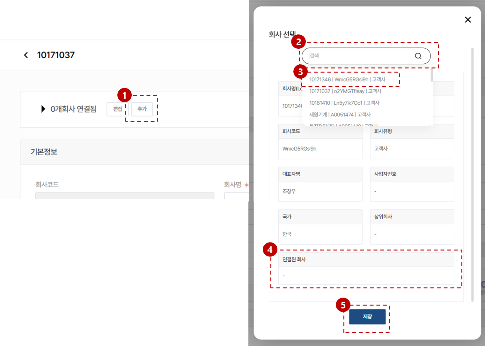

import ValidateTextByToken from "/src/utils/getQueryString.js";
import filterList from "./img/002.png";
import searchList from "./img/017.png";
import tableFilter from "./img/006.png";
import createLabor from "./img/013.png";

# 서비스 센터 데이터 관리

서비스 센터 데이터 관리에 대한 안내입니다.

<ValidateTextByToken dispTargetViewer={true} dispCaution={false} validTokenList={['head', 'branch']}>

## 목록 페이지

:::info
    - 최초에 고객사 목록에 등록되어 있던 회사 목록들 중에서 아래 중의 한 개의 항목에 해당되는 회사 데이터를 서비스 센터로써 관리할 수 있습니다. 
:::

1. [기준정보] - [센터] 메뉴를 클릭합니다.
    :::info 메뉴 접근을 위해 필요한 권한
        - TBD
    :::
2. 목록 필터링
    - 아래의 항목을 기준으로 데이터를 필터링할 수 있습니다.
        

3. 전체 등록된 **센터**의 개수를 표시합니다.
4. 선택된 센터에 의해 관리되고 있는 자산 등을 타 센터로 **이관**하는 메뉴입니다.
1. 같은 고객사인 복수개의 고객코드를 연결할 수 있습니다.
1. 검색어를 입력해서 원하는 데이터를 검색할 수 있습니다.
    - 아래의 항목을 기준으로 데이터를 검색할 수 있습니다.
        

1. 고객사를 생성합니다.
1. 테이블 기능을 수행합니다.
    - 상세 필터링 기능을 수행합니다.
        

        1. 필터링 헤드를 선택합니다.
        1. 검색어를 입력합니다.
        1. 필터 조건을 추가합니다.
        1. 입력된 내용을 초기화합니다.
        1. [검색] 버튼을 눌러 결과를 확인합니다.
    - 미리 설정된 데이터 목록의 커스텀 기능을 수행합니다.
        

        - **엑셀 출력**: 현재 필터링된 결과의 데이터 목록을 엑셀파일로 출력합니다.
        - **테이블 관리**: 테이블 보기 옵션을 설정합니다.
            

            <ol style={{listStyleType:"number"}}>
                <li>테이블의 컬럼 보기를 토글할 수 있습니다.</li>
                <li>테이블의 컬럼의 위치를 드래그앤드롭으로 조절할 수 있습니다.</li>
            </ol>
1. [센터 상세 페이지](#상세-페이지)로 이동합니다.

</ValidateTextByToken>
 
 

### 자산 이관

<ValidateTextByToken dispTargetViewer={false} dispCaution={true} validTokenList={['head']}>

:::warning 권한 알림
    - **자산 이관** 권한 필요
:::

1. 자산의 이관이 이루어질 센터를 선택합니다.
1. 이관할 방법을 선택합니다.
    - **일괄 변경**: 센터의 관리 자산 전체를 타 센터로 이관합니다.
        

    - **자산의 고객사 별로 변경**: 센터 관리 자산의 소유 고객사를 단위로 하여 자산을 타 센터로 이관합니다.
        

            1. 고객사별 선택적으로 자산을 이관할 수 있습니다.
1. 이관 자산 목록을 확인합니다.
1. 이관 대상 센터를 선택합니다.
1. [다음] 버튼을 클릭합니다.

</ValidateTextByToken>
 
 

### 같은 센터 그룹화

<ValidateTextByToken dispTargetViewer={false} dispCaution={true} validTokenList={['head']}>

#### 센터 목록에서 진행

:::tip

    - 비슷한 이름의 다른 코드로 채번된 센터가 있는 경우, **그룹화** 기능을 통해 그룹을 지정할 수 있습니다. 이 경우 각 코드를 기준으로 생성된 아래의 서비스 데이터들이 통합되어 표시됩니다. 
        - 판매 주문
        - 활동 이력
            - 서비스 이력
            - 부품 주문 이력
            - VOC 등
        - 문의 이력
        - CRM 사용자 및 고객담당자 계정
        - 센터 주소
        - 관리 자산
:::

1. 동일한 센터이기 때문에 서비스 데이터를 통합하여 관리 및 조회하고 싶은 경우, 그룹화를 진행할 고객사들을 클릭합니다. 
1. 그룹화 버튼을 클릭합니다.
1. 확인 버튼을 눌러 연결작업을 진행합니다. 
 
 

#### 센터 상세페이지에서 진행

1. 추가 버튼을 누릅니다.
1. 그룹화를 진행할 센터를 검색합니다.
1. 검색된 센터를 선택할 수 있습니다.
1. 이미 연결되어 있는 회사가 있는지 여부를 확인합니다.
    :::warning
        - 검색된 회사 이미 연결된 회사가 있을 경우 함께 그룹화가 진행됩니다.
    :::
1. 저장 버튼을 누릅니다.
    

    - 연결된 센터들의 상태를 확인할 수 있습니다.

</ValidateTextByToken>
 
 

### 센터 그룹화 해제하기

<ValidateTextByToken dispTargetViewer={false} dispCaution={true} validTokenList={['head', 'branch', 'seller', 'agent']}>

1. [편집] 버튼을 누릅니다.
1. 그룹을 해제할 고객사의 X 버튼을 클릭합니다.
1. [완료] 버튼을 클릭합니다.

 
 

## 상세 페이지
### 기본 정보

1. 상위 회사를 센터 목록에서 선택하여 설정합니다.
    :::info
        - 서비스 센터는 상하위 계층을 가진 트리 구조를 가지고 있습니다.
        - 하위 센터의 서비스 자산은 상위 센터에게 공유됩니다.
    :::
1. 서비스 부품 주문 시에 주문을 처리하게될 서비스 부품 주문 전용의 상위 센터를 설정합니다.
1. 선택된 센터의 서비스 부품 창고 번호를 지정 또는 추가합니다.
    
    :::info
        - 이 곳에 설정된 서비스 창고 번호에 따라, 재고 수량이 관리됩니다.
            - 목록에서 보관 위치를 선택하는 경우: 사내 시스템에서 가용 가능한 재고 수량이 자동으로 연동됩니다.
            - 직접 입력하는 경우: 재고 수량 관리를 직접 CRM 시스템에서 합니다.
    :::
1. 회사의 유형을 선택합니다.
    - 본사, 법인, 대리점, 거점, 고객사 중에서 선택할 수 있습니다.
    :::note 거점의 활용
        대리점의 경우 지사가 지역별로 있는 경우(예시: 둘리 대리점(HQ), 둘리 대리점(중부), 둘리대리점(남부))
            - 둘리 대리점(HQ) [대리점]  
                └ 둘리대리점(중부) [거점]  
                └ 둘리대리점(남부) [거점]  
        
        과 같이 등록하여 사용할 수 있습니다.
    :::
1. 등록채널을 표시합니다.
1. 수정사항이 있는 경우 [수정] 버튼을 눌러 저장합니다.
 
 

### 추가 정보 - 사용자 

:::info
    - 선택된 고객사의 소속으로 등록된 사용자의 CRM 계정정보를 표시합니다.
:::

:::warning 권한 알림
    - **사용자 추가**: **계정 생성** 권한 필요
:::
 
 

1. 선택된 센터 소속의 사용자로 CRM 계정을 추가할 수 있습니다.
    - [사용자 추가](#사용자-추가) 로 이동
 
 

#### 사용자 추가 1/3

- 사용자 계정 생성에 필요한 정보를 입력합니다.
- 부서
    - 부서 추가: 사용자 소속의 부서를 추가합니다. 
        

    - 부서 설정: 이미 추가된 부서 목록에서 사용자의 부서를 선택합니다.
        

    :::tip
        CRM에서 사용자 부서에 활용에 따라 시스템 사용 효율이 높아집니다.
    :::
 
 

#### 사용자 추가 2/3

- 사용자에게 할당할 권한을 선택합니다.

:::danger
    - 사용자 권한 할당 시 주의해주세요.
    - 관리자 승인 단계에서 거절될 수 있습니다.
:::
 
 

#### 사용자 추가 3/3

- 신청 내용을 확인 후 [확인] 버튼을 누릅니다.

</ValidateTextByToken>
 
 

### 추가 정보 - 조직 정보

<ValidateTextByToken dispTargetViewer={false} dispCaution={true} validTokenList={['head', 'branch']}>

:::info
    - 서비스 부품의 판매 가격과 구매가격의 테이블을 설정하는 메뉴입니다.
:::

:::warning 권한 알림
    - **조직정보 추가/편집**: **조직정보 관리** 권한 필요
:::

1. [+] 버튼을 눌러 조직정보를 추가할 수 있습니다.
1. 조직정보의 상세 페이지를 확인 / 편집이 가능합니다.

#### 조직정보 추가 및 수정

- Sales Org.
    - K120: 한화정밀기계 본사를 포함한 USD로 거래하는 모든 조직
    - K603: 한화정밀기계 중국법인을 포함한 CNY로 거래하는 모든 조직
- 조직정보
    - K3: 산업용장비사업부
    - KB: 공작기계사업부
    - KD: 반도체장비사업부
- Price List
    - 서비스 담당 부서의 별도 기준에 따라 선택
- 판매가 레벨: 선택된 센터가 서비스 부품을 판매할 때 사용하는 가격 레벨이며 Price List의 항목 중에서 선택합니다.
- 구매가 레벨: 선택된 센터가 서비스 부품을 자재승인센터로부터 구매할 때 사용하는 가격 레벨이며 Price List의 항목 중에서 선택합니다.
 
 

### 추가 정보 - 판매 주문

:::info
    - 선택된 고객사를 대상으로 발행된 판매주문 목록을 표시합니다.
:::

:::warning 권한 알림
    - **조회**: **판매주문 조회** 권한 필요
:::

1. 판매주문 번호로 검색을 할 수 있습니다.
1. 판매주문 상세페이지로 이동이 가능합니다.
    :::warning
        - 판매주문 상세페이지로의 이동을 위해서는 별도 권한이 필요합니다.
    :::

</ValidateTextByToken>
 
 

### 추가 정보 - 자산

<ValidateTextByToken dispTargetViewer={false} dispCaution={true} validTokenList={['head', 'branch', 'seller', 'agent']}>

:::info
    - 선택된 고객사를 대상으로 발행된 판매주문 목록을 표시합니다.
:::

1. 자산의 S/N 으로 검색을 할 수 있습니다.
1. 별도로 센터가 보유하고 있는 자산이거나 관리 중인 고객사 소유의 자산을 추가할 수 있습니다.
1. 자산의 상세페이지로 이동이 가능합니다.
    :::warning
        - 자산 상세페이지로의 이동을 위해서는 별도 권한이 필요합니다.
    :::

#### 자산 추가

:::warning 권한 알림
    - **자산 추가 및 편집**: **관리** 권한 필요
    - **자산 삭제**: **관리** 권한 필요 
:::

1. 자산의 S/N를 등록합니다. 
    :::warning
        - 이 필드는 고유값 필드입니다. 중복된 데이터가 있다면 '_@#$' 등의 구분자를 사용해주세요.(구분자의 사용은 최소화해주세요.)
    :::
1. 자산의 정보와 연결할 모델을 선택합니다.
1. 고객사는 이전의 고객사 정보를 자동으로 가져옵니다. 고객사를 변경하고자 하는 경우 [선택] 버튼을 눌러 변경해주세요.
1. 담당 센터는 선택된 고객사의 담당 센터를 자동으로 불러옵니다. 
1. 자산의 상세페이지로 이동이 가능합니다.
    :::warning
        - 자산 상세페이지로의 이동을 위해서는 별도 권한이 필요합니다.
    :::
 
 

### 추가 정보 - 첨부 파일

- 관련된 파일을 첨부하고 조회할 수 있습니다.

:::warning 권한 알림
    - **파일 첨부**: **작성**, **관리** 권한 필요
    - **파일 조회/다운로드**: **조회** 권한 필요 
    - **파일 삭제**:
        - **본인 업로드 파일**: **작성** 권한 필요
        - **타인 업로드 파일**: **관리** 권한 필요 
:::
</ValidateTextByToken>
 
 

### 추가 정보 - 회사 계층

<ValidateTextByToken dispTargetViewer={false} dispCaution={true} validTokenList={['head']}>

- 계층 구조를 확인할 수 있습니다.

</ValidateTextByToken>
 
 

### 추가 정보 - 고객사

<ValidateTextByToken dispTargetViewer={false} dispCaution={true} validTokenList={['head', 'branch', 'seller', 'agent']}>

- 다음의 고객사가 표시됩니다.
    - 선택된 센터가 관리중인 고객사
    - 선택된 센터의 하위 레벨의 센터가 관리중인 고객사 
 
 

### 추가 정보 - 권한

    :::warning 
    권한 알림 
    **권한 변경**: **권한 관리** 권한 보유자(시스템관리자)
    :::
센터 내부에서 활용 가능한 권한 리스트가 표시됩니다.
 
 

### 추가 정보 - 부서

서비스 업무를 효율적으로 수행하기 위해서 '부서'를 관리합니다.
</ValidateTextByToken>
