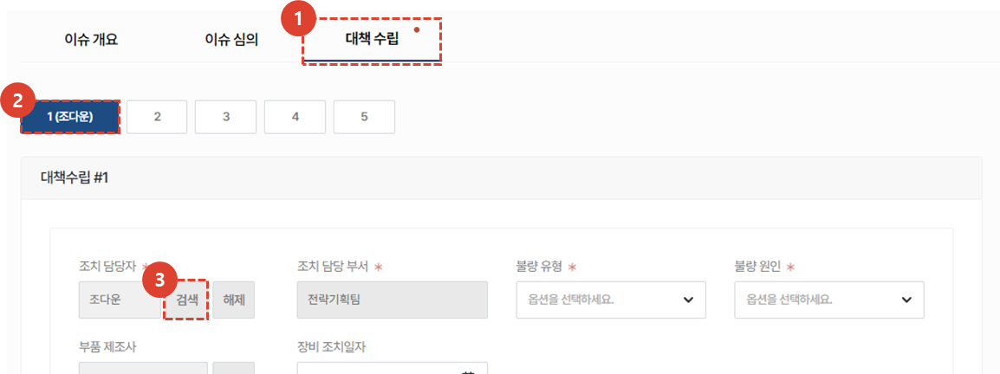
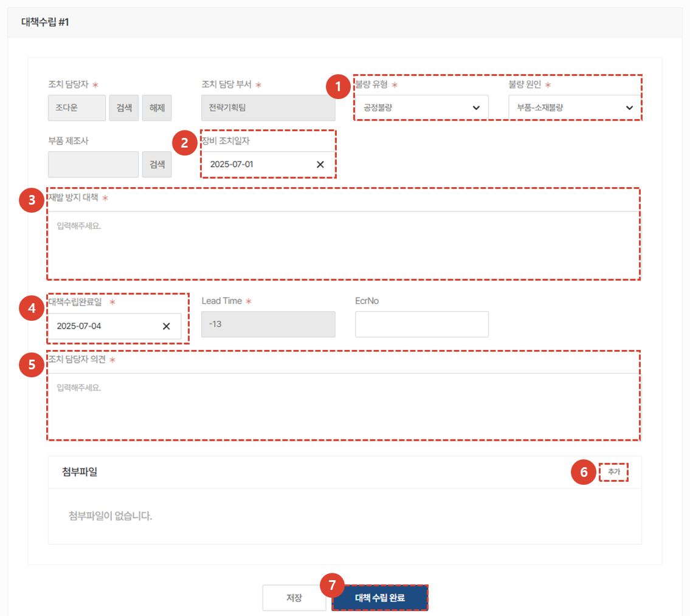
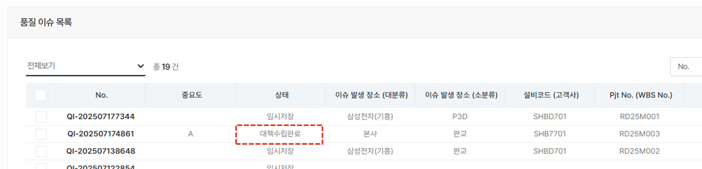
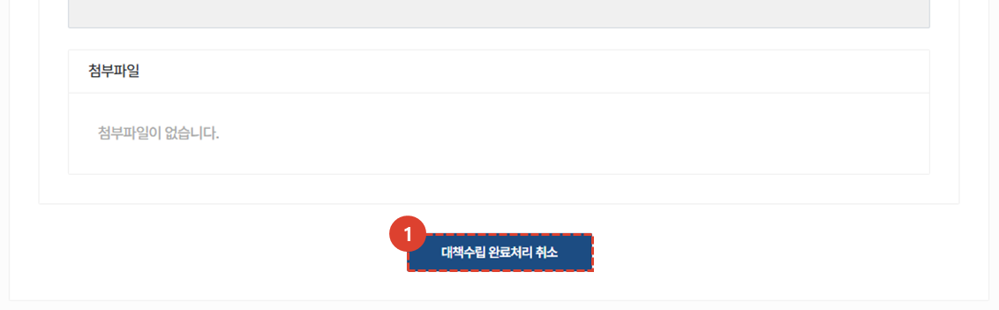
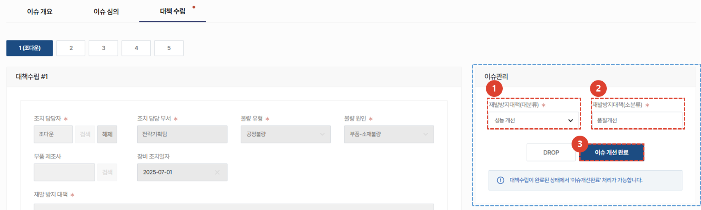
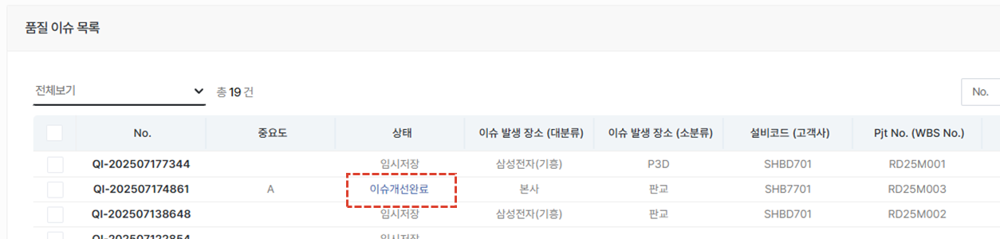

import ValidateTextByToken from "/src/utils/getQueryString.js";
import PopUp3 from "./img/024.png";
import PopUp4 from "./img/029.png";

# 이슈 대책 수립

<ValidateTextByToken dispTargetViewer={true} dispCaution={false} validTokenList={['head', 'branch']}>

## 이슈 대책 수립 중

:::info
**조치 담당자**가 조치와 관련된 내용을 등록하는 부분입니다. 
:::

### 대책수립 등록

1. **대책 수립** 탭을 클릭합니다. 
1. 대책은 **최대 5개**까지 등록이 가능합니다. 
1. **검색** 버튼을 눌러 대책을 입력할 조치 담당자를 등록합니다. 
    :::info
    등록된 조치 담당자명은 2번 항목에 표시됩니다. 
    :::
 
 

### 대책수립 상세 내용 등록

1. **불량 유형** 및 **원인**을 선택합니다. 
1. **장비 조치일자**를 등록합니다. 
    :::warning
    대책 수립 완료일은 하단 대책수립완료일에 입력하시기 바랍니다.
    :::
1. **재발 방지 대책**을 구체적으로 작성합니다. 
1. **대책 수립 완료 일자**를 등록합니다. 
    :::warning
    장비 조치일자는 상단 장비 조치일자에 입력하시기 바랍니다.
    :::
1. 조치 담당자 **의견**을 상세히 입력합니다. 
1. 관련 첨부자료가 있을 경우, 추가 버튼을 클릭하여 **첨부파일**을 등록합니다. 
1. **대책 수립 완료** 버튼을 클릭합니다. 
    :::info
    

     다음과 같은 팝업창이 추가로 나타나며 **대책수립완료** 버튼 클릭 시 관련자들에게 관련 메일이 전송됩니다. 
    :::
 
 

## 이슈 대책 수립 완료

### 완료 상태 확인

 조치 담당자가 대책수립을 완료하면 위와같은 **이메일이 전송**됩니다. 
 **대책 상세 페이지로 이동**을 클릭하여 CRM의 해당 페이지로 이동 할 수 있습니다. 
 
 

 품질 이슈 목록에서 **대책수립완료** 상태를 확인 할 수 있습니다.
 
 

### 완료처리 취소

1. 완료된 대책 수립의 **취소**가 필요한 경우 버튼을 클릭하여 취소할 수 있습니다. 
 
 

## 이슈 개선 완료

 이슈 대책 수립이 완료된 건이 있으면, 대책수립탭에 오른쪽과같은 **이슈관리 항목이 활성화**됩니다. 
    :::warning
    이슈 개선 완료를 진행 할 경우 이슈 개요/이슈 심의/대책 수립 탭의 수정 및 취소가 불가하므로 모든 대책 수립이 완료된 후에 진행하시기 바랍니다.
    :::

1. **재발방지대책(대분류)**를 선택합니다.
1. **재발방지대책(소분류)**를 선택합니다. 
1. **이슈 개선 완료** 버튼을 클릭합니다. 
 
 

1. **이슈 처리 완료** 버튼을 클릭합니다. 
    :::warning
    완료 처리 후 되돌릴 수 없으므로 유의하여 진행하시기 바랍니다.
    :::
 
 

 완료된 이슈는 품질이슈목록에서 **이슈개선완료** 상태로 변경됩니다. 

</ValidateTextByToken>
