import ValidateTextByToken from "/src/utils/getQueryString.js";
import StrongTextParser from "/src/utils/textParser.js";
import text from "/src/locale/ko/SMT/tutorial-02-installation/02-details-project.json";
import PopUp1 from "./img/016.png";
import PopUp2 from "./img/017.png";
import PopUp3 from "./img/019.png";
import PopUp4 from "./img/023.png";
import PopUp5 from "./img/024.png";
import PopUp6 from "./img/030.png";

# 개요

생성된 설치시운전 프로젝트 관리 방법 및 첫번째 탭을 안내합니다. 

<ValidateTextByToken dispTargetViewer={true} dispCaution={false} validTokenList={['head', 'branch']}>

## 프로젝트 상세

1. **개요** : 설치시운전에 대한 기본적인 내용 및 요약, 납품 목록을 입력합니다. 
1. **프리미팅** : 위탁한 도비사 담당자가 입력하는 탭 입니다. 도비사 담당자는 설치시운전 **자료 제출 페이지** 링크를 문자로 받을 수 있습니다.
    설치시운전을 위해 고객과 진행한 프리미팅 내용이 입력됩니다.
1. **설치** : 위탁한 도비사 담당자가 입력하는 탭입니다. 설치시운전에 대한 상세한 내용을 등록할 수 있습니다. 
 
 

## 내용 1/2
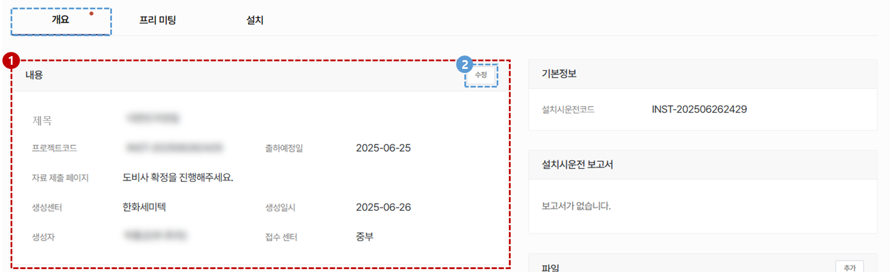

1. 설치시운전 프로젝트의 제목, 프로젝트 코드, 출하예정일, 자료 제출 페이지, 생성 센터, 생성 일시, 생성자 및 접수 센터를 확인 할 수 있습니다. 
    :::info
    도비사 확정 시, **자료 제출 페이지**에 링크가 표시되며 담당자에게 문자가 발송됩니다. 
     또한, 문자 재발송 버튼이 생성되어 도비사 담당자에게 자료 제출 요청 문자를 재전송 할 수 있습니다. 
    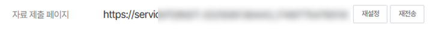
    :::
1. 기본 내용에 수정이 필요한 경우 **수정** 버튼을 클릭합니다. 
    :::info
    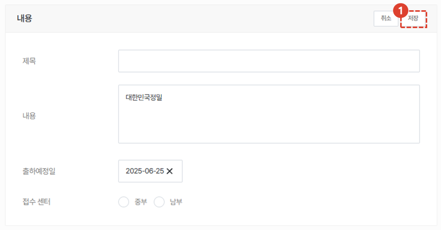
     제목, 내용, 출하예정일 및 접수 센터 수정이 가능합니다. 
    :::
 
 

## 내용 2/2
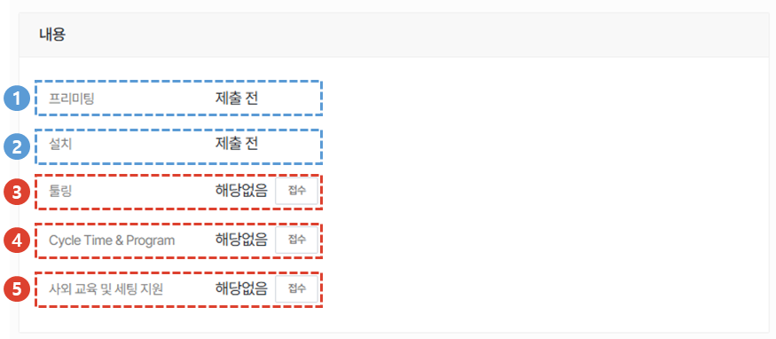
 프로젝트와 관련된 작업의 진행 사항을 확인 할 수 있습니다.

1. 도비사 담당자의 프리미팅 자료 제출 여부를 확인 할 수 있습니다.
1. 도비사 담당자의 설치 자료 제출 여부를 확인 할 수 있습니다.
1. 설치시운전을 진행하는 장비를 대상으로 툴링 요청이 발생하면 **접수**를 클릭하여 등록합니다. 
    :::info
    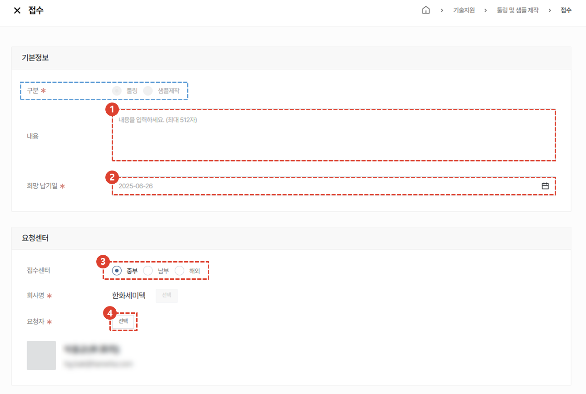
    1. 툴링 요청 내용을 작성합니다. 
    1. 희망 납기일을 입력합니다. 
    1. 접수를 받은 센터를 선택합니다. 
    1. 요청자를 선택합니다. 접수를 진행하는 사용자가 기본으로 등록되며 관련자 추가가 가능합니다.
    :::
1. Cycle Time & Program 요청이 발생하면, **접수**를 클릭하여 등록합니다. 
    :::info
    

    1. 프로젝트에 등록된 설비 중 접수를 진행할 모델을 선택합니다. 
    1. **추가** 버튼을 클릭하여 접수를 완료합니다. 
    :::
1. 사외 교육 및 세팅 지원 접수 요청이 발생하면, **접수**를 클릭하여 등록합니다. 
    :::info
    

    1. 프로젝트에 등록된 설비 중 접수를 진행할 모델을 선택합니다. 
    1. **추가** 버튼을 클릭하여 접수를 완료합니다. 
    :::
 
 

## 납품목록
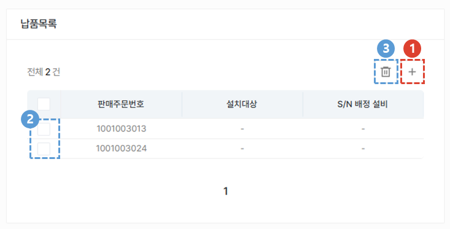
 설치시운전 프로젝트 접수 시 등록한 납품목록을 확인 할 수 있습니다.

1. 납품목록이 추가 될 경우 **+** 버튼을 클릭합니다. 
    :::info
    

    1. 추가 할 납품 목록을 선택합니다.
    1. **추가** 버튼을 클릭하여 납품 목록을 추가합니다.  
    :::
1. 삭제가 필요한 경우, 해당 목록을 체크합니다. 
1. 휴지통 아이콘을 클릭하여 삭제합니다.
 
 

## 설치 대상
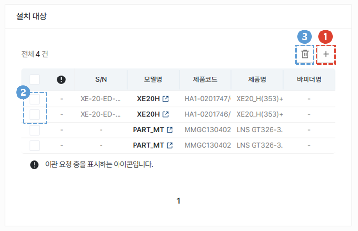
 설치 대상이 되는 설비 정보를 등록합니다. 

1. **+** 버튼을 클릭합니다. 
    :::info
    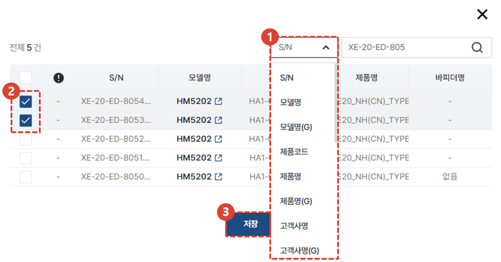
    1. S/N, 모델명, 제품코드 등의 정보를 이용해 설비를 검색합니다.
    1. 설치 대상으로 추가할 설비를 선택합니다. 
    1. **저장** 버튼을 클릭합니다.
    :::
1. 삭제가 필요한 경우, 해당 목록을 체크합니다. 
1. 휴지통 아이콘을 클릭하여 삭제합니다. 
 
 

## 관련 엔지니어
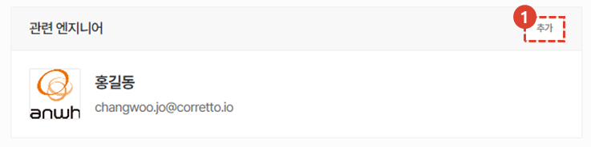
1. 설치시운전 접수 시 등록한 관련 엔지니어가 표시되며, 추가가 필요한 경우 **추가** 버튼을 클릭하여 수정합니다.
 
 

## 도비사
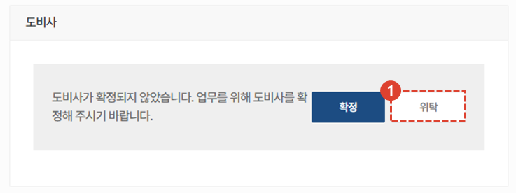
1. 도비사에 위탁이 필요한 경우 **위탁** 버튼을 클릭합니다. 
    :::warning
    

      도비사에 위탁을 하지 않고 **확정**하는 경우, 설치시운전 관련 엔지니어에게 자료 제출 페이지 주소가 문자로 전송됩니다.
    :::
 
 

1. **확인** 버튼을 클릭합니다.
 
 

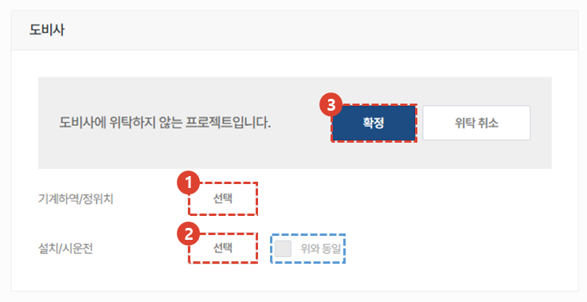
1. 기계하역/정위치 도비사를 선택합니다.
1. 설치/시운전 도비사를 선택합니다. 
      기계하역/정위치 도비사와 동일한 경우 **위와 동일** 체크박스를 선택합니다. 
1. **확정** 버튼을 클릭합니다.  클릭 시 도비사 담당자에게 자료 제출 페이지 주소가 문자로 전송됩니다.
 
 

## 공통내용
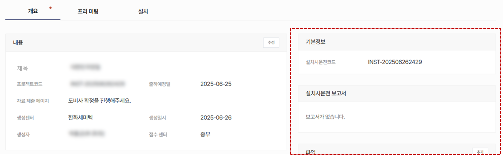
:::info
    프로젝트 상세 화면에서 각 탭에 공통으로 들어가는 내용입니다. 공통내용에 들어가는 각 항목은 하단의 내용을 참조해주세요.
:::
 
 

### 기본정보/설치시운전 보고서/파일
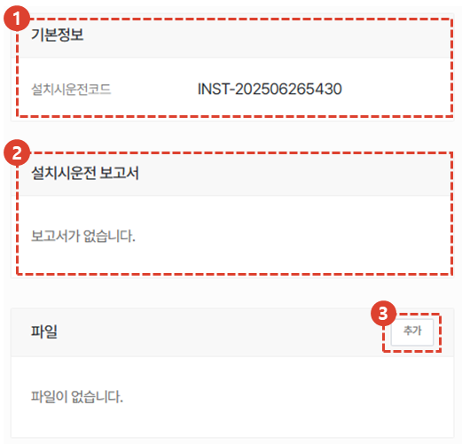
1. 설치시운전 프로젝트의 코드를 확인 할 수 있습니다.
1. **설치시운전 보고서**가 추가 될 예정입니다.
1. 프로젝트에 참고할만한 첨부파일을 추가할 수 있습니다.
 
 

### 고객사/고객사 검수 담당자
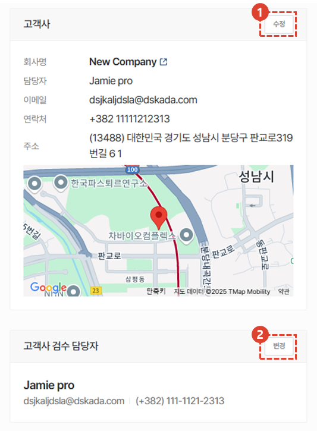
1. 고객사 정보를 확인하고, 수정이 필요한 경우 **수정** 버튼을 클릭합니다. 
1. 고객사 검수 담당자의 변경이 필요한 경우 **변경** 버튼을 클릭합니다. 
 
 

### 담당 센터/관리자/활동/코멘트
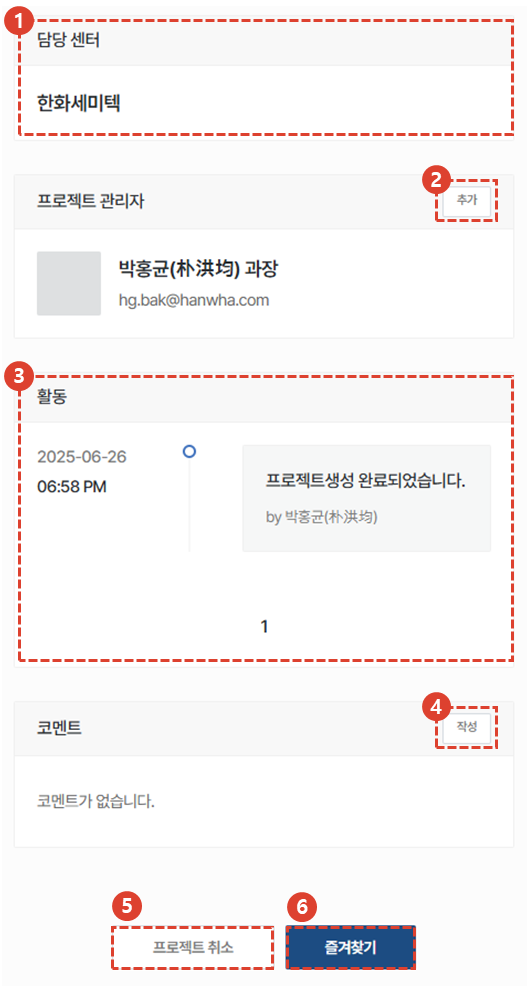
1. 담당 센터의 경우, 프로젝트 생성 이후 변경이 불가합니다. 
1. **추가** 버튼을 클릭하여 프로젝트 관리자를 추가할 수 있습니다.
1. 프로젝트의 활동 내역을 타임라인으로 확인 할 수 있습니다. 
1. 코멘트 작성으로 엔지니어 및 관리자간 소통을 할 수 있습니다. 
    :::info
    

    1. 코멘트 내용을 입력합니다. 
    1. **중요(알림 발송)**을 체크한 경우, 관련자들에게 문자 알림이 발송됩니다.
    1. 버튼을 클릭하여 코멘트 작성을 완료합니다. 
    :::
1. 프로젝트를 취소해야 할 경우 사용합니다. 설치시운전 작업이 완료되면 버튼이 비활성화 됩니다. 
1. **즐겨찾기**를 선택 할 수 있습니다.
</ValidateTextByToken>

