import ValidateTextByToken from "/src/utils/getQueryString.js";

# 교육 관리

온라인 및 집합교육 관리 방법을 안내합니다.

<ValidateTextByToken dispTargetViewer={true} dispCaution={true} validTokenList={['head', 'branch']}>

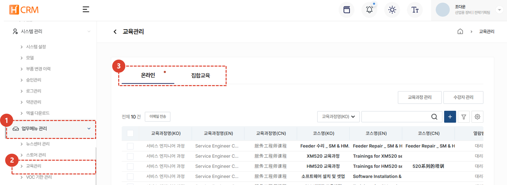
1. **업무메뉴 관리**를 클릭합니다. 
1. **교육관리**를 클릭합니다. 
1. **온라인** 및 **집합교육** 중 관리할 과정을 클릭합니다. 

## 온라인 교육

### 목록

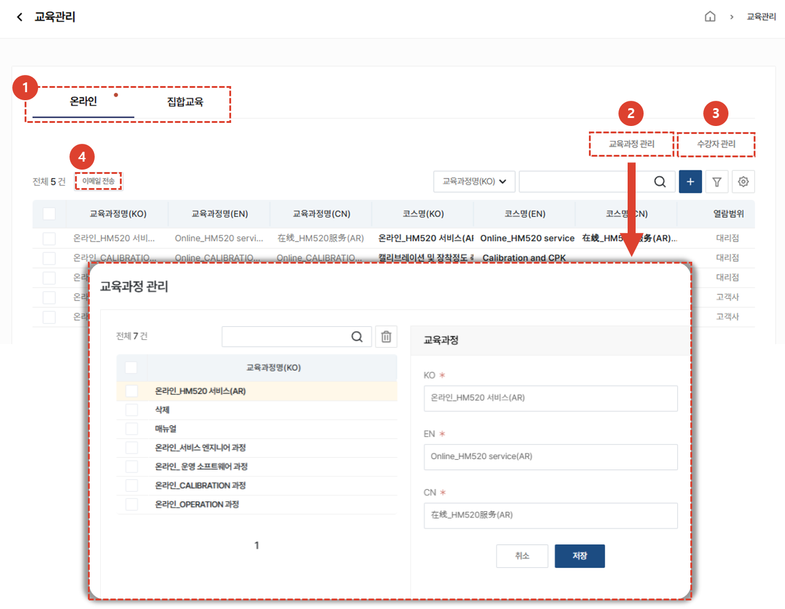
1. 온라인 / 오프라인 탭을 선택해 이동할 수 있습니다.
1. [교육과정 관리] 버튼을 클릭 시, 교육과정 관리 모달이 나타납니다. 교육과정을 등록, 수정, 삭제할 수 있습니다. 
1. [수강자 관리] 버튼을 클릭 시, [온라인 수강자 관리] 페이지로 이동합니다. 
1. 온라인 교육을 1개 선택 후, [이메일전송] 버튼을 클릭하여 코스 상세 링크를 이메일로 전송할 수 있습니다. 이때 보내지는 링크는 사용자단의 코스 상세 즉, 수강신청을 할 수 있는 페이지입니다. 
 
 

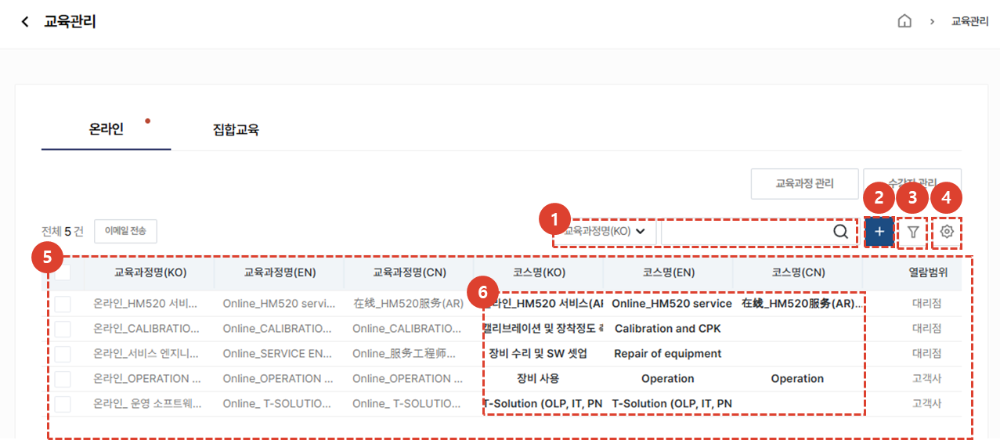
1. **카테고리**의 유형을 선택 후, 원하는 검색어로 검색할 수 있습니다.
1. [추가] 버튼을 클릭하여 코스를 등록할 수 있습니다.
1. [필터] 버튼을 클릭하여 상세 검색을 할 수 있습니다. 
1. [톱니바퀴] 버튼을 클릭하여 온라인코스 삭제, 테이블 관리, 엑셀다운로드를 할 수 있습니다.
1. 등록된 코스 목록을 볼 수 있습니다.
1. [코스명]을 클릭하여 [코스 상세]페이지로 이동합니다.
 
 

### 이메일 전송

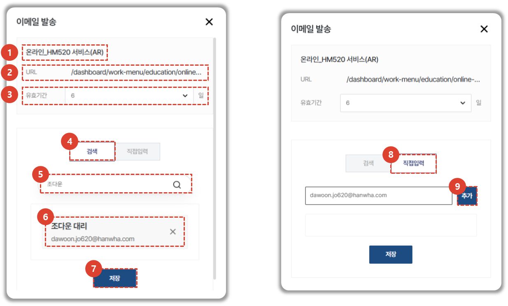
1. 코스 제목이 표시됩니다.
1. 공유할 코스 상세 링크가 표시됩니다. 이때 코스 선택은 [업무메뉴관리 > 온라인 교육관리]에서 하지만, 첨부되는 링크는 사용자단의 코스 상세입니다. 링크를 전송받은 사용자가 코스를 둘러보고, 수강신청을 할 수 있게 하기 위해서 입니다. 
1. 유효기간을 선택 할 수 있습니다. 링크를 전송받은 사용자는 유효기간 내에 링크를 통해 [코스 상세]에 접근할 수 있습니다.
1. [검색] 탭을 선택 시, 한화 그룹웨어 내에 존재하는 이름, 이메일을 검색할 수 있습니다. 
1. 이름 또는 이메일 검색하면 일치하는 항목이 드롭다운에 표시됩니다. 선택 시, 하단 목록에 추가됩니다. 
1. 이메일을 전송받을 사용자 목록이 표시됩니다. 그룹웨어에서 검색한 사용자는 이름, 직책, 이메일이 표시되고 직접입력한 경우 이메일만 표시됩니다. X를 클릭하여 사용자를 삭제할 수 있습니다.
1. [전송] 버튼 클릭 시, 사용자들에게 이메일이 전송됩니다. 
1. [직접입력] 탭을 선택 시, 링크를 공유하고 싶은 이메일을 자유롭게 입력할 수 있습니다. 
1. 이메일을 입력 후, [추가] 버튼 클릭 시, 하단 목록에 추가됩니다. 
 
 

### 코스 등록

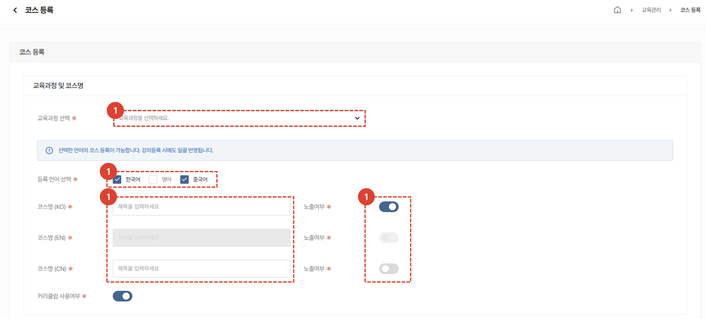
1. 교육과정을 선택할 수 있습니다.
1. 한/중/영 중 등록하고자 하는 언어를 선택할 수 있습니다. 선택하지 않은 언어는 코스명, 간단소개, 노출여부 설정, 태그등록, 썸네일, 비고, 자료실 등록이 Disabled 되어 입력할 수 없습니다. 
1. 코스명을 입력할 수 있습니다. 
1. 사용자단에 코스 노출여부를 선택할 수 있습니다. 임시저장 기능입니다.
 
 

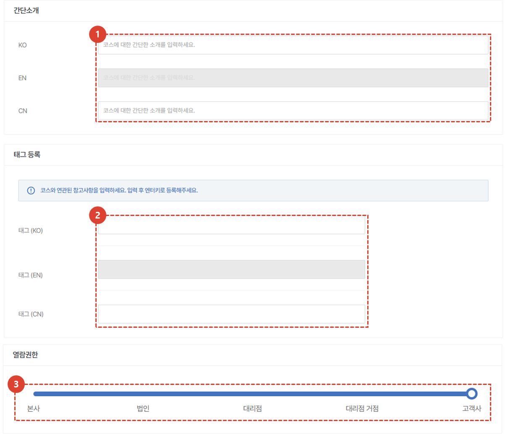
1. 코스의 간단소개를 작성할 수 있습니다. 작성된 내용은 사용자단의 [교육 > 온라인 교육 > 온라인 강의]의 코스 카드에서 확인할 수 있습니다. 
1. 코스와 관련되어 참고하면 좋을 내용을 자유롭게 입력할 수 있습니다.  **Ex) 인기강의, 필수, HM520 등**
1. 코스를 열람할 수 있는 열람권한을 선택할 수 있습니다. 
 
 

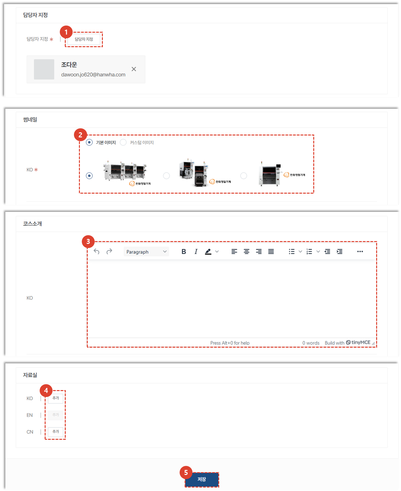
1. 해당 코스에 문의가 작성될 시, 대응할 수 있는 담당자를 지정할 수 있습니다. 지정된 담당자에겐 코스에 문의가 발생할 시, CRM알림과 이메일이 1. 전송됩니다. 
1. 사용자단에 보여질 코스의 썸네일을 기본 이미지와 커스텀 이미지 중 선택하여 등록할 수 있습니다.
1. 코스 소개를 작성할 수 있습니다. 작성된 내용은 사용자단의 [교육 > 온라인 교육 > 온라인 강의 > 코스상세 > 코스소개 탭]에서 확인할 수 있습니다. 
1. 자료를 추가할 수 있습니다. 
1. [등록] 버튼을 클릭하여 코스를 등록할 수 있습니다. 
    :::tip
    - 썸네일, 코스소개, 자료실은 언어에따라 개별적으로 작성할 수 있습니다. 
    :::
 
 

### 코스 수정
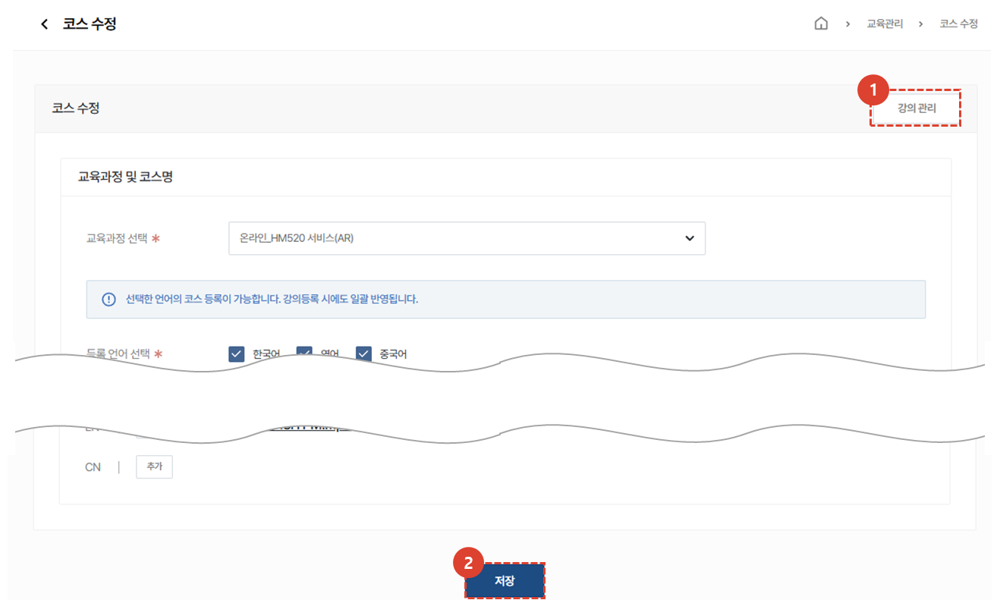
이미 작성된 코스의 경우, 코스 상세에서 내용을 수정할 수 있습니다. 
1. [강의관리] 버튼을 클릭하여 강의 관리 페이지로 이동할 수 있습니다. 수정사항을 저장하지 않을 시, 저장이 되지 않고 이동됩니다.
1. [저장] 버튼을 클릭하여 수정된 코스를 저장할 수 있습니다. 
 
 

### 코스 수정 - 강의관리 - 커리큘럼 등록 / 수정
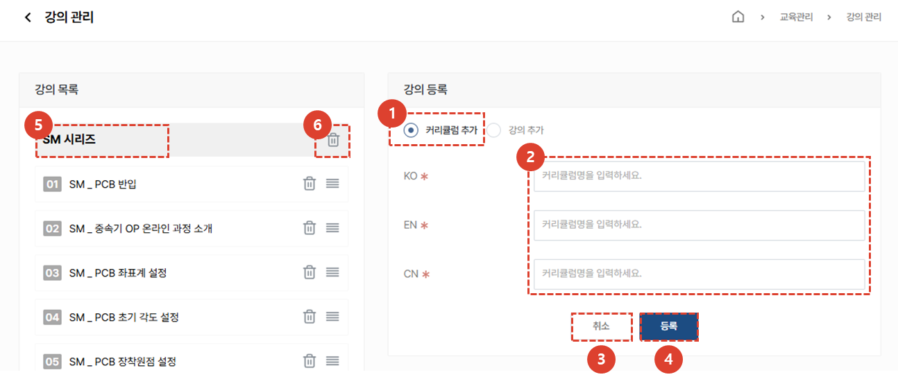
1. 커리큘럼 추가를 할 수 있습니다. 
1. 코스 등록시 선택한 언어가 강의관리 페이지에도 선택되어 있습니다. 
    :::tip
    - 강의관리에서는 별도의 언어선택이 불가하며 해당 언어의 강의가 준비되어있지 않더라도 커리큘럼명은 생성해두어야 합니다. 
    :::
1. 커리큘럼명을 입력할 수 있습니다. 
1. [취소] 버튼을 클릭하여 입력값을 초기화할 수 있습니다. 
1. [저장] 버튼을 클릭하여 커리큘럼을 등록할 수 있습니다. 
1. 커리큘럼명을 선택하여 수정화면으로 전환할 수 있습니다.
1. 휴지통 아이콘을 클릭하여 등록된 커리큘럼을 삭제할 수 있습니다. 
 
 

### 코스 수정 - 강의관리 - 커리큘럼 사용 강의 등록 / 수정

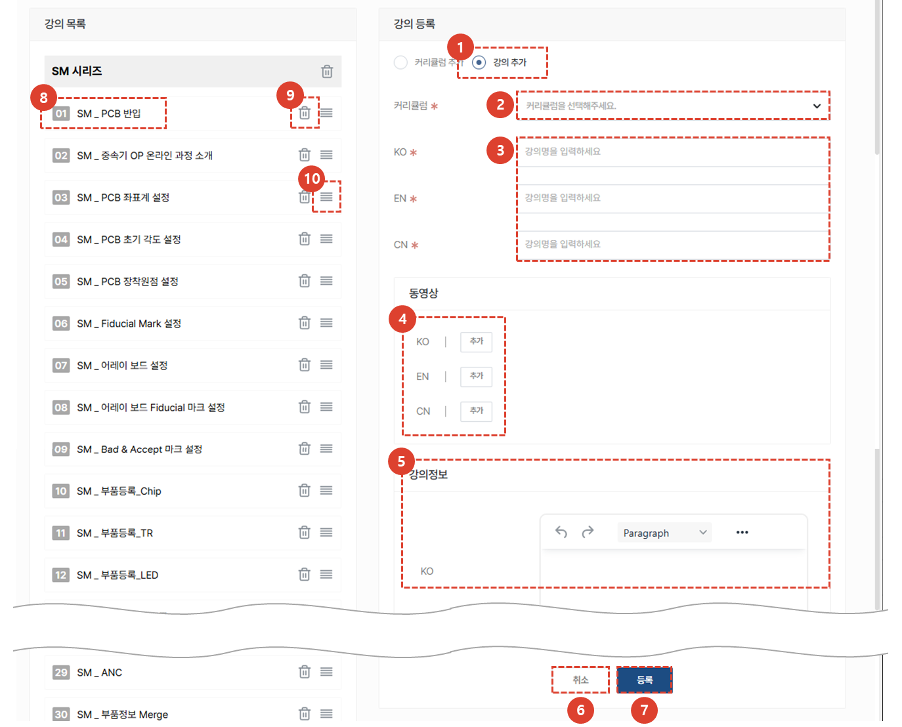
1. 강의 추가를 할 수 있습니다. 
    :::tip
    - 등록시 선택한 언어가 강의관리 페이지에도 선택되어 있습니다. 강의관리에서는 별도의 언어선택이 불가하며 해당 언어의 강의가 준비되어있지 않더라도 강의명은 생성해두어야 합니다. 
    :::
1. 커리큘럼을 선택할 수 있습니다. 선택한 커리큘럼 밑에 강의가 추가됩니다. 
1. 강의명을 입력할 수 있습니다. 
1. 동영상 파일을 첨부할 수 있습니다. 
1. 비고를 입력할 수 있습니다. 
1. [취소] 버튼을 클릭하여 입력값을 초기화할 수 있습니다. 
1. [저장] 버튼을 클릭하여 강의를 등록할 수 있습니다. 
1. 강의명을 선택하여 수정화면으로 전환할 수 있습니다.
1. 휴지통 아이콘을 클릭하여 등록된 강의를 삭제할 수 있습니다. 
1. 드래그 아이콘을 클릭 후, 드래그하여 커리큘럼내에서 강의순서를 조절할 수 있습니다. 
 
 

### 코스 수정 - 강의관리 - 커리큘럼 미사용 강의 등록 / 수정

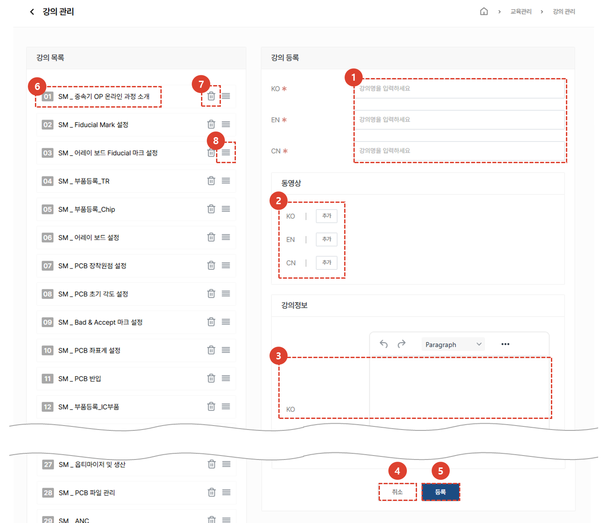
1. 강의명을 입력할 수 있습니다. 
    :::tip
    - 등록시 선택한 언어가 강의관리 페이지에도 선택되어 있습니다. 강의관리에서는 별도의 언어선택이 불가하며 해당 언어의 강의가 준비되어있지 않더라도 강의명은 생성해두어야 합니다. 
    :::
1. 동영상 파일을 첨부할 수 있습니다. 
1. 강의 내요을 입력할 수 있습니다. 
1. [취소] 버튼을 클릭하여 입력값을 초기화할 수 있습니다. 
1. [저장] 버튼을 클릭하여 강의를 등록할 수 있습니다. 
1. 강의명을 선택하여 수정화면으로 전환할 수 있습니다.
1. 휴지통 아이콘을 클릭하여 등록된 강의를 삭제할 수 있습니다. 
1. 드래그 아이콘을 클릭 후, 드래그하여 강의순서를 조절할 수 있습니다. 
 
 

### 수강자 관리

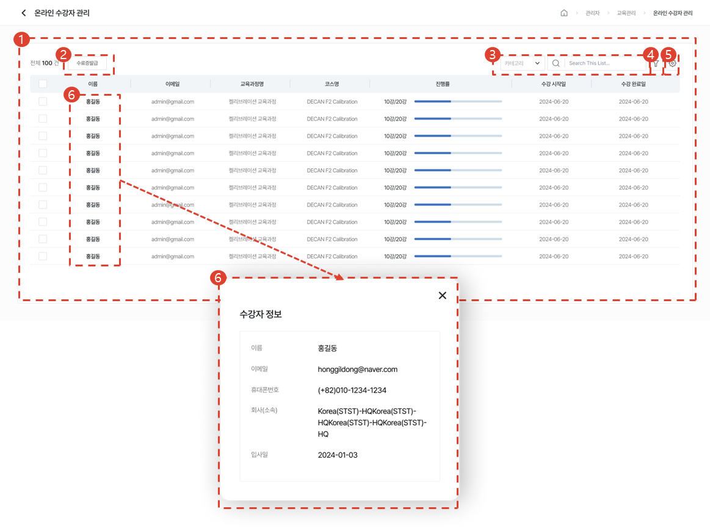

1. 온라인 수강자 목록을 볼 수 있습니다. 
1. 수강자를 선택 후, [수료증발급] 버튼을 클릭하여 수료증을 발급받을 수 있습니다. 
1. Selectbox의 유형을 선택 후, 원하는 검색어로 검색할 수 있습니다.
1. [필터] 버튼을 클릭하여 상세 검색을 할 수 있습니다. 
1. [톱니바퀴] 버튼을 클릭하여 테이블 관리, 엑셀다운로드를 할 수 있습니다.
1. 이름 클릭시, 수강자 정보 모달이 열립니다. 
 
 

## 집합교육
### 목록
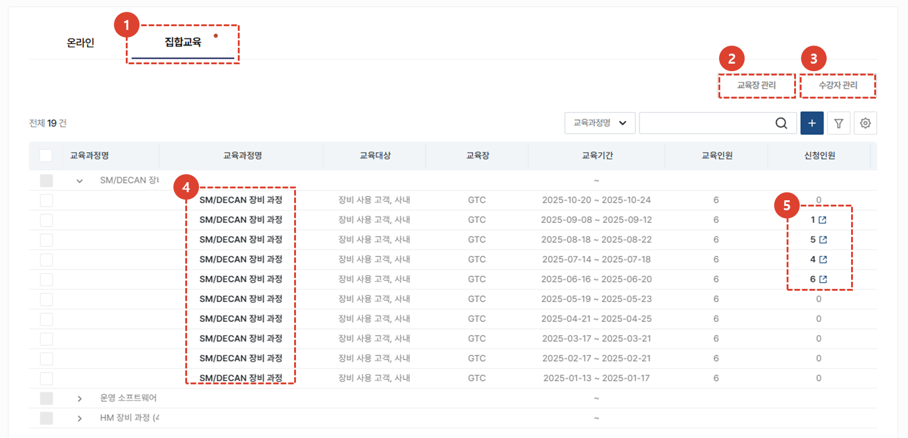
1. **집합교육** 탭을 클릭하여 집합교육 관리를 시작합니다. 
1. **교육장 관리** 버튼 클릭 시, 교육장 정보를 신규추가하거나 수정할 수 있습니다. 
1. **수강자 관리** 버튼 클릭 시, 집합 교육을 신청한 전체 수강자를 확인하고 수강 만족도 조사를 전송할 수 있습니다. 
    :::warning
    해당 버튼 클릭 시 **전체 교육에 대한 수강자 리스트**를 확인 할 수 있습니다. 
    :::
1. **교육과정명**을 클릭하여 집합교육과정 수정 페이지로 이동합니다. 개설된 집합교육의 내용을 수정 할 수 있습니다. 
1. **신청인원**이 있는 경우 클릭하여 집합교육 수강자 관리 페이지로 이동합니다. 해당 교육의 수강자를 대상으로 수강 만족도 조사를 전송할 수 있습니다. 
    :::warning
    개별 교육의 신청인원을 클릭하면 **해당 교육의 수강자 리스트만 확인** 할 수 있습니다.
    :::
 
 

### 교육장 관리 - 목록
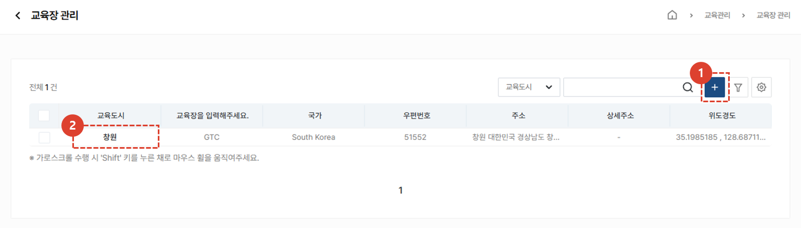
등록된 교육장 목록을 볼 수 있습니다.
1. **+** 버튼을 클릭하여 교육장을 신규 추가할 수 있습니다.
1. **교육도시**를 클릭하여 교육장 정보를 수정할 수 있습니다.
 
 

### 교육장 관리 - 추가 및 수정
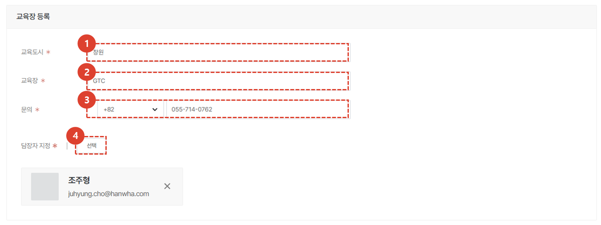
1. 교육이 운영되는 도시명을 입력하세요.
1. 교육이 운영되는 교육장명을 입력하세요.
1. 교육장에 문의할 수 있는 번호를 입력하세요.
1. 해당 오프라인교육과정에 문의가 작성될 시, 대응할 수 있는 담당자를 지정할 수 있습니다. 지정된 담당자에겐 오프라인교육과정에 문의가 발생할 시, CRM알림과 이메일이 전송됩니다. 
 
 

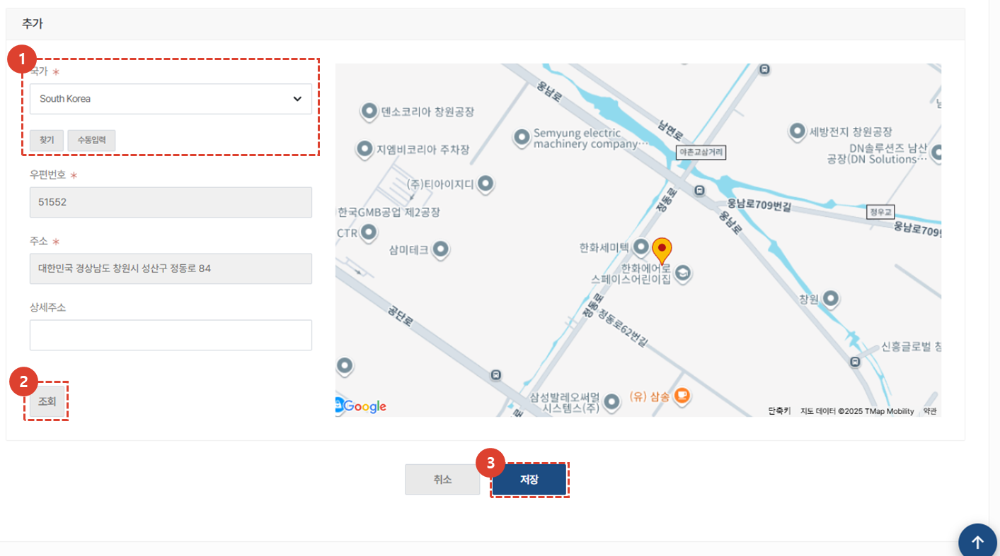
1. 교육장이 운영되는 국가 및 주소를 입력합니다.
1. 주소를 입력하여 **조회** 버튼을 클릭 시, 지도에서 위치를 확인할 수 있습니다. 
1. **저장** 버튼을 클릭 시, 교육장이 추가됩니다. 
 
 

### 수강자 관리
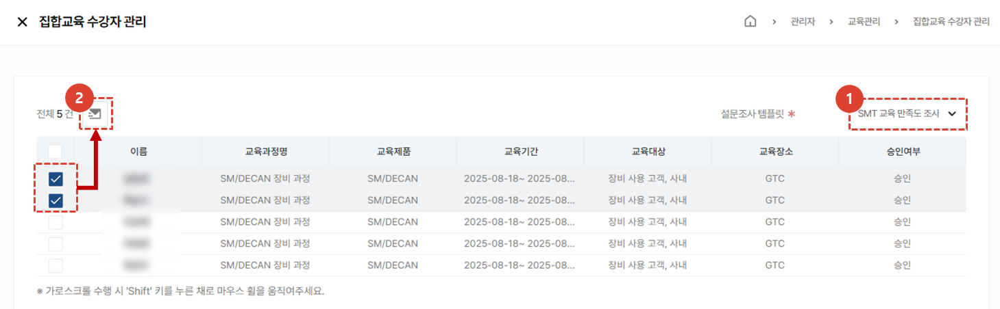
오프라인 수강자 목록을 확인하고, 수강 만족도 조사를 보낼 수 있습니다. 
1. 수강자에게 전송할 설문조사 템플릿을 선택합니다.
1. 수강자를 선택 후, **이메일** 버튼을 클릭합니다. 
    :::warning
    이메일 버튼 클릭 시 설문 대상에 추가됩니다. 
    설문 대상은 **만족도 조사 메뉴 > 교육 만족도 탭 > 설문 결과 및 상세 버튼 > 설문지 관리 탭 > 설문대상**에서 확인 할 수 있습니다. 
    :::
 
 

:::warning
설문조사 **재발송 시, 기존의 답변 내역은 삭제**되므로 설문에 응답한 수강자에게 재발송할 경우 이를 유의하시기 바랍니다. 
:::
1. 수강자에게 발송할 설문조사 채널을 선택합니다. 
    :::info
    SMS 및 EMAIL 모두 선택 가능합니다.
    :::
1. 전송 버튼을 클릭하면 설문조사가 발송됩니다.
</ValidateTextByToken>