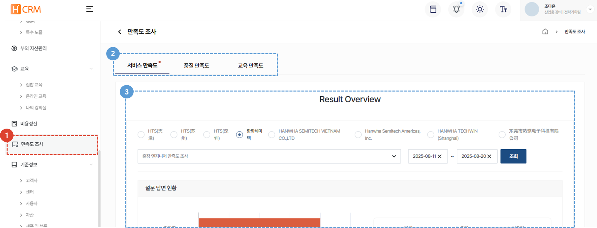

import ValidateTextByToken from "/src/utils/getQueryString.js";

# 만족도 조사

서비스, 품질, 교육에 대한 만족도 조사 설문지를 생성하고 결과를 관리할 수 있습니다. 

<ValidateTextByToken dispTargetViewer={true} dispCaution={true} validTokenList={['head']}>

## 목록

1. **만족도 조사** 메뉴를 클릭합니다. 
1. **서비스 만족도, 품질 만족도, [교육 만족도](./02-traning.md)** 탭을 클릭하여 설문조사 생성 및 관리를 할 수 있습니다. 
1. 해당 탭의 상세 내용을 제공합니다.

</ValidateTextByToken>