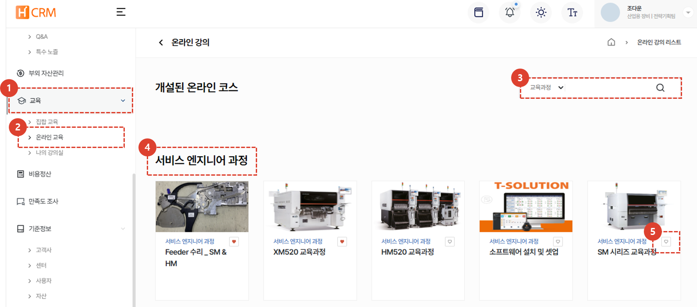
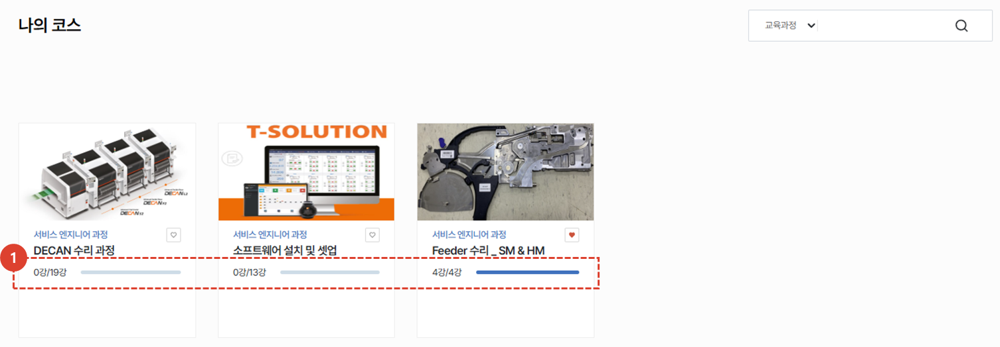
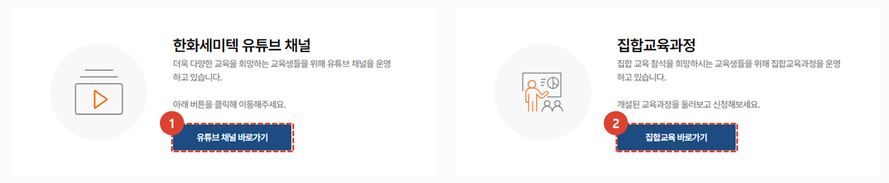
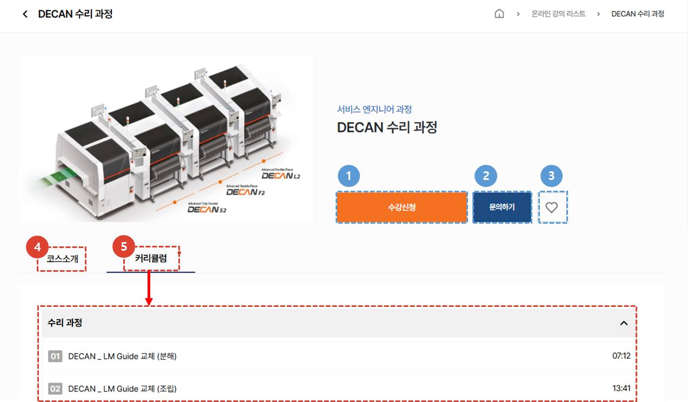
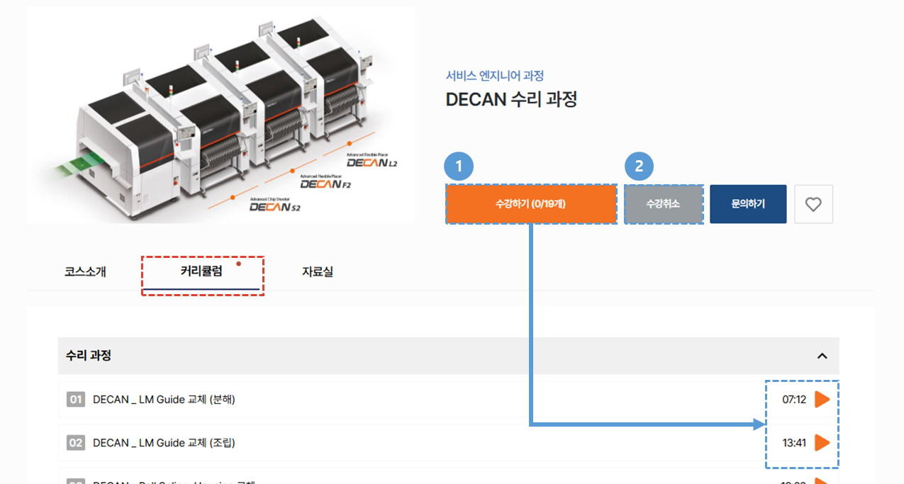
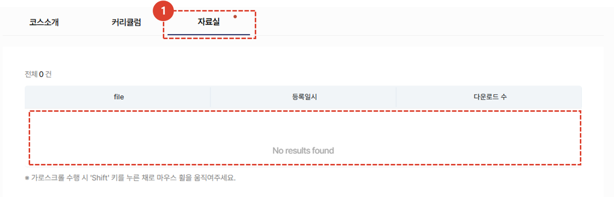
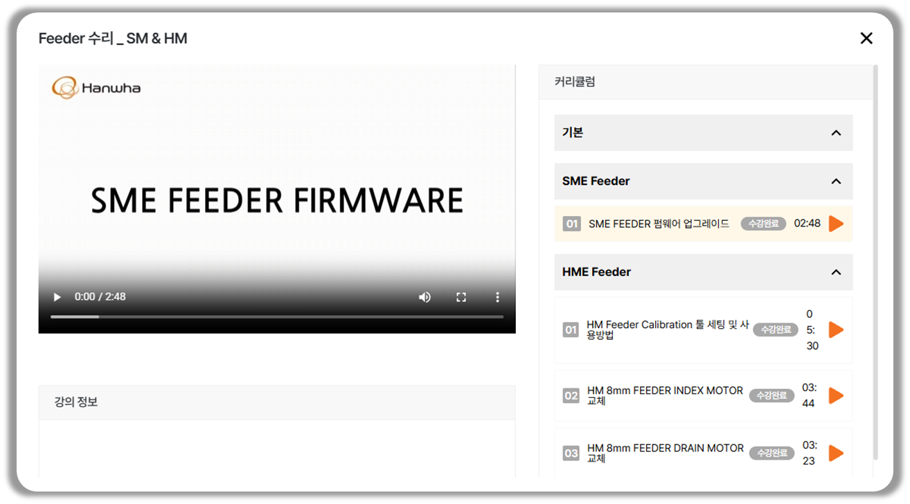
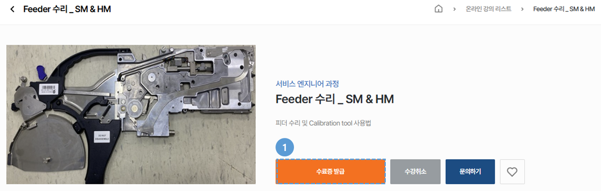

import ValidateTextByToken from "/src/utils/getQueryString.js";
import qna from "./img/005.png";
import Popup1 from "./img/014.png";
import Popup2 from "./img/016.png";
import Popup3 from "./img/018.png";

# 온라인 교육
온라인 교육과정의 소개와 수강 절차에 대해 안내합니다.
<ValidateTextByToken dispTargetViewer={true} dispCaution={true} validTokenList={['head', 'branch', 'seller', 'agent', 'customer']}>

## 온라인 교육 목록
### 온라인 코스

1. **교육** 메뉴를 클릭합니다.
1. **온라인 교육** 메뉴를 클릭하면 개설된 온라인 교육 과정을 볼 수 있습니다. 
1. Selectbox의 유형을 선택 후, 원하는 검색어로 검색할 수 있습니다.
1. 온라인코스 목록입니다. 제목을 클릭하여 코스의 상세페이지로 이동이 가능합니다. 
1. **♡** 버튼 클릭 시, [**나의 강의실 > 나의 관심코스**](./03-my-lecture.md)에 코스가 저장됩니다.
 
 

### 나의 코스

1. 수강중인 코스 목록입니다. 제목을 클릭하여 코스의 상세페이지로 이동이 가능하며 **수강 현황**을 확인 할 수 있습니다. 
 
 

### 유튜브 및 집합교육

1. **유튜브 채널 바로가기** 버튼을 클릭하여 한화정밀기계 유튜브 채널로 이동할 수 있습니다.
1. [**집합교육 바로가기**](./02-offline-lecture.md) 버튼을 클릭하여 집합교육교육 페이지로 이동할 수 있습니다.
 
 

## 코스 상세
### 수강 신청 전

1. **수강신청** 버튼을 클릭하여 수강신청을 할 수 있습니다. 
1. **문의하기** 버튼을 클릭 시 온라인교육 문의 페이지가 새탭으로 열립니다. 해당 페이지에서 문의내용을 작성할 수 있습니다.
    :::info
    

    문의 내용을 작성하고 저장하면 교육 담당자가 확인 후 문의 내용에 대한 답변을 발송합니다.
    :::
1. **♡** 버튼 클릭 시, [나의 강의실 > 나의 관심코스](./03-my-lecture.md)에 코스가 저장됩니다.
1. **코스소개** 탭을 클릭하여 해당 코스에 대한 소개 내용을 볼 수 있습니다. 
1. **커리큘럼** 탭을 선택하여 해당 과정의 영상 리스트를 확인 할 수 있습니다. 
 
 

### 수강 신청 후

1. **수강하기** 버튼 또는 커리큘럼의 **재생**버튼을 클릭하여 강의를 재생할 수 있습니다.
1. **수강취소** 버튼을 클릭하여 수강취소를 할 수 있습니다. 
    :::warning
    

    수강을 취소하면 **해당 코스의 모든 수강기록이 삭제**됩니다.     
    :::
1. 코스소개 / 커리큘럼 / 자료실 탭을 선택해 이동할 수 있습니다.
 
 

1. 자료명을 클릭하여 교육 관리자가 공유해둔 자료를 다운로드할 수 있습니다.
 
 

1. 수강 화면에서 현재 진행중인 수강 목록 및 커리큘럼을 확인 할 수 있습니다. 
    :::warning
    

     동영상 수강이 완료된 후, **수강 종료 팝업의 확인** 버튼을 눌러야 **수강완료 처리**가 됩니다.
    :::
    :::tip
    

     모든 강의의 수강이 완료되면, 수료증 발급 안내 팝업이 표시됩니다. 
     **확인** 버튼을 클릭하여 수료증발급을 페이지로 이동됩니다. (개발예정)
    :::
 
 

### 수강 완료

1. 모든 강의의 수강을 완료한 경우 **수료증 발급** 버튼이 활성화되며, 수료증을 다운로드 할 수 있습니다. (개발예정)
</ValidateTextByToken>