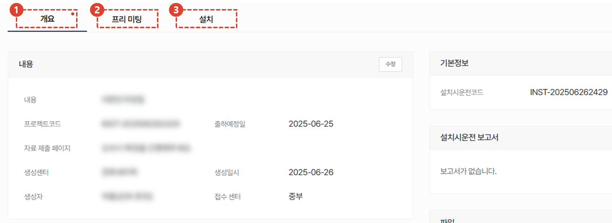
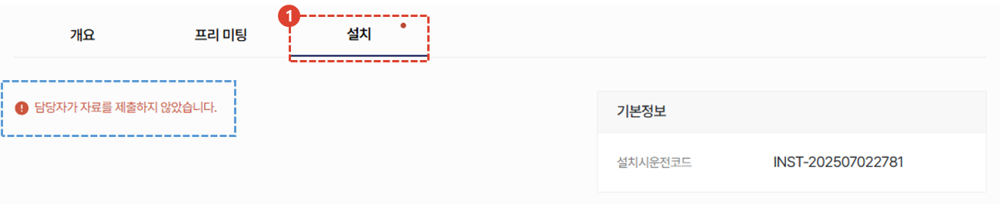
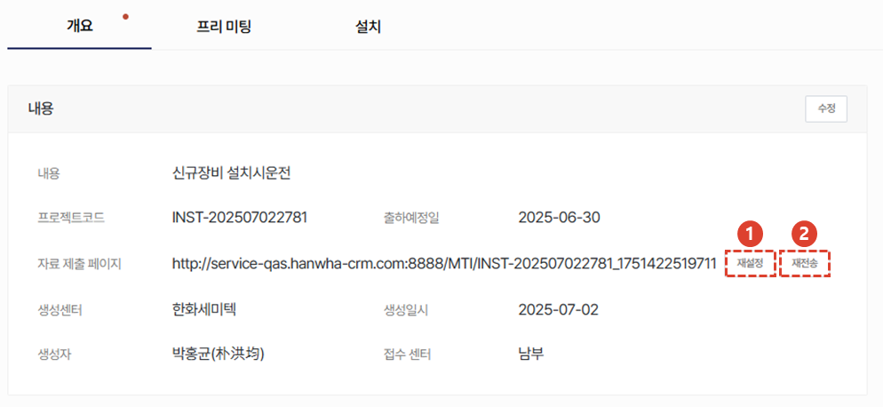
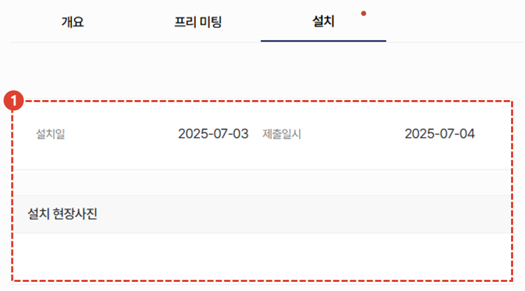
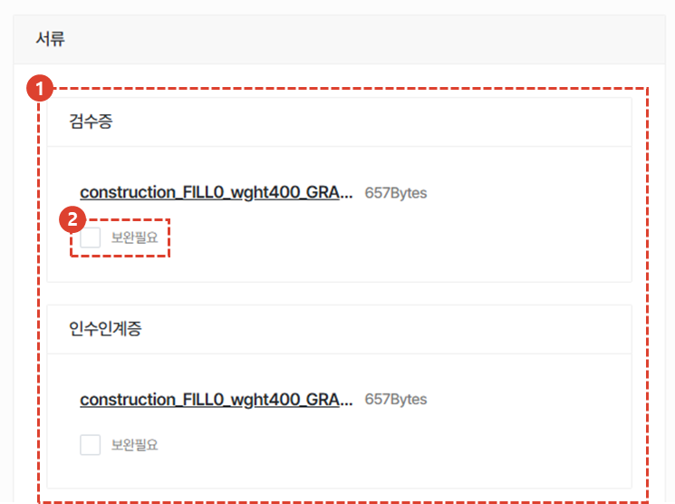
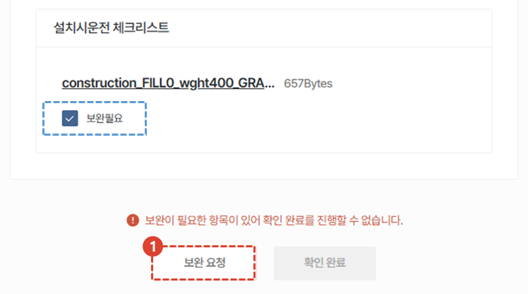
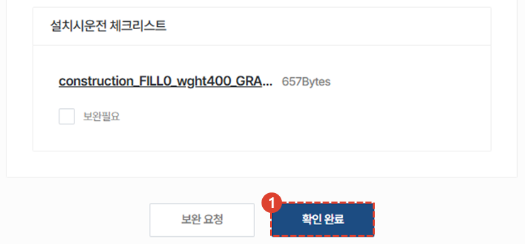
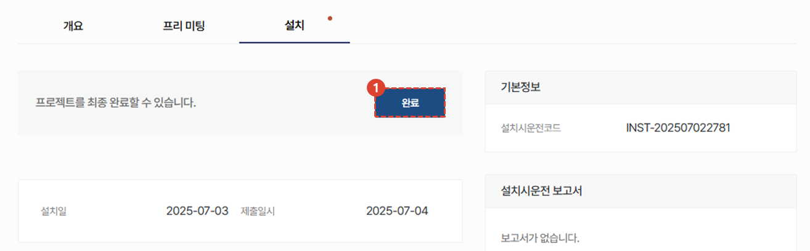

import ValidateTextByToken from "/src/utils/getQueryString.js";
import StrongTextParser from "/src/utils/textParser.js";
import text from "/src/locale/ko/SMT/tutorial-02-installation/02-details-project.json";
import PopUp6 from "./img/030.png";
import Mobile1 from "./img/033.png";
import Mobile8 from "./img/047.png";
import Mobile9 from "./img/048.png";
import Mobile10 from "./img/049.png";
import Popup3 from "./img/053.png";
import Popup4 from "./img/056.png";

# 설치

설치 내역 입력 및 처리 방법을 안내합니다.

<ValidateTextByToken dispTargetViewer={true} dispCaution={false} validTokenList={['head', 'branch']}>

## 프로젝트 상세

1. **개요** : 설치시운전에 대한 기본적인 내용 및 요약, 납품 목록을 입력합니다. 
1. **프리미팅** : 위탁한 도비사 담당자가 입력하는 탭 입니다. 도비사 담당자는 설치시운전 **자료 제출 페이지** 링크를 문자로 받을 수 있습니다.
    설치시운전을 위해 고객과 진행한 프리미팅 내용이 입력됩니다.
1. **설치** : 위탁한 도비사 담당자가 입력하는 탭입니다. 설치시운전에 대한 상세한 내용을 등록할 수 있습니다. 
 
 

## (본사)설치 자료 제출

  도비사에서 진행하는 설치 내역을 등록하고, 본사에서 확인 할 수 있는 탭 입니다. 

1. 설치 탭을 클릭합니다. 
:::warning
도비사에서 설치 내역을 입력하기 전 인 경우, 그림과 같이 "**담당자가 자료를 제출하지 않았습니다.**" 라는 문구가 표시됩니다. 
  **개요** 탭에서 도비사 담당자에게 설치 제출 문자를 재전송 할 수 있습니다. 
:::
 
 

### 자료 제출 문자 발송

설치시운전 프로젝트가 생성되면, 프로젝트 담당자들에게 관련 문자가 발송됩니다.
 프리미팅 및 설치 관련 자료 제출 문자를 받지 못한 경우, 문자 재전송이 가능합니다.

1. 자료 제출 페이지 링크를 재설정 할 수 있습니다. 
1. **재전송** 버튼 클릭 시 담당자에게 문자가 재전송됩니다.  
 
 

## (도비사)설치 자료 제출
:::info
**도비사 담당자**는 문자로 받은 링크에 접속하여 설치 자료를 제출해야 합니다.
:::

1. 프로젝트의 기본 정보 확인이 가능합니다. 
    :::info
    프로젝트 No., 고객사 명, 고객사 주소, 고객사 검수 담당자 명, 담당자 연락처, 출하 예정일을 확인 할 수 있습니다.
    :::
1. 설치 탭을 클릭합니다. 
 
 

1. 설치 시작일을 선택합니다. 
    :::warning
    설치 시작일을 기준으로 
    :::
1. 검수증을 촬영하여 등록합니다. 
1. 인수인계서를 촬영하여 등록합니다.
 
 

1. 안전교육 이수 확인서를 촬영하여 등록합니다. 
1. 작업내용 일지를 촬영하여 등록합니다. 
1. 설치시운전 체크리스트를 촬영하여 등록합니다. 
1. 설치 과정에 공유해야 할 사항을 입력합니다. 
1. 모든 항목의 입력이 완료되면 **제출** 버튼을 클릭합니다. 
    :::info
    

    1. **확인** 버튼을 클릭하여야 최종 제출이 완료됩니다. 
     제출이 완료되면 본사 담당자에게 확인 요청 메일이 발송됩니다.
    :::
 
 

## (본사)설치 보완 요청
:::info
설치 자료 제출이 완료되면 본사 담당자는 설치 내역을 확인하고 "확인완료" 처리를 해야합니다.
:::

1. 입력된 설치일 및 설치 현장 사진을 확인합니다.
 
 

1. 검수증, 인수인계증, 안전교육, 작업내용일지, 설치시운전 체크리스트를 확인합니다.
1. 설치 자료의 보완이 필요한 경우 해당 "보완필요" 체크박스를 클릭합니다. 
 
 

1. **보완요청** 버튼을 클릭합니다. 

1. 보완요청을 하는 사유를 입력하고 **확인** 버튼을 클릭합니다.
     보완이 요청되면 설치 담당자에게 보완요청 문자 메세지가 발송됩니다.
 
 

## (본사)설치 확인완료

1. 본사 담당자는 프리미팅 내역을 확인한 뒤 **확인완료** 버튼을 클릭합니다. 
    :::info
    **확인완료** 버튼을 클릭하면 프로젝트를 최종 완료할 수 있는 버튼이 활성화됩니다. 
     프로젝트를 최종 완료하기 전까지는 각 항목에 대하여 수정 요청이 가능합니다. 
    :::
 
 

1. **완료** 버튼을 클릭하여 프로젝트를 최종 완료합니다. 
    :::info
    
    

    1. **저장** 버튼을 클릭하여 상태를 변경합니다. 설치시운전 완료 처리 후에는 상태 변경이 불가함을 유의하여야합니다. 
    :::
 
 

## 공통내용

:::info
    프로젝트 상세 화면에서 각 탭에 공통으로 들어가는 내용입니다. 공통내용에 들어가는 각 항목은 하단의 내용을 참조해주세요.
:::
 
 

### 기본정보/설치시운전 보고서/파일

1. 설치시운전 프로젝트의 코드를 확인 할 수 있습니다.
1. **설치시운전 보고서**가 추가 될 예정입니다.
1. 프로젝트에 참고할만한 첨부파일을 추가할 수 있습니다.
 
 

### 고객사/고객사 검수 담당자

1. 고객사 정보를 확인하고, 수정이 필요한 경우 **수정** 버튼을 클릭합니다. 
1. 고객사 검수 담당자의 변경이 필요한 경우 **변경** 버튼을 클릭합니다. 
 
 

### 담당 센터/관리자/활동/코멘트

1. 담당 센터의 경우, 프로젝트 생성 이후 변경이 불가합니다. 
1. **추가** 버튼을 클릭하여 프로젝트 관리자를 추가할 수 있습니다.
1. 프로젝트의 활동 내역을 타임라인으로 확인 할 수 있습니다. 
1. 코멘트 작성으로 엔지니어 및 관리자간 소통을 할 수 있습니다. 
    :::info
    

    1. 코멘트 내용을 입력합니다. 
    1. **중요(알림 발송)**을 체크한 경우, 관련자들에게 문자 알림이 발송됩니다.
    1. 버튼을 클릭하여 코멘트 작성을 완료합니다. 
    :::
1. 프로젝트를 취소해야 할 경우 사용합니다. 설치시운전 작업이 완료되면 버튼이 비활성화 됩니다. 
1. **즐겨찾기**를 선택 할 수 있습니다.

</ValidateTextByToken>

