import ValidateTextByToken from "/src/utils/getQueryString.js";
import filterList from "./img/002.png";
import searchList from "./img/053.png";
import tableFilter from "./img/006.png";
import createLabor from "./img/013.png";

# 자산

자산 데이터 관리에 대한 안내입니다. 자산 메뉴에서 보증기간 관리 및 보증서 발급이 가능합니다.

<ValidateTextByToken dispTargetViewer={true} dispCaution={true} validTokenList={['head', 'branch', 'seller', 'agent']}>

## 목록
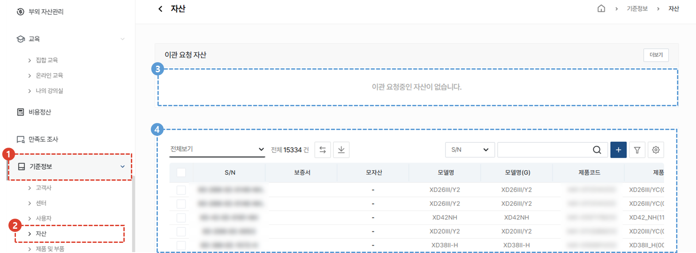
1. 기준정보 메뉴를 클릭합니다.
1. 자산 메뉴를 클릭합니다. 
1. 자산의 정보 중 센터 또는 고객사 변경으로 이관 요청 중인 자산이 표시됩니다. 
    :::info
    본사 및 법인의 자산 관리 **담당자가 이관 승인**을 해야만 이관이 완료됩니다. 
    :::
1. 자산 목록을 확인하고 S/N를 클릭하여 자산의 상세 정보를 확인하거나 자산의 수정 및 신규 등록을 할 수 있습니다.
 
 

## 자산 추가
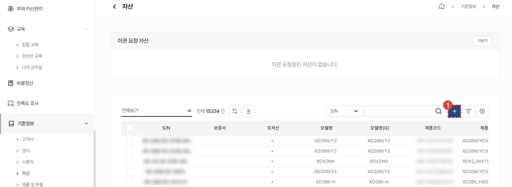
1. 자산의 신규 등록을 위해 **+** 버튼을 클릭합니다. 
 
 

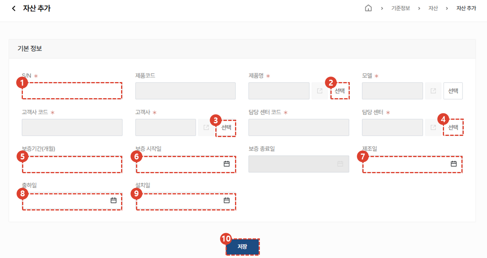
1. **S/N**를 입력합니다. 
1. **제품명**을 선택합니다. 제품명 선택 시 제품코드가 자동 입력됩니다. 
1. **모델**을 선택합니다. 
1. **고객사**를 선택합니다. 고객사 선택 시 고객사 코드가 자동 입력됩니다. 
1. **담당 센터**를 선택합니다. 담당 센터 선택 시 담당 센터 코드가 자동 입력됩니다. 
1. **보증기간(개월)**을 입력합니다. 미 입력시 기본 24개월로 계산됩니다. 
1. **보증시작일**을 입력합니다.
    :::warning
    미입력시 **출하일을 기준**으로 보증기간이 계산됩니다.
    :::
1. **제조일**을 입력합니다.
1. **출하일**을 입력합니다. 보증시작일이 등록되어있지 않은 경우 출하일을 기준으로 보증기간이 계산됩니다. 
1. 고객사에 제품을 설치한 **설치일**을 입력합니다. 아직 설치가 진행되지 않은 경우 입력하지 않습니다. 
1. **저장** 버튼을 클릭하여 자산 추가를 완료합니다. 
 
 

## 자산 정보 수정
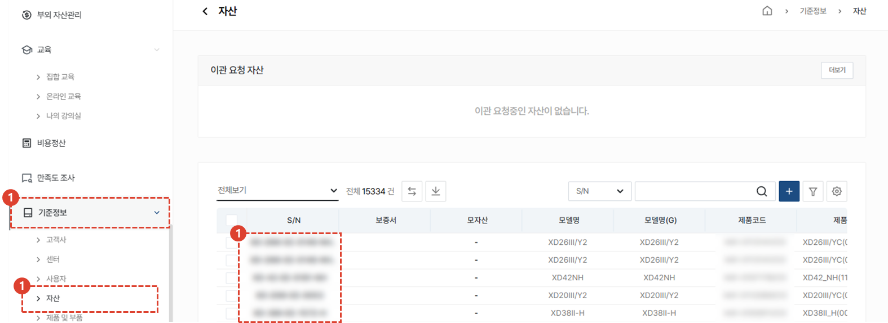
1. **기준정보** 메뉴를 클릭합니다. 
1. **자산** 메뉴를 클릭합니다.
1. 수정이 필요한 자산의 **S/N**를 클릭합니다.  

 
 

### 기본정보 수정
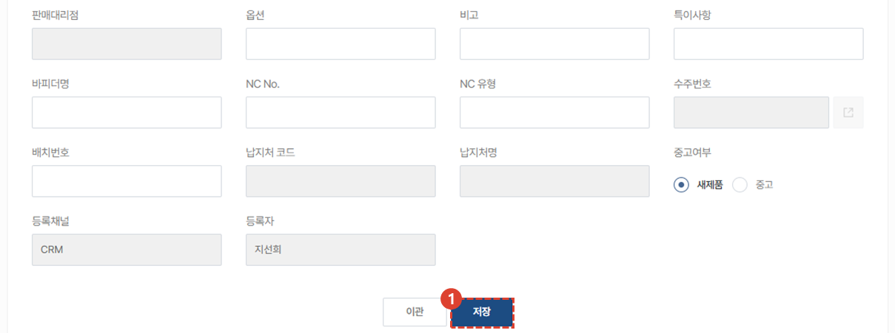
1. 변경할 내용을 입력하고 **저장** 버튼을 클릭합니다.
 
 

### 자산 이관
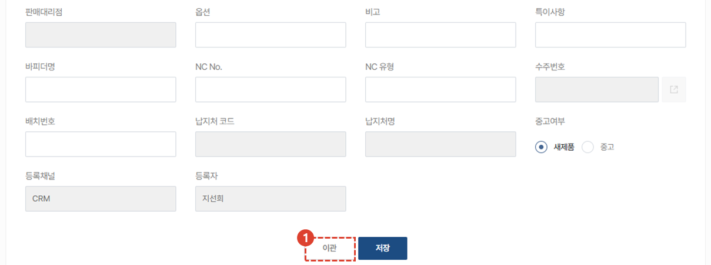
1. 고객사 및 센터 이관이 필요한 자산의 상세 화면에서 **이관** 버튼을 클릭합니다.
 
 

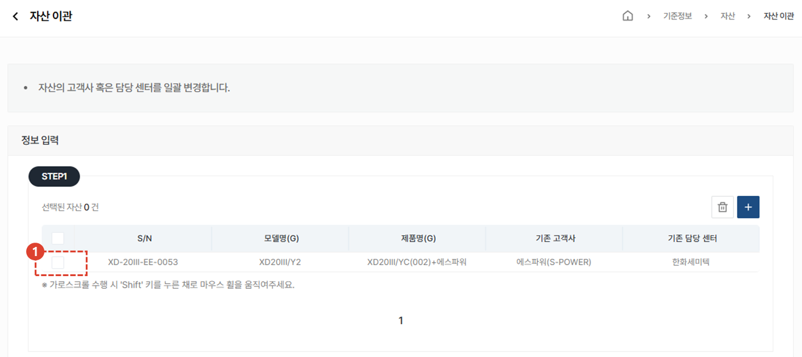
1. 이관할 **자산을 선택**합니다. 
 
 

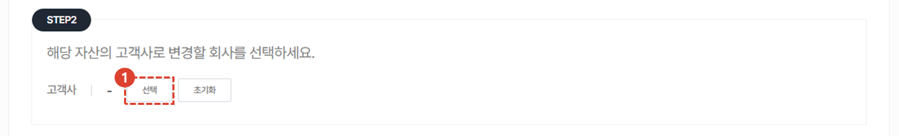
1. 해당 자산의 **고객사**로 변경할 회사를 **선택**합니다. 
 
 

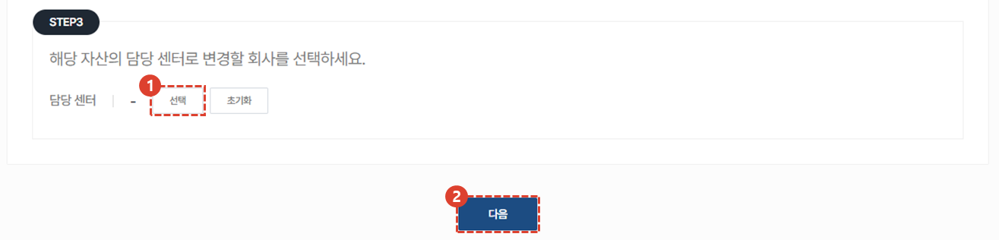
1. 해당 자산의 **담당 센터**로 변경할 회사를 **선택**합니다. 
1. **다음** 버튼을 클릭합니다. 
 
 

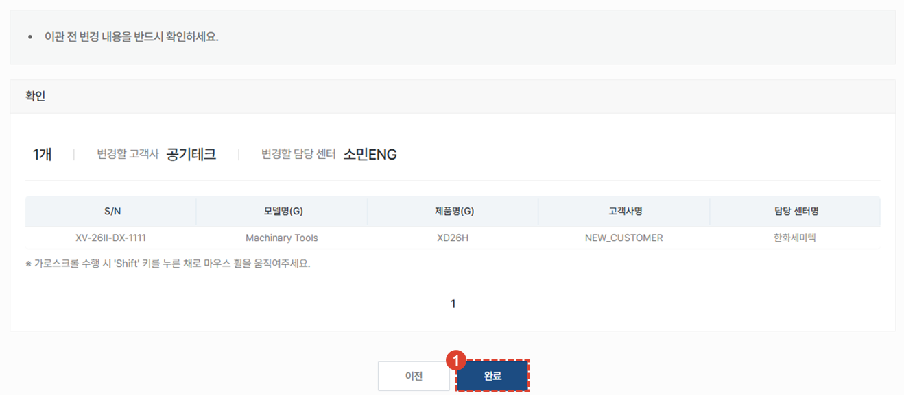
1. 변경될 내용을 확인하고 **완료**버튼을 클릭합니다. 
:::info
**완료**버튼을 누르면 자산 [**관리 담당자는 이관 승인 요청을 검토**](#목록) 할 수 있습니다.
자산 이관은 본사 및 법인의 자산 관리 담당자가 최종 승인 후에 완료됩니다. 
:::
 
 

### 보증기간 갱신
:::tip
자산의 상세 화면에서 **보증기간을 갱신** 할 수 있습니다. 
 해외 법인의 보증기간 생성은 **보증기간 관리** 메뉴에서 수행할 수 있습니다.
:::

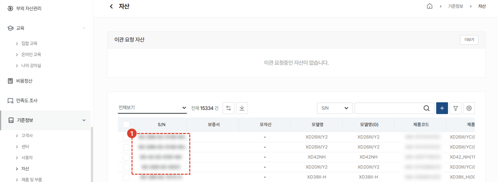
1. 보증기간 갱신이 필요한 자산의 S/N를 클릭합니다. 
 
 

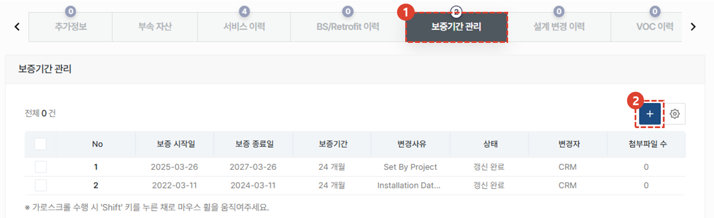
:::warning
목록이 비어있는 경우에는 보증기간을 **출하일** 기준으로 임시 계산합니다. 이 경우 보증서 출력이 불가합니다.  **보증서 출력을 원할 경우 보증기간 관리에서 보증기간 추가를 수행해야 합니다.**
:::
1. 자산 상세 화면 하단의 탭 중, **보증기간 관리** 탭을 클릭합니다. 
1. **+** 버튼을 클릭합니다. 
 
 

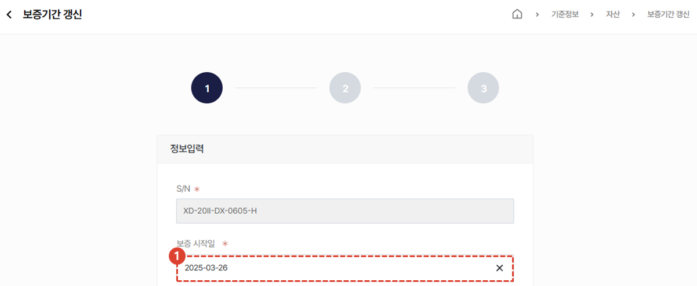
1. **보증 시작일**을 입력합니다. 
 
 

1. 보증종료일 **입력 방식**을 선택합니다. 
1. **보증기간(개월)**을 입력합니다. 
    :::warning
    보증기간을 임의로 입력하지 않도록 주의해야합니다. 
    :::
 
 

1. 보증기간 갱신 **사유**를 자세히 입력합니다. 
1. **다음** 버튼을 클릭합니다. 
 
 

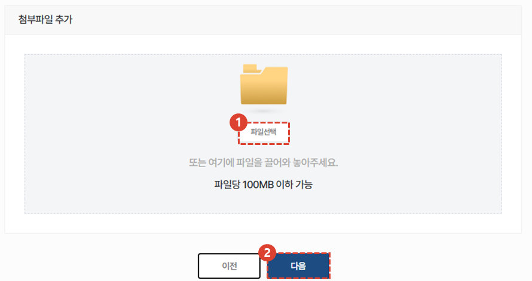
1. 보증기간 갱신과 관련한 문서를 첨부합니다. 
1. **다운** 버튼을 클릭합니다. 
 
 

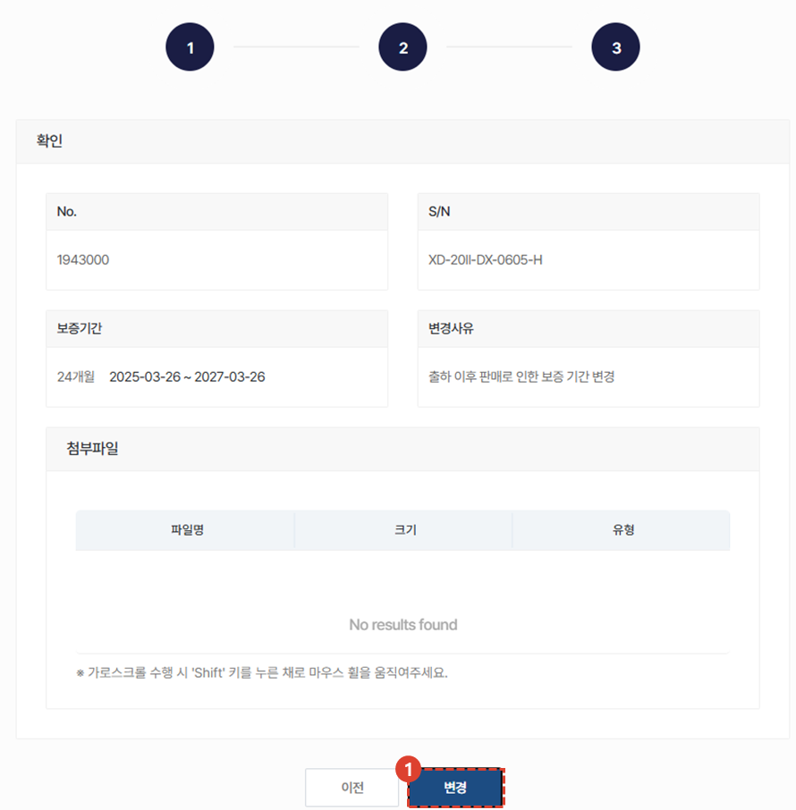
1. 변경 내용을 최종 확인 한 뒤 **변경** 버튼을 클릭합니다. 
:::info **변경이 완료되면 자산 기본 정보에 반영됩니다.** 
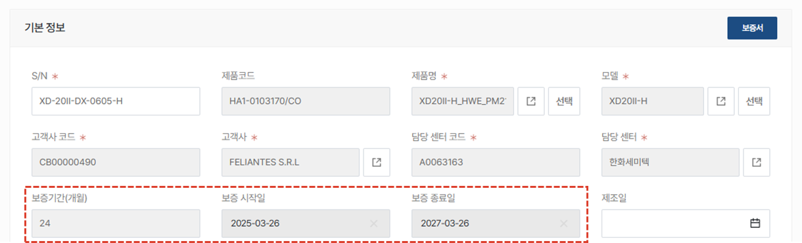
:::
</ValidateTextByToken>