import ValidateTextByToken from "/src/utils/getQueryString.js";
import Cancle from "./img/057.png";
import back_order from "./img/058.png";
import circle from "./img/062.png";

# 판매

접수된 주문서의 처리 절차에 대해 안내합니다.
<ValidateTextByToken dispTargetViewer={true} dispCaution={false} validTokenList={['head', 'branch', 'seller']}>
:::info
판매권한을 갖고있는 담당자만 보이는 메뉴입니다. 본사, 법인 및 대리점(자재거점)의 자재 담당자에 해당합니다. 
:::

## 목록
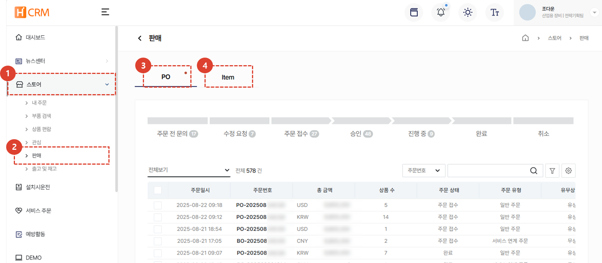
1. **스토어** 메뉴를 클릭합니다. 
1. **판매** 메뉴를 클릭하여 주문서 처리를 수행합니다. 
1. [**PO**](#po) :접수된 주문을 PO 단위로 관리하는 페이지 입니다. 전체 PO에 대한 진행 현황을 파악하여 관리 할 수 있습니다. 
1. [**Item**](#item) : PO에 포함된 부품 단위로 주문 접수 내역을 관리 할 수 있습니다. PO가 미결인 경우 그게 왜 미결인지 어느 부품이 주문 처리가 덜 되었는지 한눈에 파악 할 수 

## PO
:::info
PO 메뉴는 부품 주문을 **PO 단위로 관리**하는 탭 입니다. 
 부품단위로 주문 처리 현황을 파악하고 관리하고 싶은 경우 [**Item 탭**](#item)을 확인해야 합니다.
:::

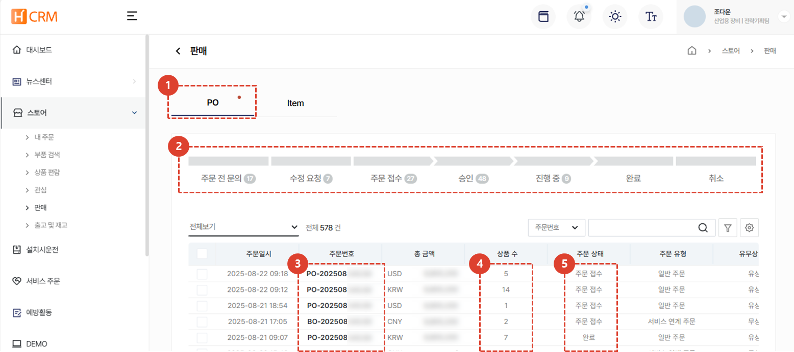
1. **PO** 탭을 클릭합니다.
1. 주문서 목록에서 **주문서의 상태**를 확인 할 수 있습니다. 각 상태를 클릭하면 해당 상태의 주문 건이 목록에 나타납니다. 
1. **주문번호**를 클릭하여 PO의 상세 페이지로 이동 할 수 있습니다.  PO 상세 페이지는 [**주문서 상세**](#주문서-상세)를 참조 부탁드립니다. 
1. 각 주문에 포함된 **총 상품 수**가 표시됩니다. 
1. **현재 주문 상태**를 확인 할 수 있습니다. 
 
 

## Item
:::info
Item 메뉴는 부품 주문을 **부품 단위로 관리**하는 탭 입니다.
 PO단위로 주문 처리 현황을 파악하고 관리하고 싶은 경우 [**PO 탭**](#po)을 확인해야 합니다.
:::

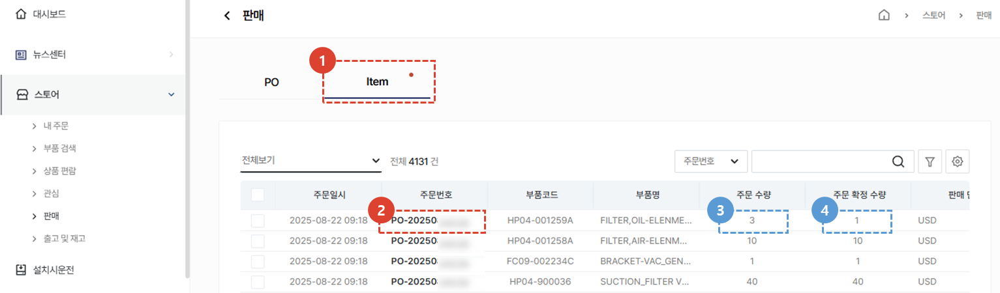
1. **Item** 탭을 클릭합니다. 
1. **주문번호**를 클릭하여 해당 PO의 상세 페이지로 이동할 수 있습니다. PO 상세 페이지는 [**주문서 상세**](#주문서-상세)를 참조 부탁드립니다. 
1. 각 **부품별 주문 수량**이 나타납니다. 
1. 각 **부품별 주문 확정 수량**이 나타납니다. 
    :::tip
    각 부품별 주문 확정 수량 목록을 통해 **처리 필요 부품이 무엇인지 쉽게 파악** 할 수 있습니다. 
    :::
</ValidateTextByToken>
 
 

## 주문서 상세
### 주문서 승인
<ValidateTextByToken dispTargetViewer={false} dispCaution={true} validTokenList={['head', 'branch']}>

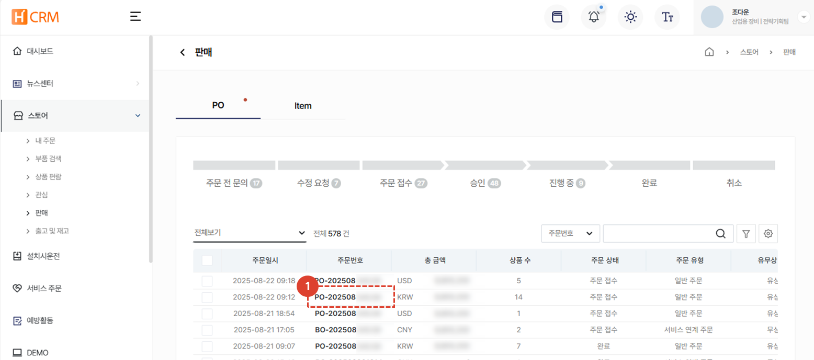
1. 주문이 접수된 PO의 주문번호를 클릭합니다. 
:::info
주문서 상세 화면에서 주문을 승인하거나 수정요청, 기각 할 수 있습니다.
:::
 
 

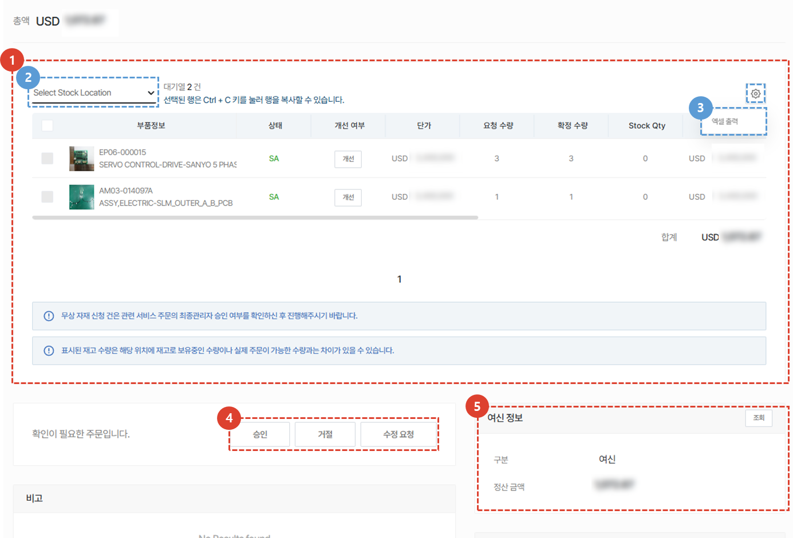
1. 주문 아이템을 정보를 확인합니다.
     목록에서 부품 정보, 부품 상태, 개선 여부, 단가, 요청 수량, 확정 수량, Stock Qty, 합계, 연관 서비스 번호, 서비스 유형, 최종관리자 승인여부, 대상 S/N, 비고 를 확인 할 수 있습니다. 
1. **Storate Location**을 선택하여 특정 자재 창고의 재고 확인이 가능합니다. 
1. 주문 목록을 **엑셀 출력** 할 수 있습니다.
1. 내용 확인이 끝나면, 주문서의 승인여부를 선택합니다. 
    - 승인: 주문서를 승인합니다. [승인 이후의 절차를 보려면 여기를 클릭합니다.](#승인-후---백오더-생성)
    - 거절: 주문서가 반려/취소됩니다.  주문 **거절 사유** 입력을 해야하며, 입력 시 주문 작성자에게 메일이 전송됩니다.
    - 수정요청: 주문서를 수정할 것을 요청합니다. 주문 **수정요청 사유**(수량변경, 판가변경, 부품코드 변경등의 사유) 입력을 해야하며, 입력 시 주문 작성자에게 메일이 전송됩니다.
1. 관련하여 구매자의 여신 정보가 표시됩니다. 
 
 

### 승인 후
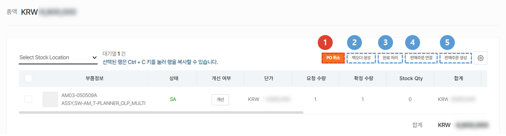
승인된 주문서는 다음의 5가지 방법으로 처리 할 수 있습니다.
1. [**PO 취소**](#po-취소) : 주문 정보의 유무상 구분 변경 등의 사유가 있는 경우, PO 취소를 할 수 있습니다. 
    :::info
        

        주문 정보의 유무상 구분 변경 등의 사유가 있는 경우, PO 취소를 할 수 있습니다. 취소된 주문서는 수정 요청 및 재 승인이 가능합니다.
    :::
1. [**백오더 생성**](#승인-후---백오더-생성) : 중간 판매자가 본사를 대상으로 주문서의 부품을 재주문해야 하는 경우 사용합니다.
1. [**완료 처리**](#승인-후---완료-처리) : 법인 외 대리점 허브가 다른 대리점으로부터 받은 주문을 처리할때 사용하는 버튼입니다. 완료 처리 버튼을 누르면 **구매자에게는 이 주문서가 완료** 상태로 표시됩니다.
1. [**판매주문 연결**](#승인-후---판매주문-연결) : 이미 SAP에서 판매 주문을 한 후, 해당 정보를 입력할 경우 사용합니다.
1. [**판매주문 생성**](#승인-후---판매주문-생성) : 이 주문서를 바탕으로 판매주문을 발행할 경우 사용합니다.
 
 
</ValidateTextByToken>

<ValidateTextByToken dispTargetViewer={false} dispCaution={true} validTokenList={['head', 'branch', 'seller']}>

### 승인 후 - 백오더 생성
백오더는 **중간 판매자** (법인 또는 Amtest 등의 자재 거점)의 사용 메뉴로 구매자의 주문 요청건을 대응한 뒤, 재고 충당을 위해 본사로 주문을 해야하는 경우 사용할 수 있습니다. 이 주문서를 근거로 본사로 주문서가 생성됩니다. 
    :::info
    백오더 생성은 **무상 자재 신청일 경우에만** 생성 가능합니다.  
    :::
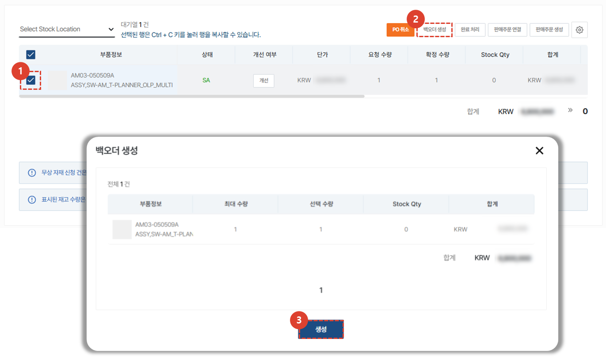
1. 재고 확보를 위해 본사로 발주를 낼 부품 항목을 체크합니다. 
1. **백오더 생성** 버튼을 클릭합니다. 
1. 백오더로 생성할 부품 수량을 확인합니다. **선택 수량**을 더블클릭하여 수정 할 수있습니다. 
 **생성** 버튼을 눌러 백오더를 생성합니다.
    :::info
    

    SO가 저장되면, **Circle 결재 전송** 버튼을 눌러 서클 품의를 상신해야 합니다.
    :::
 
 

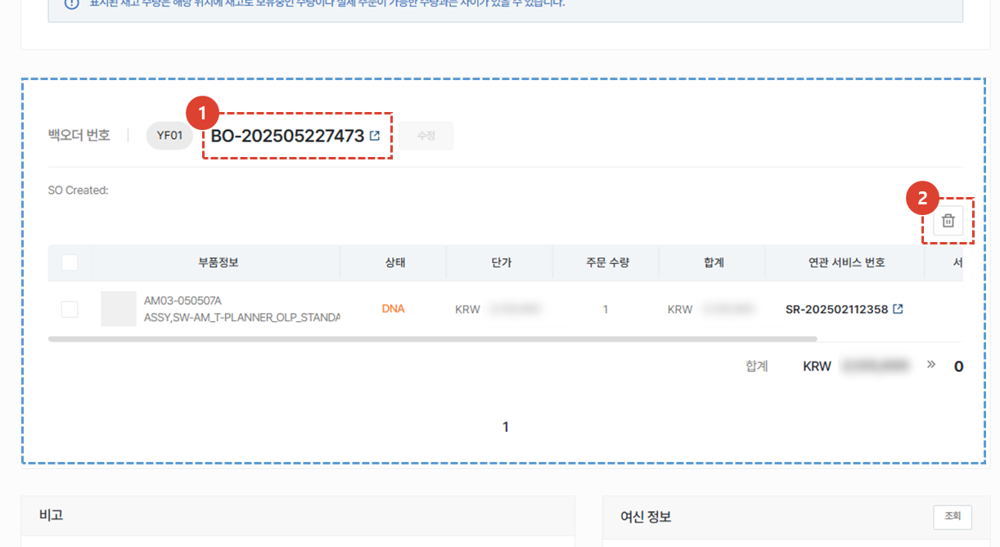
백도어가 생성되면, 부품 목록 하단에 **주문 내역**이 나탑니다. 
1. 백도어 번호를 클릭하여 **백오더 상세**를 확인 할 수 있습니다. 
2. **삭제** 버튼을 클릭하여 생성된 백오더를 취소 할 수 있습니다.
</ValidateTextByToken>

<ValidateTextByToken dispTargetViewer={false} dispCaution={true} validTokenList={['head']}>
:::info
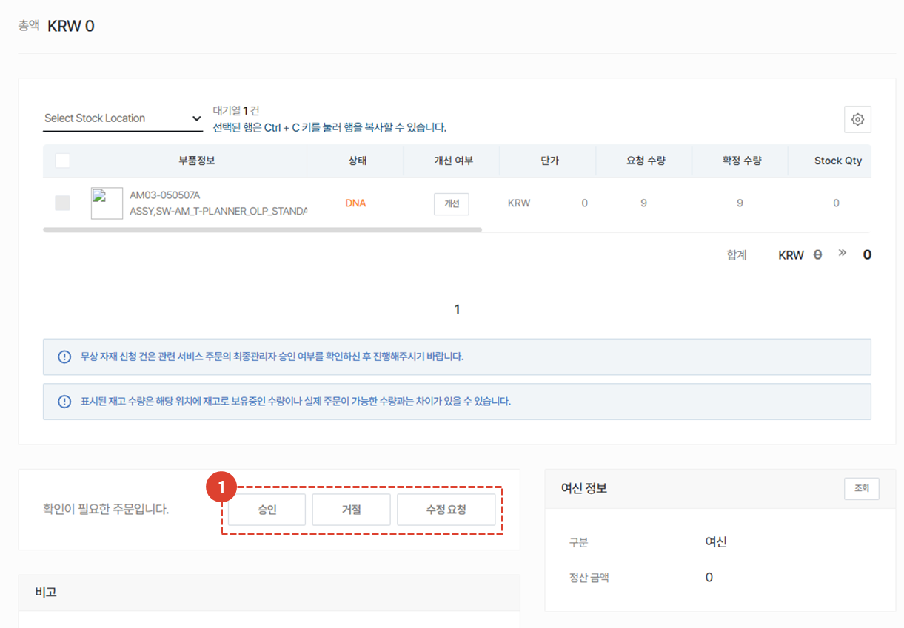
1. 본사 자재 출고 담당자는 백오더에 대한 정보 확인 후 승인/거절/수정요청 을 진행합니다. 
 이후 프로세스는 [**판매주문 생성**](#승인-후---판매주문-생성)과 동일합니다. 
:::
 
 
</ValidateTextByToken>

### 승인 후 - 완료 처리
<ValidateTextByToken dispTargetViewer={false} dispCaution={true} validTokenList={['head', 'branch', 'seller']}>
**완료 처리**는 법인 외 대리점 허브가 다른 대리점으로부터 받은 주문을 처리할때 사용하는 버튼입니다. 
 처리 결과의 **기록 목적**을 갖고 있습니다. 

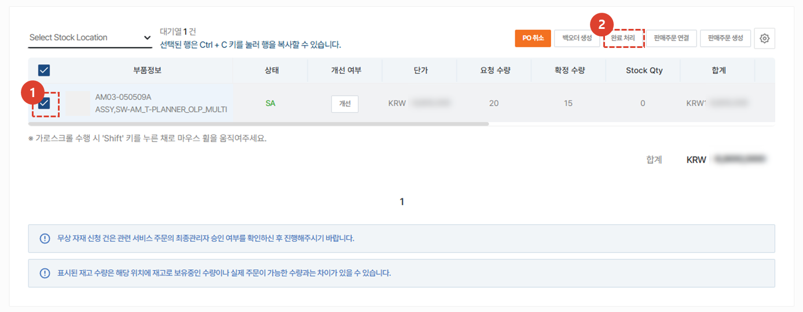
1. 완료처리 할 부품을 체크합니다.
1. **완료 처리** 버튼을 클릭합니다. 

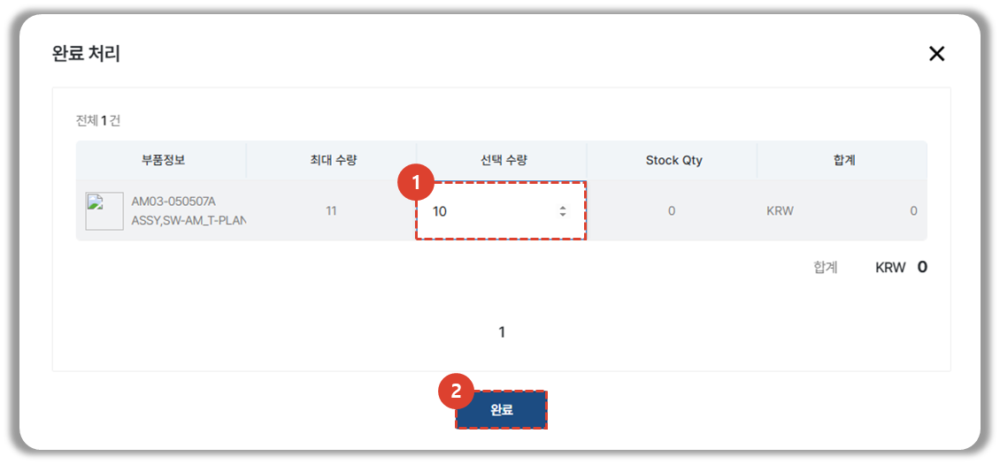
1. 주문이 완료된 부품 수량을 입력합니다.  최대 수량이 입력되어있으며, 수정이 필요 할 경우 더블클릭하여 수정합니다.
1. **완료** 버튼을 클릭하여 완료처리를 진행합니다. 
 
 

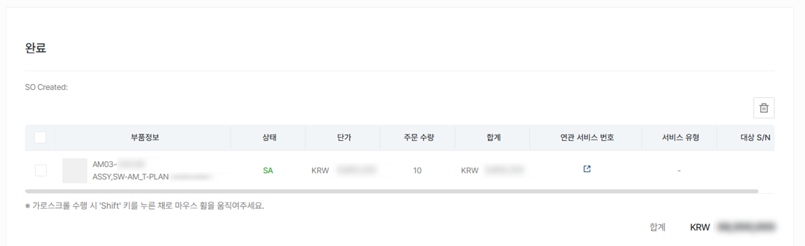
:::tip 안내
주문이 완료된 품목의 주문 수량, 금액 정보가 화면 하단에 추가됩니다. 
:::
</ValidateTextByToken>
 
 

### 승인 후 - 판매주문 연결
<ValidateTextByToken dispTargetViewer={false} dispCaution={true} validTokenList={['head']}>

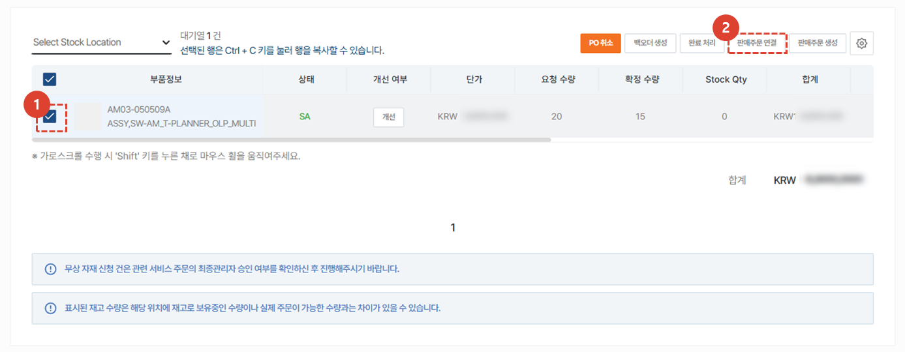
1. 판매주문과 연결할 할 부품을 체크합니다.
1. **판매주문 연결** 버튼을 클릭합니다. 

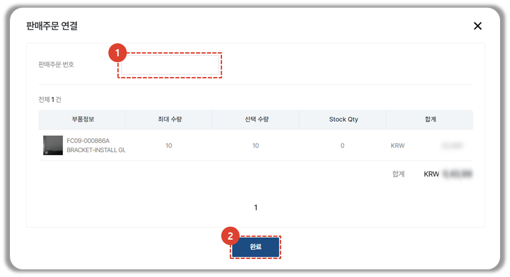
1. 내부 시스템에서 발행된 판매주문번호를 입력합니다. 
1. **완료** 버튼을 클릭하여 판매주문을 연결합니다. 
:::tip 안내
입력한 판매주문 내용이 화면 하단에 추가됩니다.  
:::
 
 

### 승인 후 - 판매주문 생성
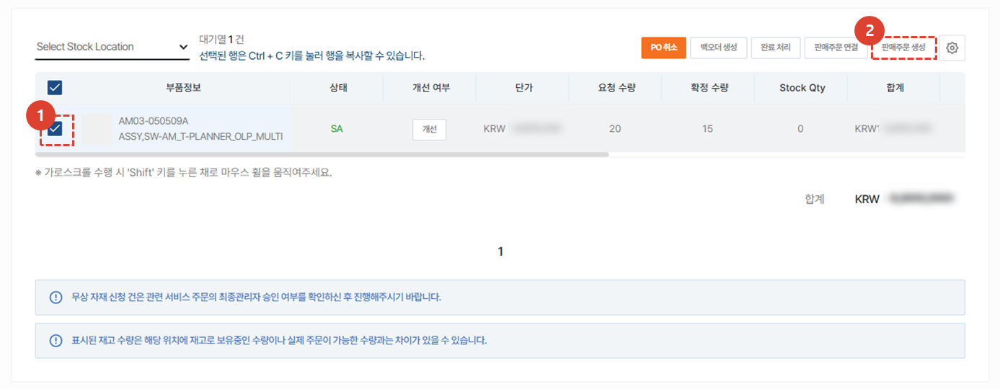
1. 새로운 판매주문을 생성할 부품을 체크합니다. 
1. **판매주문 생성** 버튼을 클릭합니다.

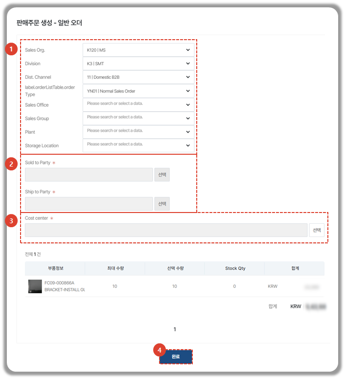
1. 오더 발행을 위한 값을 선택합니다. 
2. 대금지급을 진행할 업체 및 배송받을 업체를 선택합니다. 
3. Cost center를 선택합니다. 
4. **완료** 버튼을 클릭합니다. 
:::tip 안내
생성된 판매주문 내용이 화면 하단에 추가됩니다. 
:::
 
 
</ValidateTextByToken>

### 주문서 수정
<ValidateTextByToken dispTargetViewer={false} dispCaution={true} validTokenList={['head', 'branch', 'seller']}>

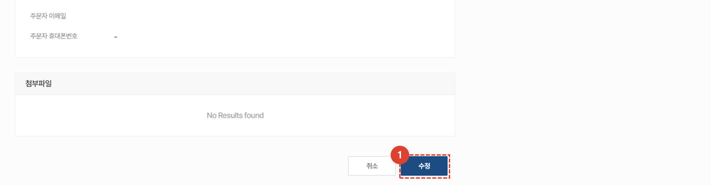
1. 주문 수정을 위해 상세 페이지 하단의 **수정** 버튼을 선택하여 작성 내용을 **수정**, **저장** 할 수 있습니다. 
    :::warning
        수정된 주문서는 반드시 "**주문**" 버튼을 클릭해야만 주문이 진행됩니다. 
    ::: 

</ValidateTextByToken>