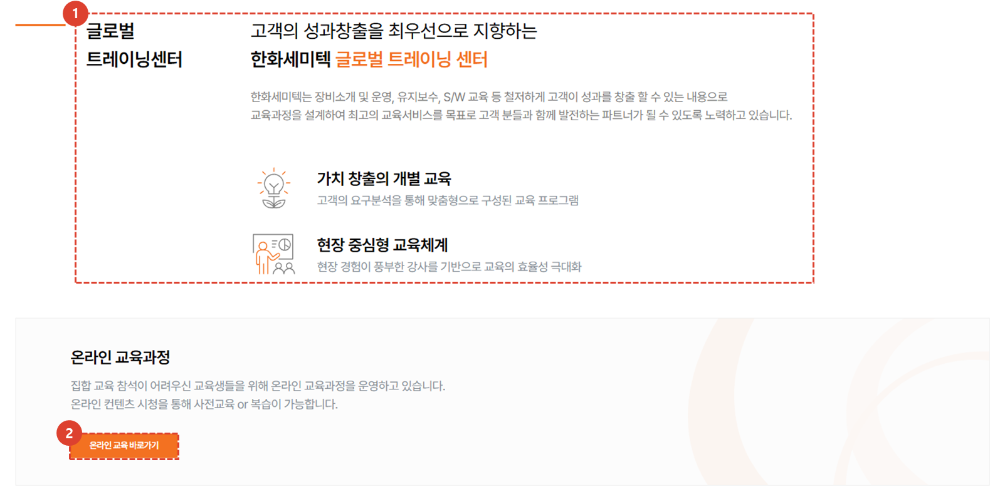
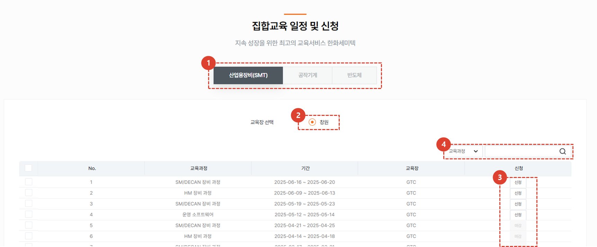
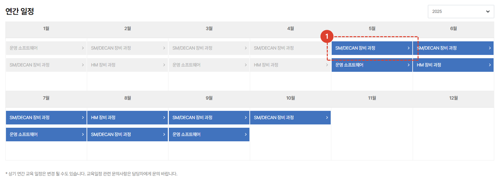
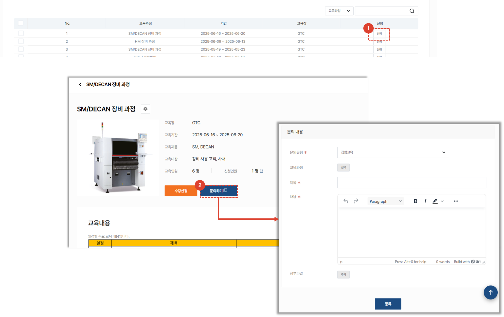
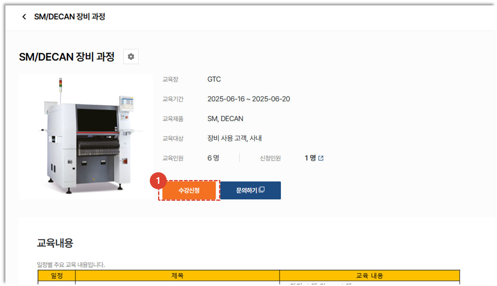
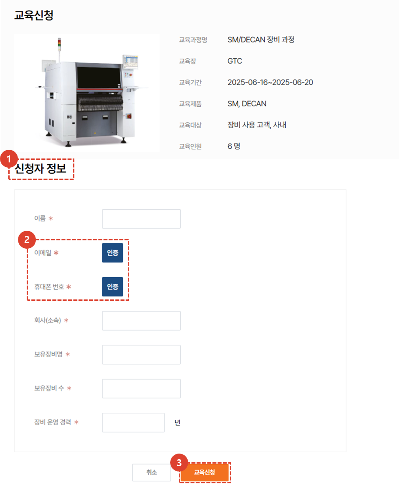

import ValidateTextByToken from "/src/utils/getQueryString.js";
import qna from "./img/005.png";

# 집합 교육
집합 교육(오프라인 교육) 과정의 소개와 수강 절차에 대해 안내합니다.
<ValidateTextByToken dispTargetViewer={true} dispCaution={false} validTokenList={['head', 'branch', 'seller', 'agent', 'customer']}>

## 메인 페이지
### 소개

1. 집합 교육 페이지 소개입니다. 
1. [**온라인교육 바로가기**](./01-online-lecture.md) 버튼을 클릭하여 온라인 교육 페이지로 이동할 수 있습니다. 
 
 

### 집합교육 일정 및 신청

1. **사업부**를 선택할 수 있습니다.
1. 원하는 **교육장**을 선택할 수 있습니다.
1. 사업부와 교육장 선택에 따라 운영중인 오프라인교육 목록입니다. [**신청**](#교육-신청) 클릭 시, 상세페이지로 이동합니다. 
1. Selectbox의 유형을 선택 후, 원하는 검색어로 **검색**할 수 있습니다.
 
 

### 연간 일정

1. 연간 일정을 한 눈에 볼 수 있습니다. [**강의 제목**](#교육-신청)을 클릭하여 상세페이지로 이동이 가능합니다. 
1. 연도별 연간일정을 조회할 수 있습니다. 
 
 

## 상세 페이지
### 목록

1. **신청** 버튼을 클릭 시, [**교육 신청 페이지**](#교육-신청)로 이동됩니다. 
    :::tip
    - 교육 신청기간이 아닐 경우, 신청 버튼을 클릭할 수 없습니다. 
    :::
1. **문의하기** 버튼을 클릭 시 문의 페이지가 새 탭으로 열립니다. 해당 페이지에서 문의내용을 작성할 수 있습니다.
    :::info
    

    문의 내용을 작성하고 저장하면 교육 담당자가 확인 후 문의 내용에 대한 답변을 발송합니다.
    :::
 
 

### 교육 신청

1. **신청** 버튼을 클릭 시, [신청 페이지](#신청-페이지)로 이동됩니다. 
    :::tip
    - 교육 신청기간이 아닐 경우, 신청 버튼을 클릭할 수 없습니다. 
    :::
 
 

### 신청 페이지

1. 오프라인 교육신청을 위한 신청자 정보를 입력해야 합니다.
1. **이메일 인증**과 **휴대폰번호 인증**을 해야 합니다.
1. 필수값을 모두 입력 후, **교육신청** 버튼을 클릭 시, 오프라인교육 신청이 완료됩니다. 신청에 대한 결과는 관리자 심사를 거쳐 신청자 메일로 전송됩니다. 
</ValidateTextByToken>

<ValidateTextByToken dispTargetViewer={true} dispCaution={false} validTokenList={['head']}>

## 집합교육 관리
:::info
집합교육의 **과정생성 및 교육 진행 후 수강자 관리 방법**을 안내합니다.
:::

1. **업무메뉴 관리**를 클릭합니다. 
1. **교육관리**를 클릭합니다. 
1. [**집합교육 과정 탭을 클릭**](/docs/SMT/tutorial-13-task-management/02-manage-training.md)하여 교육 과정 및 교육장, 수강자를 관리 합니다. 

</ValidateTextByToken>