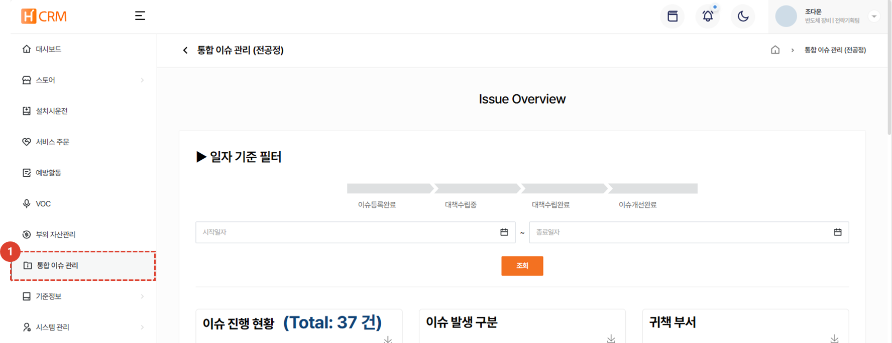
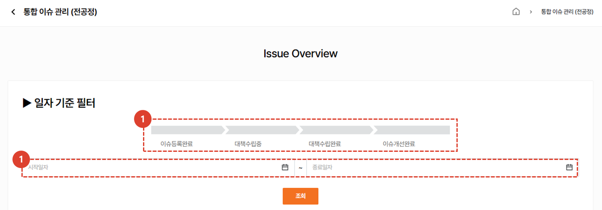
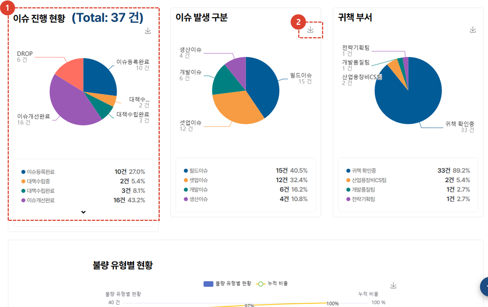
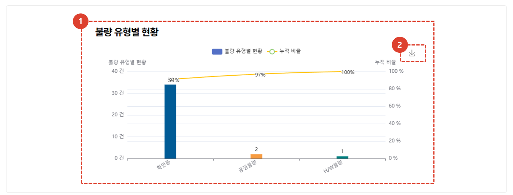
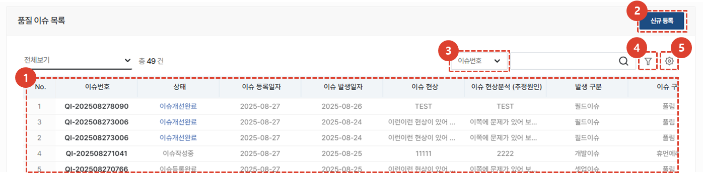

import ValidateTextByToken from "/src/utils/getQueryString.js";

# 통합이슈관리

<ValidateTextByToken dispTargetViewer={true} dispCaution={false} validTokenList={['head', 'branch']}>
고객사에서 일어나는 이슈를 관련 부서들과 협업하여 관리할 수 있는 메뉴입니다. 

## 통합이슈관리 목록

1. **통합 이슈 관리** 버튼을 클릭합니다. 
 
 

### 그래프
:::info
필터를 이용해 원하는 그래프를 추출하고 **다운로드** 받을 수 있습니다.
:::

1. 이슈 진행 프로세스입니다. 클릭하여 해당 진행 상황에 대한 그래프를 확인 할 수 있습니다. 재 클릭시 선택이 해제됩니다.
1. 특정 일자에 등록된 이슈의 그래프를 확인하고자 할 때, **시작일자**와 **종료일자**를 입력합니다. 
1. **조회**  버튼을 클릭하면 선택된 이슈 진행 목록 및 일자에 대한 결과 그래프가 아래와 같이 나타납니다. 
 
 

1. **원형 그래프** : 이슈 진행 현황, 이슈 발생 구분, 귀책 부서
1. **아이콘**을 클릭하면 그래프 이미지를 다운로드 받을 수 있습니다. 
 
 

1. **막대 그래프** : 불량 유형별 현황, 불량 원인별 현황, 개선 대책 유형별 현황
1. **아이콘**을 클릭하면 그래프 이미지를 다운로드 받을 수 있습니다. 
 
 

### 리스트

그래프 하단에 품질 이슈 목록을 확인 할 수 있습니다. 
1. 품질 이슈 목록입니다.
    :::info
    이슈 목록에서 이슈와 관련된 모든 내용을 표시 할 수 있으며, **테이블 관리에서 표시할 리스트 및 순서를 자유자재로 수정** 할 수 있습니다. 
    - **이슈 기본 정보** : 이슈 번호, 상태, 이슈 등록일자, 이슈 발생일자, 이슈 현상, 이슈 현상분석, 발생 구분, 이슈 구분
    - **모델 관련 정보** : 모델명, 설비코드(고객사), 공정명, Module
    - **이슈 상세 정보** : 이슈 발생 장소, 이슈 등록부서, 이슈 등록자, Pjt No.
    - **관련 부품 정보** : Unit, 부품코드, 부품명, 부품 S/N, 수량, 부품 제조사
    - **조치 관련 정보** : 중요도, 재발 여부, 조치 담당 부서, 조치 담당자, 불량 유형, 불량 원인, 장비 조치 여부, 장비 조치 일자, 
    - **대책 관련 정보** : 재발 방지 대책, 재발 방지 대책 조치 여부, 대책 수립 완료일, Lead Time, EcrNo, 재발방지대책(대분류, 소분류), 조치완료일, 개선완료여부
    :::
1. **신규등록**을 클릭하여 통합이슈를 등록 할 수 있습니다. 
1. **검색 필터**입니다. 드롭다운박스를 클릭하여 원하는 검색 필터를 사용할 수 있습니다. 
1. **상세 검색** 버튼입니다. 여러 검색 필터를 조합하여 상세 검색을 하고자할 때 사용할 수 있습니다.  
1. 버튼을 클릭하여 **엑셀 출력**이나, **테이블 관리**를 할 수 있습니다.  테이블 관리를 통해 리스트에 표시할 항목을 선택하고 순서를 바꿀 수 있습니다. 
</ValidateTextByToken>
