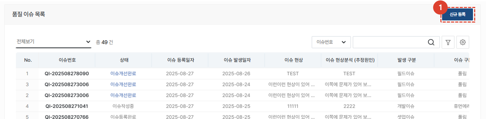
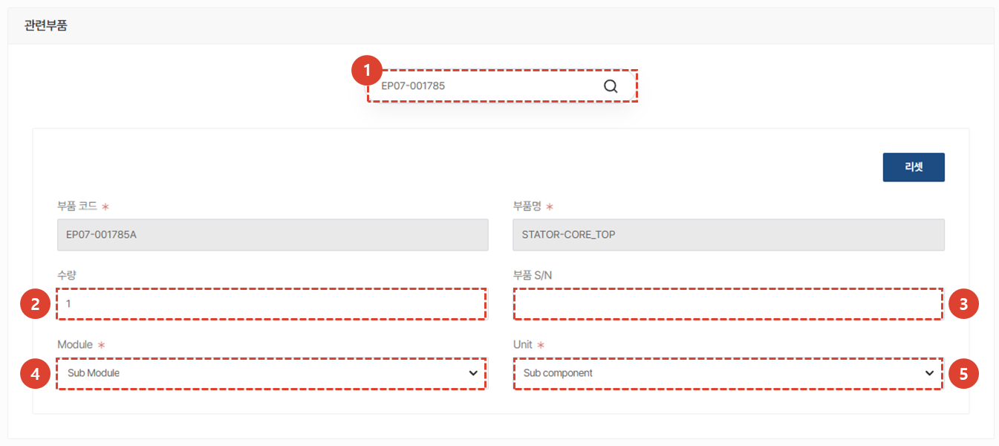
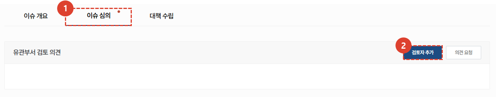
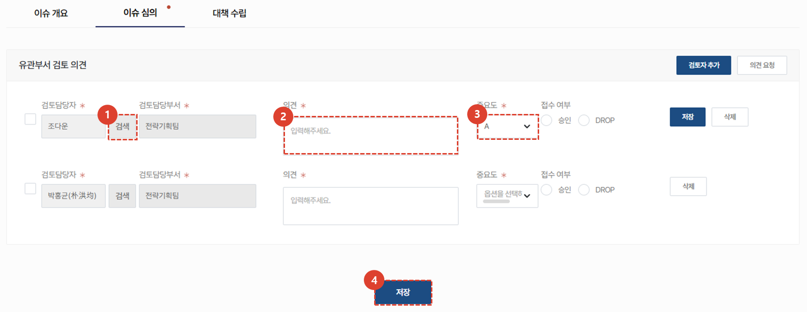
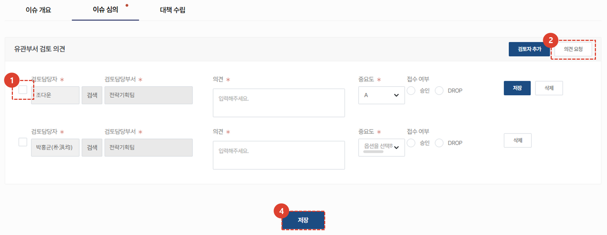
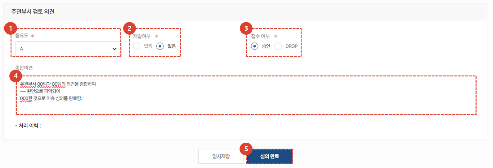

import ValidateTextByToken from "/src/utils/getQueryString.js";
import PopUp1 from "./img/010.png";
import PopUp2 from "./img/018.png";

# 이슈 등록

<ValidateTextByToken dispTargetViewer={true} dispCaution={false} validTokenList={['head', 'branch']}>

## 이슈 접수

1. **신규 등록** 버튼을 클릭합니다. 
 
 

1. 이슈의 기본 정보를 등록합니다. 조치 요청 납기를 제외한 **모든 항목은 필수 입력사항**입니다.
 
 

이슈와 관련하여 사용된 부품을 등록 할 수 있습니다. 
1. **제품 코드를 검색**하여 등록합니다. 조회가 불가한 부품은 직접 입력합니다.  
1. 사용할 **수량**을 입력합니다. 
1. 부품의 **Serial Number**가 존재한다면 입력합니다. 
1. 해당되는 **Module**을 선택합니다. 
    :::info
    Module 리스트는 다음과 같습니다. 
    - Sub Module / PM6 / PM5 / PM4 / PM3 / PM2 / PM1 / Platform / System
    :::
1. 해당되는 **Unit**을 선택합니다. 
    :::info 
    Unit 리스트는 다음과 같습니다. 
    - Sub component / MPB / Gas Line Unit / Vacuum Unit / Elec. Unit / Source Box Unit / Chamber Unit / Lid Unit / Moving Unit / Frame Unit / TM Chamber Unit / L/L Chamber Unit / EFEM Unit / 공통
    :::
 
 

1. 관련 **첨부파일**을 첨부합니다. 
1. 이슈 등록자는 해당 이슈에 대한 **의견**을 상세히 입력합니다. 
1. 이슈 등록 내용을 **임시저장** 할 수 있습니다. 
1. 이슈 등록을 위한 내용 입력이 완료되면 **이슈 등록** 버튼을 클릭합니다. 
 
 

1. **결재 승인자**를 등록합니다. 
1. **상신 의견**을 입력합니다. 
1. **확인** 버튼을 클릭하여 이슈 등록에 대한 결재 상신을 완료합니다. 
 
 

## 이슈 등록 중

1. 결재가 진행중인 이슈는 **이슈등록중** 상태로 표시됩니다. 
 
 

## 이슈 등록 완료

1. 이슈 등록에 대한 결재가 완료되면 등록자에게 이슈 등록 **이메일이 발송**됩니다. 
 
 

1. 이슈 등록이 완료되면 상태값이 **이슈등록완료**로 표시됩니다. 
1. 이슈 **No. 를 클릭**하여 이슈 상세 내용 확인 및 심의, 대책 수립 등 관리를 수행 할 수 있습니다.
 
 

### 이슈 수정 및 취소

이슈 수정 및 취소가 필요한 경우, 상세 화면 하단의 버튼을 클릭하여 진행합니다. 
1. **수정** 버튼을 클릭하여 이슈 수정이 가능합니다. 
    :::info
        이슈 등록 결재가 진행 중인 경우에도 문서 수정이 가능합니다.
    :::
1. **접수 취소**를 할 경우, 접수가 취소되며 되살릴 수 없으니 유의하여 진행하시기 바랍니다. 
 
 

### 이슈 심의 요청
:::info
**주관부서**에서 검토 담당자를 지정하고 검토 의견을 요청하는 부분입니다.
:::

등록된 이슈에 대한 심의를 진행하고 조치 담당자를 지정하는 단계입니다. 
1. **이슈심의** 탭을 클릭합니다. 
1. **검토자 추가** 버튼을 클릭하여 이슈를 검토할 검토자를 등록합니다. 
    :::info
    검토자는 **여러명 등록이 가능**합니다.
    :::
 
 

1. **검색** 버튼을 클릭하여 검토 담당자를 추가합니다. 
1. 검토 담당자가 **의견**을 작성하는 란 입니다.  
1. 검토 담당자가 **중요도**를 입력하는 란 입니다. 
1. **저장** 버튼을 눌러 검토 담당자를 저장하거나, 검토 담당자가 입력한 사항을 저장할 수 있습니다.  
 
 

검토 담당자에게 해당 이슈에 대한 의견 요청 메일을 보낼 수 있습니다. 
1. 이메일을 전송할 **담당자를 체크**합니다. 
1. **의견요청** 버튼을 클릭합니다. 
    :::info
    

    1. 팝업창의 **확인** 버튼을 클릭해야지만 의견요청 이메일이 전송됩니다. 
    :::
 
 

### 이슈 심의 의견 등록
:::info
**주관부서**의 이슈에 대한 최종 의견을 등록하는 부분입니다. 검토 담당자들의 의견을 종합하여 최종 의견을 등록하고 이슈 심의를 완료 할 수 있습니다. 
:::

1. 이슈에 대한 종합적인 **중요도**를 선택합니다. 
1. 이슈가 종전 발생 이력이 있는지 **재발여부**를 선택합니다. 
1. 이슈 **승인** 혹은 **Drop** 여부를 선택합니다. 
1. 이슈에 대한 **종합 의견**을 입력합니다. 
1. **심의 완료** 버튼을 클릭하여 이슈 심의를 완료합니다. 
     등록 버튼을 클릭한 시점이 처리 이력에 표시됩니다. 
 
 

이슈 심의가 승인된 경우 위와같은 담당자에게 위와같은 **이메일이 전송**됩니다. 
 
 

이슈 심의가 승인되면 해당 이슈는 **대책수립중** 상태로 변경됩니다. 

</ValidateTextByToken>
