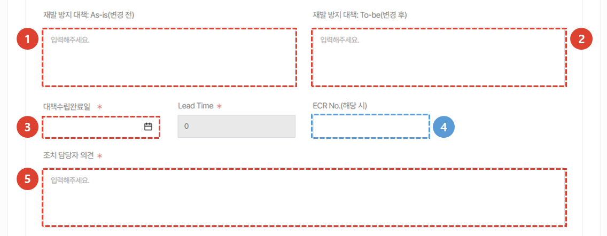
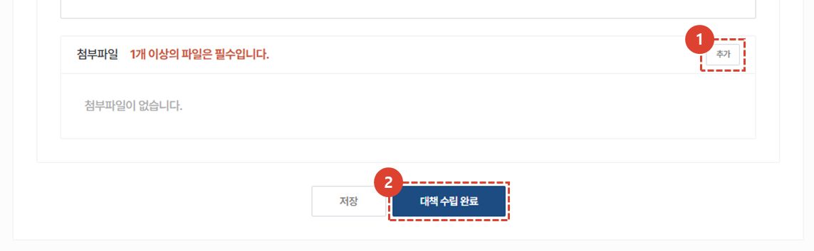
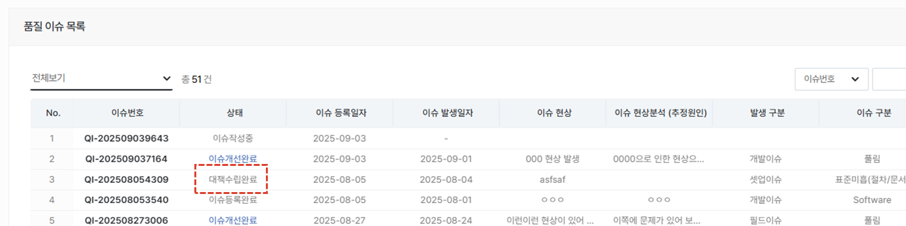
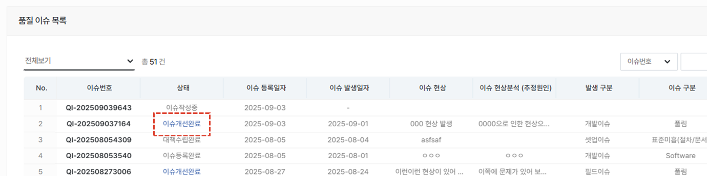
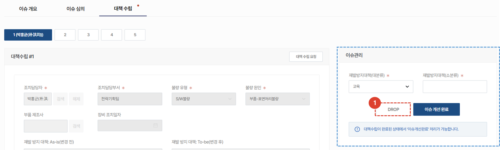

import ValidateTextByToken from "/src/utils/getQueryString.js";
import PopUp3 from "./img/024.png";
import PopUp4 from "./img/029.png";
import PopUp5 from "./img/042.png";

# 이슈 대책 수립
이슈의 대책 수립을 등록하고 이슈 완료 처리 방법을 안내합니다. 
<ValidateTextByToken dispTargetViewer={true} dispCaution={false} validTokenList={['head', 'branch']}>

## 이슈 대책 수립 중

:::info
**조치 담당자**가 조치와 관련된 내용을 등록하는 부분입니다. 
:::

### 대책수립 등록

1. **대책 수립** 탭을 클릭합니다. 
1. **검색** 버튼을 눌러 대책을 입력할 조치 담당자를 등록합니다. 
    :::info
    대책수립은 **최대 5명**에게 요청 가능합니다. 조치담당자 명은 대책수립 
    :::
1. **대책수립요청** 버튼을 클릭하면 조치담당자에게 **대책수립요청 메일이 발송**됩니다. 
 
 

1. 대책수립을위한 조치 담당자는 위와같은 **이메일**을 수신받습니다.  **링크를 클릭**하면 대책 수립 페이지로 연결됩니다. 

### 대책수립 상세 내용 등록

1. **불량 유형**을 선택합니다. 
1. **불량 원인**을 선택합니다.
1. **부품 제조사**를 검색하여 선택 할 수 있습니다. 
1. **장비 조치일자**를 등록합니다. 이슈 해결을 위해 장비에 조치를 진행한 일자를 입력합니다. 
    :::warning
    대책 수립 완료일은 하단 대책수립완료일에 입력하시기 바랍니다.
    :::

1. **재발 방지 대책 As-is**를 입력합니다. 재발 방지 대책을 세우기 전 기존 상태에 대한 내용을 구체적으로 작성합니다. 
    :::tip
    수립된 재발방지 대책은 **재발 방지 대책 : To-be**란에 입력합니다.  
    :::
1. **재발 방지 대책 : To-be**를 입력합니다.
1. **대책 수립 완료일**을 등록합니다. 
    :::warning
    장비 조치일자는 상단 장비 조치일자에 입력하시기 바랍니다.
    :::
1. ECR No. 입력이 필요한 경우에만 해당 번호를 입력합니다. 
1. 조치담당자 **의견**을 상세히 입력합니다. 
 
 

1. 관련 첨부자료가 있을 경우, 추가 버튼을 클릭하여 **첨부파일**을 등록합니다. 
    :::warning
    첨부파일은 필수값입니다. 관련된 파일을 1개 이상 등록해야 합니다.
    :::
1. **대책 수립 완료** 버튼을 클릭합니다. 
    :::info
    

     다음과 같은 팝업창이 추가로 나타나며 **대책수립완료** 버튼 클릭 시 관련자들에게 관련 메일이 전송됩니다. 
    :::
 
 

## 이슈 대책 수립 완료

### 완료 상태 확인

 조치 담당자가 대책수립을 완료하면 위와같은 **이메일이 전송**됩니다. 
 **대책 상세 페이지로 이동**을 클릭하여 CRM의 해당 페이지로 이동 할 수 있습니다. 
 
 

 품질 이슈 목록에서 **대책수립완료** 상태를 확인 할 수 있습니다.
 
 

### 완료처리 취소

1. 완료된 대책 수립의 **취소**가 필요한 경우 버튼을 클릭하여 취소할 수 있습니다. 
 
 

## 이슈 개선 완료
:::tip
대책 수립 완료 후 진행되는 이슈를 관리는 **주관부서** 영역입니다. 
:::

 이슈 대책 수립이 완료된 건이 있으면, 대책수립탭에 오른쪽과같은 **이슈관리 항목이 활성화**됩니다. 
    :::warning
    이슈 개선 완료를 진행 할 경우 이슈 개요/이슈 심의/대책 수립 탭의 수정 및 취소가 불가하므로 모든 대책 수립이 완료된 후에 진행하시기 바랍니다.
    :::

1. **재발방지대책(대분류)**를 선택합니다.
1. **재발방지대책(소분류)**를 선택합니다. 
1. **이슈 개선 완료** 버튼을 클릭합니다. 
 
 

1. 이슈에 대한 의견을 입력한 후, **이슈 처리 완료** 버튼을 클릭합니다. 
    :::warning
    완료 처리 후 되돌릴 수 없으므로 유의하여 진행하시기 바랍니다.
    :::
 
 

 완료된 이슈는 품질이슈목록에서 **이슈개선완료** 상태로 변경됩니다. 
 
 

## 이슈 DROP
:::info
심의가 완료되어 대책 수립 단계에 있는 이슈를 취소하는 방법을 안내합니다.  
:::

1. 이슈관리 영역의 **DROP 버튼**을 클릭합니다. 
    :::warning
    DROP된 이슈는 되살릴 수 없으니 유의하여 사용하시기 바랍니다.
    :::

</ValidateTextByToken>
