import ValidateTextByToken from "/src/utils/getQueryString.js";
import filterList from "./img/002.png";
import searchList from "./img/003.png";
import tableFilter from "./img/006.png";
import createLabor from "./img/013.png";
import filter1 from "./img/056.png";
import filter2 from "./img/057.png";
import filter3 from "./img/058.png";
import filter4 from "./img/059.png";
import table1 from "./img/060.png";
import table2 from "./img/061.png";
import popup1 from "./img/064.png";
import popup2 from "./img/066.png";
import popup3 from "./img/070.png";
import popup4 from "./img/074.png";

# 제품 및 부품

제품 및 부품 데이터 관리에 대한 안내입니다.

<ValidateTextByToken dispTargetViewer={true} dispCaution={true} validTokenList={['head', 'branch', 'seller', 'agent']}>

## 목록 페이지
    :::tip 조회 가능한 데이텈
        - MDG에서 채번된 제품 및 부품코드 데이터
        - H-CRM에서 시스템 매핑을 위해 자동으로 생성된 데이터
    :::

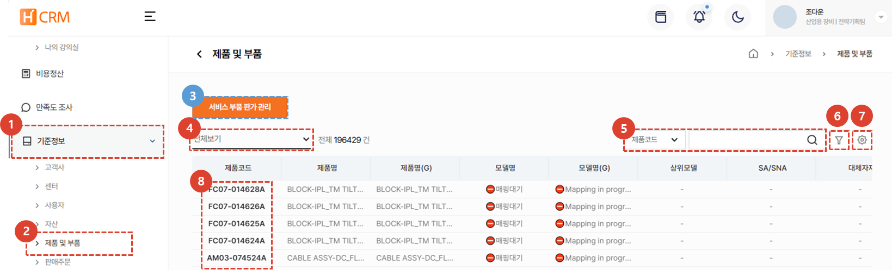
1. **기준정보** 메뉴를 클릭합니다.
1. **제품 및 부품** 메뉴를 클릭합니다.
1. **서비스 부품 판가 관리**를 클릭하여 판가 조회가 가능합니다. 
1. [**목록 필터링**](#목록-필터링)을 이용하여 특정 조건의 고객사만 표시할 수 있습니다.
1. [**검색어**](#검색)를 입력해서 원하는 데이터를 검색할 수 있습니다. 
1. [**복수개의 필터**](#상세검색)를 등록하여 데이터를 검색할 수 있습니다. 
1. [**엑셀 출력**](#엑셀출력), [**테이블 관리**](#테이블관리)를 할 수 있습니다. 
1. [**제품코드**](#상세-페이지)를 클릭하여 제품코드의 상세 정보를 조회 할 수 있습니다.
 
 

### 목록 필터링
:::tip
사용자/부서별 또는 최근 작성 건을 필터링하는 방법을 안내합니다. 
:::
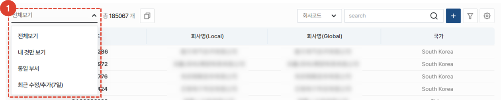
1. 원하는 필터링 방법을 선택합니다. 선택 즉시 해당하는 목록이 리스트에 표시됩니다. 
 
 

### 검색
:::tip
테이블 검색 방법을 안내합니다.
:::

1. 검색 필터를 **선택**한 뒤 검색합니다. 
 
 

### 상세검색
:::tip
**복수**개의 검색 필터 적용 방법을 안내합니다. 
:::
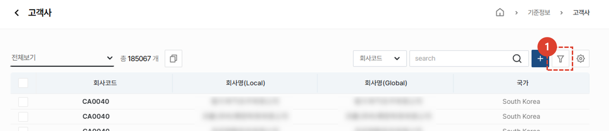
1. **필터 버튼**을 클릭합니다. 
 
 

1. 필터를 선택합니다. 
1. 검색어를 입력합니다. 
1. **+** 버튼을 클릭하여 검색 항목을 추가합니다. 
1. **검색** 버튼을 클릭하여 결과를 확인합니다. 
 
 

### 엑셀출력
:::tip
목록의 엑셀 출력 방법을 안내합니다.
:::

1. 엑셀 출력 버튼을 클릭합니다. 
 
 

1. **출력 옵션**을 선택합니다. 
1. **확인** 버튼을 누른 뒤 [**시스템관리 > 엑셀다운로드**](/docs/SEMI/tutorial-07-system-management/03-export-data.md) 메뉴에 접속하여 엑셀을 다운로드할 수 있습니다. 
 
 
 
### 테이블관리
:::tip
열의 표시 여부와  표시할 열과 순서 변경 방법을 안내합니다. 
:::

1. **테이블관리**를 클릭하여 테이블에 보여질 항목 및 순서를 변경할 수 있습니다. 
 
 

1. 테이블에 보일 항목의 토클 버튼을 클릭하여 파란색이 되도록 합니다. 
1. 리스트 아이콘을 드래그하여 열 위치를 변경 할 수 있습니다. 
1. **닫기**를 클릭하면 선택된 내용으로 테이블이 변경됩니다. 
 
 

## 상세 페이지
### 기본 정보
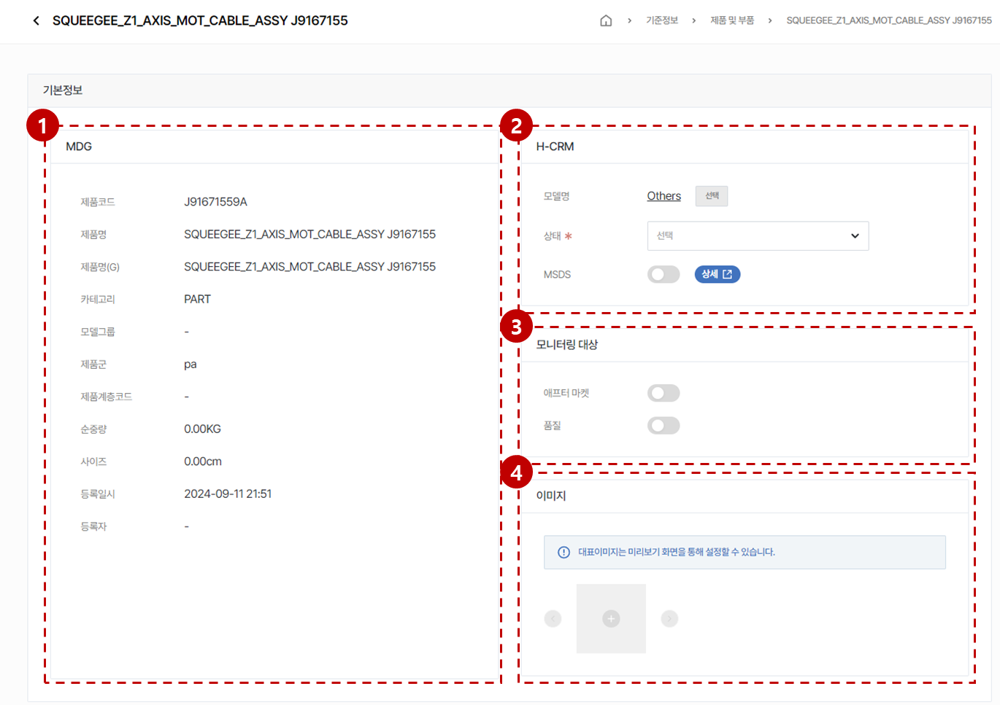
1. MDG에서 인터페이스된 정보를 표시합니다. 이곳의 정보는 수정할 수 없습니다.
1. H-CRM에서 활용하기 위해 가공할 수 있는 추가 정보를 표시합니다.
    - **모델명**: [선택] 버튼을 눌러 모델을 선택합니다.
        :::info
            모델은 [**모델관리 페이지**](/tutorial-07-system-management/01-model-manage.md)에서 관리합니다.
        :::
    - **상태**: 제품/부품의 서비스 가능 상태를 설정합니다.
        - **SA**: 서비스가 가능한 상태입니다.
        - **DNA**: 각 지점별로 보유하고 있는 재고로 서비스 대응이 가능하지만, 더이상 본사로의 추가 주문은 불가능한 상태입니다.
        - **SNA**: 서비스 대응이 불가능한 상태입니다. 대체가능한 서비스 부품을 사용하여 서비스 대응을 해주세요.
            :::warning
                상태가 표기되지 않은 제품 및 부품이 있을 수 있습니다. 이 경우, 서비스 주문의 신청이 가능하지만 관리자에 의해 상태가 변경될 수 있는 부분 참고 부탁드립니다.
            :::
    - **MSDS**🚧 : Material Safety Data Sheet의 약자로, 물질 안전 보건자료에 대한 공시가 필요한 부품에 한해 사용합니다. 토글 스위치를 ON 으로 위치시키면 MSDS 상세 페이지로 이동하는 버튼이 생성됩니다.

1. 모니터링 대상 🚧
    - 제품 및 부품 데이터의 특정 속성에 대한 모니터링이 필요한 경우 사용합니다.
    - 세부 기능은 TBD
1. 제품 및 부품 데이터의 실물 사진 또는 관련한 **이미지**를 첨부 할 수 있습니다.
        :::info
            - 첫번째로 표시되는 이미지가 대표 이미지로 활용됩니다.
            - 이미지의 미리보기 화면에서 대표이미지를 설정할 수 있습니다.
        :::
</ValidateTextByToken>
 
 

### 추가 정보 - Plant
<ValidateTextByToken dispTargetViewer={false} dispCaution={true} validTokenList={['head', 'branch']}>

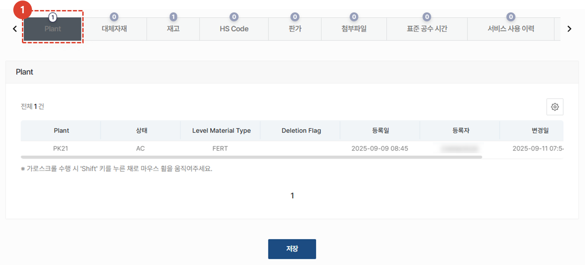
1. 제품의 Plant 정보를 조회할 수 있습니다. 
    - **PK21 / VK21**: 산업용장비 사업부 Plant
    - **PK22 / VK22**: 공작기계 사업부 Plant
    - **PK23 / VK23**: 반도체장비 사업부(전공정) Plant
    - **PK24 / VK24**: 반도체장비 사업부(후공정) Plant
    :::tip
        Plant를 타 사업부로 확장하여 사용하고 싶을 때는 MDG의 기준정보를 변경해주시기 바랍니다.
    :::

 
 

### 추가 정보 - 대체자재
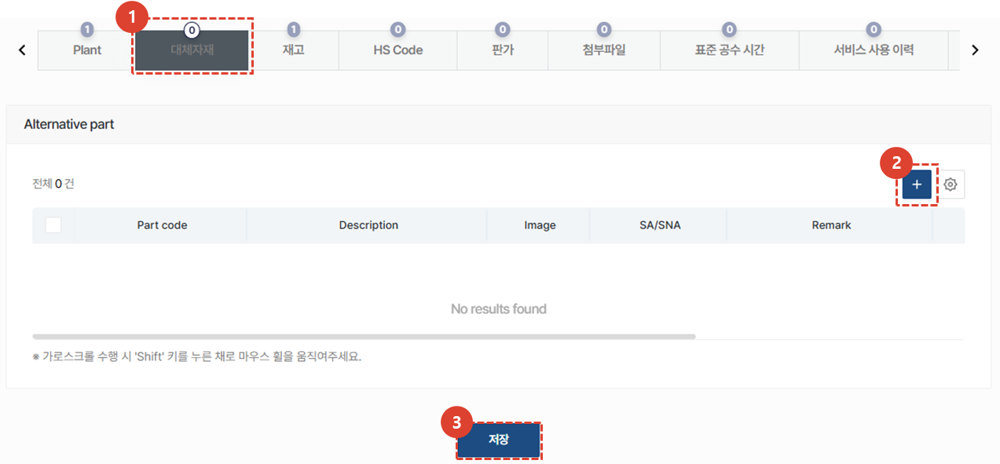
1. 대체자재가 있는 경우 해당 정보 조회가 가능합니다. 
1. 대체자재를 추가해야 하는 경우 **+** 버튼을 클릭하여 추가합니다. 
    :::info
    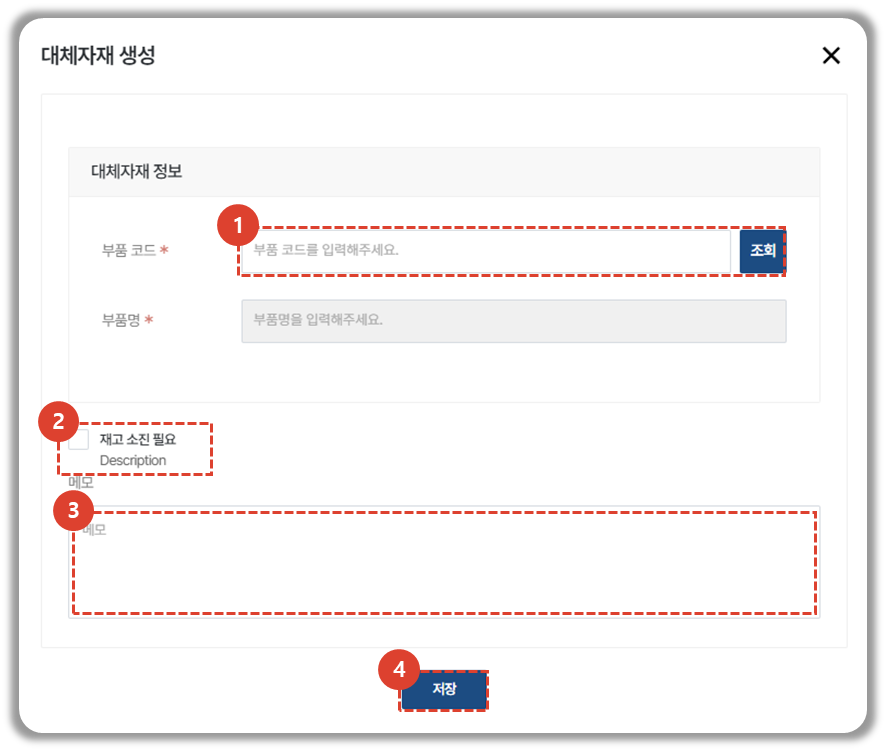
    1. 대체자재 정보를 입력합니다. 
    1. 기존 자재의 재고 소진이 필요한 경우, **재고 소진 필요**를 체크합니다. 
    1. 기타 관련 사항을 입력합니다. 
    1. **저장** 버튼을 클릭하여 대체자재를 추가합니다. 
    :::
1. 대체자재 정보의 업데이트 후에는 **저장** 버튼을 클릭하여야 정보가 업데이트 됩니다. 

### 추가 정보 - 재고
:::warning
        재고의 등록경로 컬럼 값이 **SAP**인 경우, 데이터 수정이 불가능합니다.
:::
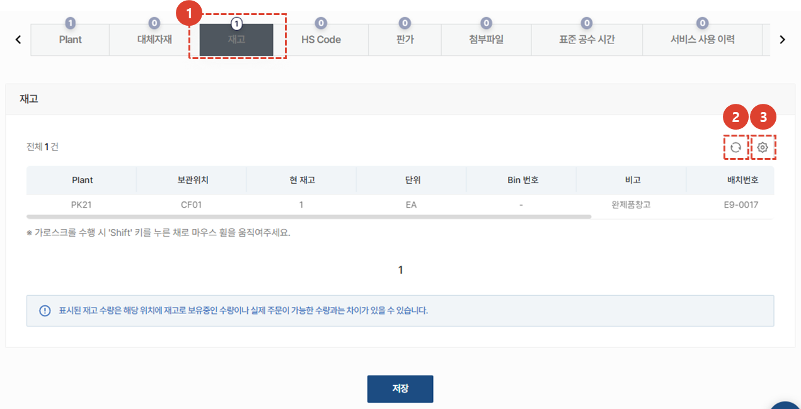
1. 선택된 제품/부품 데이터의 재고 보유 현황을 표시합니다.
    :::info
        - 본사 소속의 사용자는 모든 창고의 재고가 표시됩니다.
        - 그 외 회사 소속의 사용자는 아래의 재고가 표시됩니다.
            - [**센터 - 저장위치**](/04-centers.md)에서 설정된 창고위치의 재고
            - [**스토어 - 재고**](/SEMI/tutorial-04-store/stock-manage.md)에서 수기로 등록하고 관리하는 저장위치의 재고
            - [**센터 - 자재승인센터**](/04-centers.md)에서 설정된 창고위치의 재고 
    :::
1. **새로고침** 버튼을 클릭하여 재고 보유 현황을 업데이트 할 수 있습니다. 
1. **톱니바퀴** 버튼을 클릭하여 재고 리스트의 테이블 관리가 가능합니다.   
</ValidateTextByToken>
 
 

<ValidateTextByToken dispTargetViewer={false} dispCaution={true} validTokenList={['head', 'branch', 'seller', 'agent']}>

### 추가 정보 - HS Code
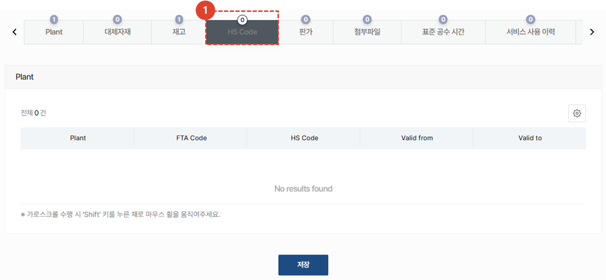
1. 제품 및 부품의 수출이 있을 경우 **국가간 세금코드**를 확인 할 수 있습니다.

### 추가 정보 - 판가
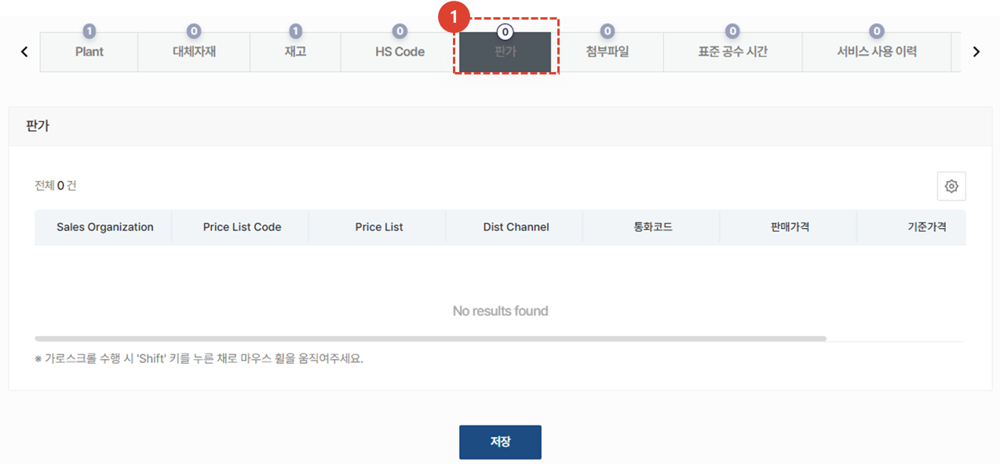
:::warning 열람 가능 판가 정보
    - **판가 관리자**: 모든 **Price List** 에 매핑된 판가 정보를 표시합니다. 
    - **그 외 사용자**: **기준정보-센터-조직정보** 에서 설정된 공급가와 판매가격 테이블의 판가 정보를 표시합니다.
:::
1. 판가 탭을 클릭하여 판가 정보 확인이 가능합니다. 
 
 

### 추가 정보 - 첨부 파일
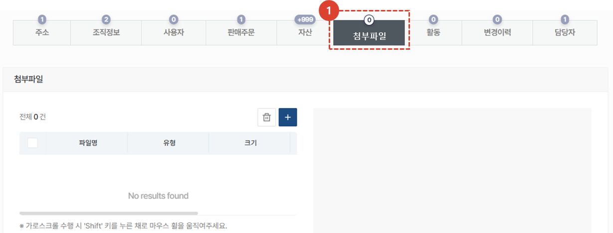
1. 관련된 파일을 첨부하고 조회할 수 있습니다.
 
 

### 추가 정보 - 표준 공수 시간
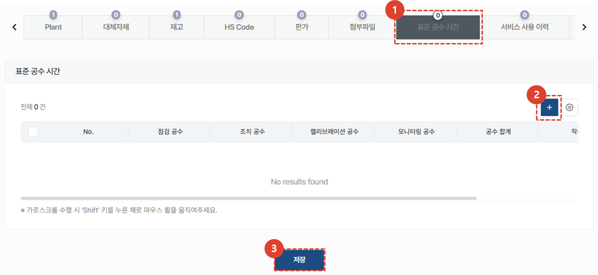
1. **표준 공수 시간** 탭을 클릭하여 선택된 서비스 부품을 교체하기 위해 산정된 표준 공수 시간을 등록하고 관리할 수 있습니다.
1. **+** 버튼을 눌러 표준 공수를 추가할 수 있습니다.
    - 모델: 표준 공수 시간이 적용되는 모델을 선택합니다. **(리프모델만 선택 가능)**
    - 공수: 시간(Hrs) 단위로 공수 시간을 입력합니다.
    - 메모: 공수 시간과 관련한 상세 내용을 입력합니다.
1. 표준 공수 시간 입력이 완료되면 **저장** 버튼을 클릭합니다. 
</ValidateTextByToken>
 
 
<ValidateTextByToken dispTargetViewer={false} dispCaution={true} validTokenList={['head']}>

### 추가 정보 - 서비스 사용 이력
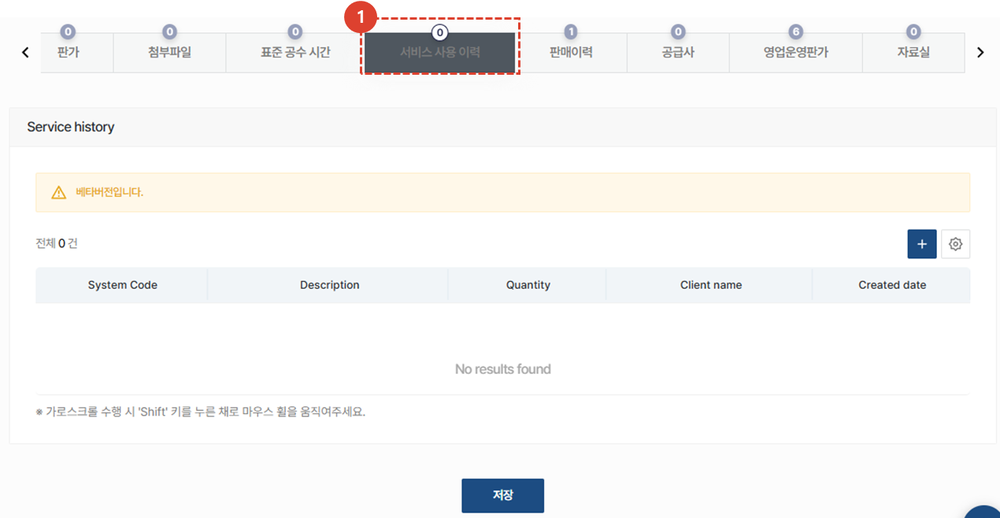
1. 자산에 대한 **서비스 사용 이력**을 조회할 수 있는 기능을 제공 예정 입니다. 
 
 

### 추가 정보 - 판매 이력
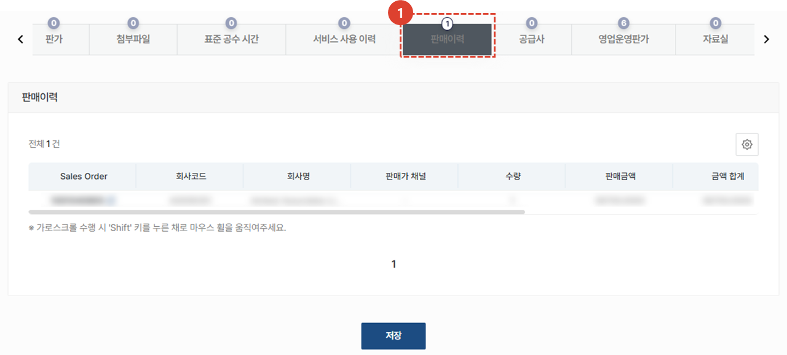
1. 선택된 제품 및 부품과 관련된 판매 주문 이력을 표시합니다.
 
 
 
 

### 추가 정보 - 공급사
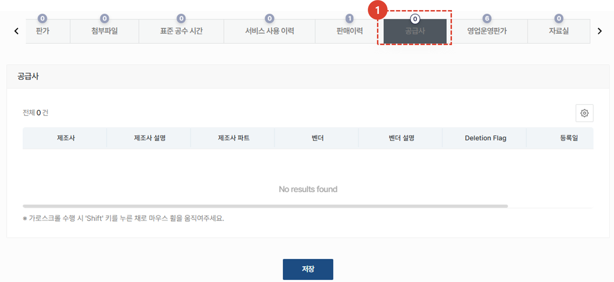
1. 선택된 제품 및 부품의 공급사 정보를 표시합니다.
:::danger
    - 서비스 부품 판가 설정 시 참고용으로 활용하기 위하여 영업 운영판가를 표시합니다.
    - 그 외의 목적으로의 사용은 불가합니다.
:::
 
 

### 추가 정보 - 영업운영판가
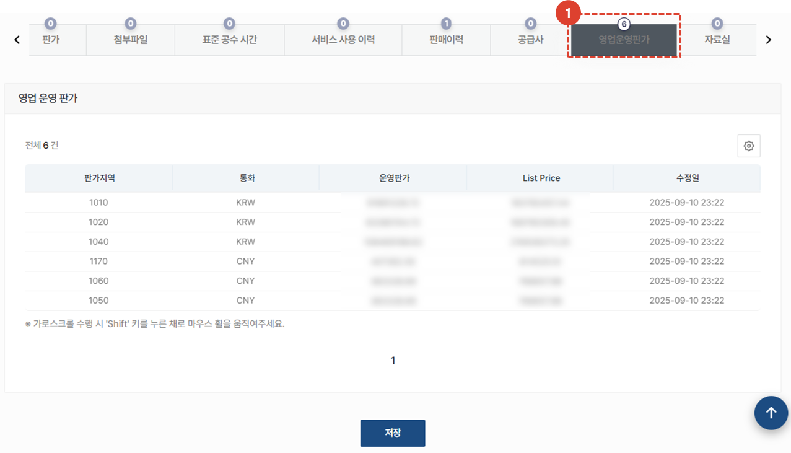
1. 영업운영판가를 조회 할 수 있습니다. 영업운영판가는 본사 영업관리자 및 시스템 관리자 등 판가조회 권한이 부여된 사용자만 접근 가능합니다. 
 
 

### 추가 정보 - 자료실
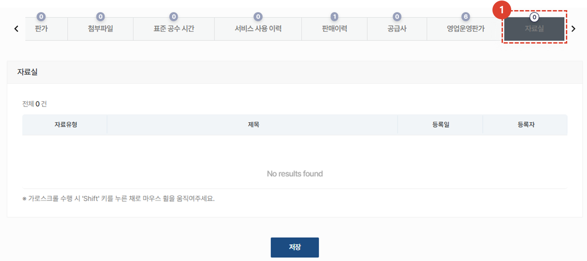
1. 해당 제품 및 부품과 관련한 자료가 업로드 되어있는 경우 그 리스트를 확인할 수 있습니다. 
</ValidateTextByToken>