import ValidateTextByToken from "/src/utils/getQueryString.js";
import filterList from "./img/002.png";
import searchList from "./img/017.png";
import tableFilter from "./img/006.png";
import createLabor from "./img/013.png";
import filter1 from "./img/056.png";
import filter2 from "./img/057.png";
import filter3 from "./img/058.png";
import filter4 from "./img/059.png";
import table1 from "./img/060.png";
import table2 from "./img/061.png";
import popup1 from "./img/064.png";
import popup2 from "./img/066.png";
import popup3 from "./img/070.png";
import popup4 from "./img/074.png";

# 고객사

고객사 데이터 관리에 대한 안내입니다.

<ValidateTextByToken dispTargetViewer={true} dispCaution={false} validTokenList={['head', 'branch', 'seller', 'agent']}>

## 목록 페이지
    :::tip 아래의 데이터들이 목록에 표시됩니다.
        **등록채널** 컬럼에 데이터가 생성된 위치가 표시됩니다.
        - **MDG**: MDG에서 채번된 고객사 정보
        - **4CUST**: 4CUST 시스템에서 마이그레이션된 고객사 정보
        - **CRM**: H-CRM 서비스 모듈에서 생성된 고객사 정보
        - **SALES-CRM**: H-CRM 영업 모듈에서 생성된 고객사 정보
    :::
 
 

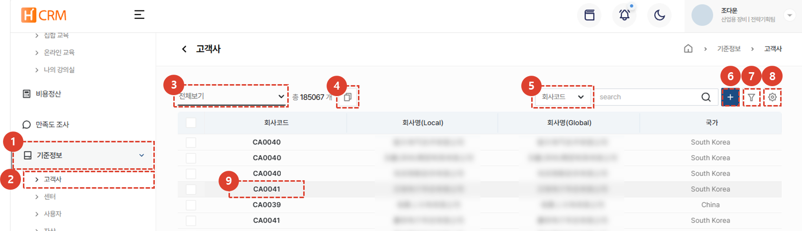
1. **기준정보** 메뉴를 클릭합니다. 
1. **고객사** 메뉴 클릭 시 고객사 데이터 목록이 나타납니다. 
1. [**목록 필터링**](#목록-필터링)을 이용하여 특정 조건의 고객사만 표시할 수 있습니다.
1. 같은 고객사인 복수개의 [**고객코드를 연결**](#고객코드-연결)할 수 있습니다.
1. [**검색어**](#검색)를 입력해서 원하는 데이터를 검색할 수 있습니다. 
1. **신규 고객사를 생성**할 수 있습니다. 
1. [**복수개의 필터**](#상세검색)를 등록하여 데이터를 검색할 수 있습니다. 
1. [**엑셀 출력**](#엑셀출력), [**테이블 관리**](#테이블관리) 또는 고객사 정보의 [**삭제**](#삭제)를 할 수 있습니다. 
1. [**고객사 코드**](#상세-페이지)를 클릭하여 고객사의 상세 정보를 조회 할 수 있습니다.

 
 

### 목록 필터링
:::tip
사용자/부서별 또는 최근 작성 건을 필터링하는 방법을 안내합니다. 
:::

1. 원하는 필터링 방법을 선택합니다. 선택 즉시 해당하는 목록이 리스트에 표시됩니다. 
 
 

### 검색
:::tip
테이블 검색 방법을 안내합니다.
:::

1. 검색 필터를 **선택**한 뒤 검색합니다. 
 
 

### 상세검색
:::tip
**복수**개의 검색 필터 적용 방법을 안내합니다. 
:::

1. **필터 버튼**을 클릭합니다. 
 
 

1. 필터를 선택합니다. 
1. 검색어를 입력합니다. 
1. **+** 버튼을 클릭하여 검색 항목을 추가합니다. 
1. **검색** 버튼을 클릭하여 결과를 확인합니다. 
 
 

### 엑셀출력
:::tip
목록의 엑셀 출력 방법을 안내합니다.
:::

1. 엑셀 출력 버튼을 클릭합니다. 
 
 

1. **출력 옵션**을 선택합니다. 
1. **확인** 버튼을 누른 뒤 [**시스템관리 > 엑셀다운로드**](/docs/SEMI/tutorial-07-system-management/03-export-data.md) 메뉴에 접속하여 엑셀을 다운로드할 수 있습니다. 
 
 
 
### 테이블관리
:::tip
열의 표시 여부와  표시할 열과 순서 변경 방법을 안내합니다. 
:::

1. **테이블관리**를 클릭하여 테이블에 보여질 항목 및 순서를 변경할 수 있습니다. 
 
 

1. 테이블에 보일 항목의 토클 버튼을 클릭하여 파란색이 되도록 합니다. 
1. 리스트 아이콘을 드래그하여 열 위치를 변경 할 수 있습니다. 
1. **닫기**를 클릭하면 선택된 내용으로 테이블이 변경됩니다. 
 
 

### 삭제
:::warning
고객사 삭제 방법을 안내합니다.
 삭제 시 **복구가 어려우니** 주의하여 진행하시기 바랍니다.
:::

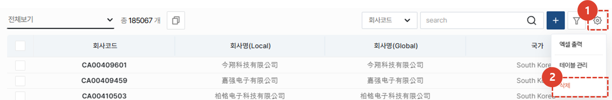
1. **톱니바퀴** 버튼을 클릭합니다. 
1. **삭제** 버튼을 클릭합니다. 
 
 

1. 팝업창의 **삭제** 버튼을 클릭하여 고객사를 삭제합니다.
 
 

## 고객사 등록
:::warning
신규 고객사 등록 시, 기존에 등록된 고객사가 없는 지 확인하여 중복 등록되지 않도록 주의하시기 바랍니다.
:::
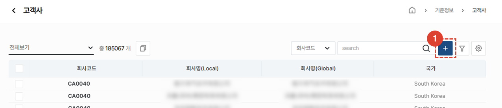
1. **+**버튼을 클릭합니다. 
 
 

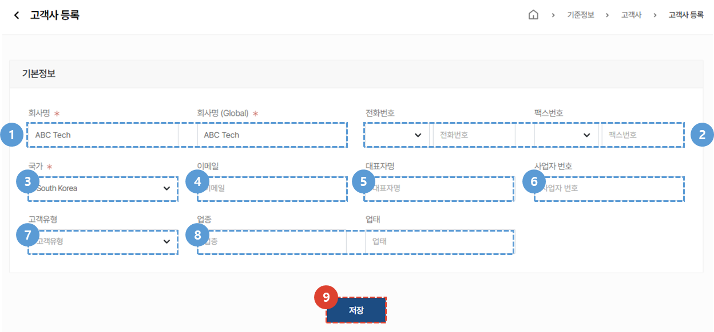
1. 등록할 **회사명**을 입력합니다. 
1. **전화번호** 및 **팩스번호**를 입력합니다. 
1. 등록할 고객사의 **국가**를 선택합니다. 
    :::warning
    고객사의 본사가 위치한 국가가 아닌 장비가 설치될 위치를 입력해주시기 바랍니다. 
    :::
1. 고객사 담당자의 **이메일**을 입력합니다. 
1. **대표자 명**을 입력합니다. 
1. **사업자 번호**를 입력합니다. 
1. **고객유형**을 선택합니다. 
1. **업종** 및 **업태**를 선택합니다.
1. **저장** 버튼을 클릭하여 고객사 등록을 완료합니다.
 
 

## 고객코드 연결
:::tip
**동일한 고객사가 여러개 등록**되어 있는 경우 **한 개의 고객사로 묶는 방법을 안내합니다.** 
 이는 여러개로 등록되어있어 주문 내역이나 자산이 산재되어 있는 문제를 방지 할 수 있습니다. 
:::

### 목록 페이지에서
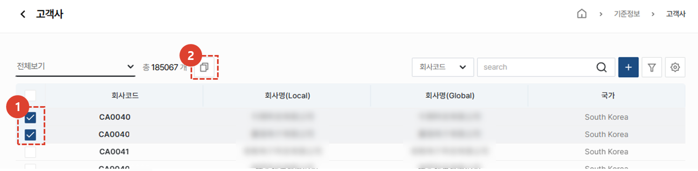
1. 묶음이 필요한 **복수개의 고객사를 체크**합니다.
1. **복사 아이콘**을 클릭합니다. 
 
 

1. **확인** 버튼을 클릭하여 고객사 연결을 완료합니다.
 
 

### 상세 페이지에서

1. 연결할 고객사 선택을 위해 **추가**버튼을 클릭합니다. 
 
 

1. 연결할 고객사를 검색합니다.
1. 검색된 내역이 맞는지 확인한 후, **저장** 버튼을 클릭합니다. 
:::tip

고객사 연결이 완료되면 위와 같이 표시됩니다. 
:::
 
 

### 대표회사 변경
:::info
연결 회사 중 대표로 표시할 회사희 변경 방법을 안내합니다. 
:::

1. **편집** 버튼을 클릭합니다. 
 
 

1. 대표 회사를 **선택**합니다.
 
 

1. **변경** 버튼을 클릭합니다. 
 
 

1. **완료** 버튼을 클릭합니다. 
:::info

대표로 지정된 고객사는 위 이미지와 같이 표시됩니다.
:::
 
 

## 상세 페이지
### 기본 정보 - MDG에서 등록된 고객사
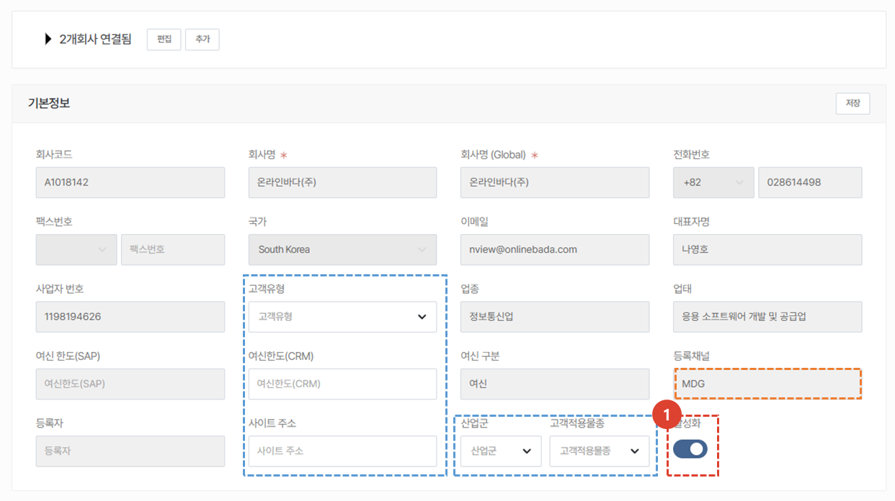
:::warning
    MDG에서 등록된 고객사의 대부분의 기본정보는 수정할 수 없습니다.
     파란 박스 외 기본정보 수정은 **MDG에서 수행**하세요.
:::
1. 활성화가 체크된 고객사만이 서비스 주문, 기술지원 등에서 고객사 검색이 가능해집니다. 
 서비스를 더이상 수행하지 않는 고객사의 경우, 활성화 버튼을 해제합니다.
 
 

### 기본 정보 - SALES-CRM(Salesforce)에서 등록된 고객사
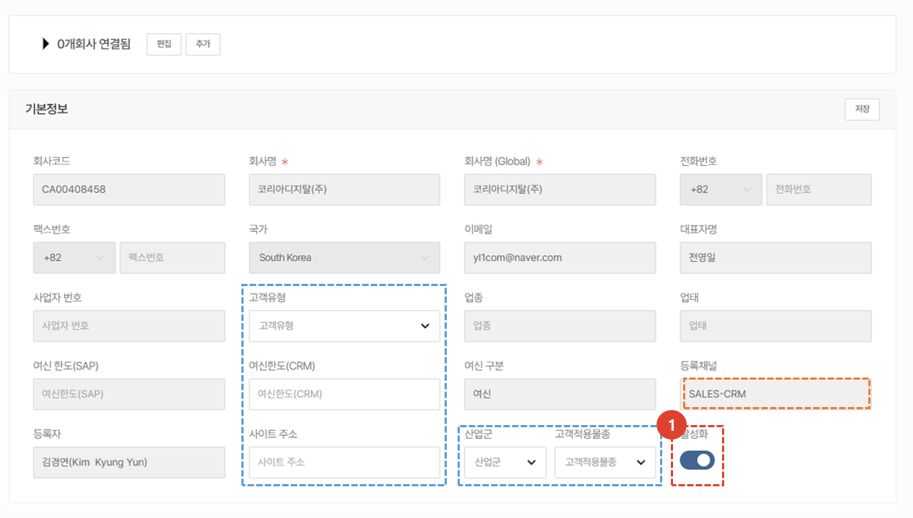
:::warning
    SALES-CRM(Salesforce)에서 등록된 고객사의 대부분의 기본정보는 수정할 수 없습니다.
     파란 박스 외 기본정보 수정은 **SALES-CRM(Salesforce)에서 수행**하세요.
:::
1. 활성화가 체크된 고객사만이 서비스 주문, 기술지원 등에서 고객사 검색이 가능해집니다. 
 서비스를 더이상 수행하지 않는 고객사의 경우, 활성화 버튼을 해제합니다.
 
 

### 기본 정보 - CRM(Service)에서 등록된 고객사
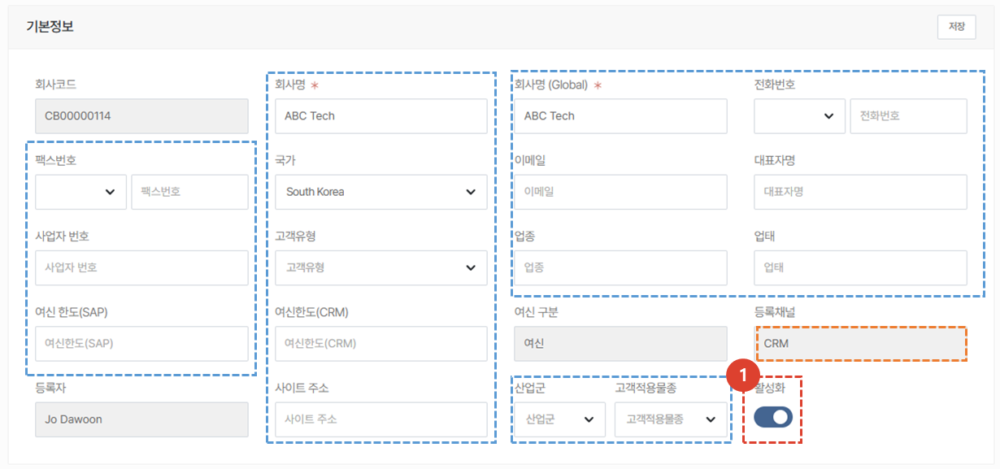
:::warning
    CRM(서비스)에서 등록된 고객사의 기본정보는 대부분 수정 가능합니다.
     파란 박스 외 기본정보는 **수정 불가** 영역입니다.
:::
1. 활성화가 체크된 고객사만이 서비스 주문, 기술지원 등에서 고객사 검색이 가능해집니다. 
 서비스를 더이상 수행하지 않는 고객사의 경우, 활성화 버튼을 해제합니다.
 
 

### 추가 정보 - 주소
:::warning
    중국지역의 도메인으로 접속한 경우, 지도 UI가 표시되지 않습니다.
:::

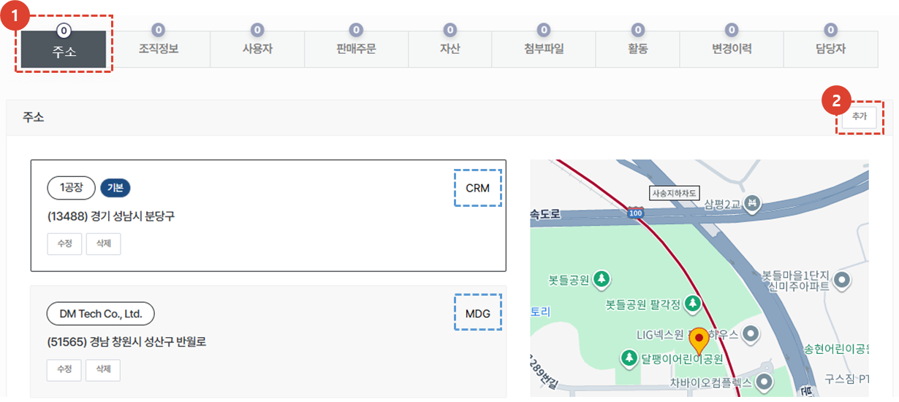
1. 추가정보의 **주소** 탭을 클릭하면 고객사에 등록된 주소 정보가 표시됩니다. 
    :::tip
    주소의 등록채널이 파란박스와 같이 표시됩니다. 
    :::
1. **추가** 버튼을 클릭하여 고객사 주소를 신규 추가 할 수 있습니다. 
    :::info 고객사 주소 신규 추가 방법
    
    1. 등록할 주소의 **국가**를 추가합니다. 
    1. **주소명**을 입력합니다. 
    1. **찾기** 버튼을 클릭하여 주소를 검색 할 수 있습니다. 
    1. 찾기 혹은 수동입력 후 **조회** 버튼을 클릭하면 지도를 확인 할 수 있습니다. 
    1. **저장** 버튼을 클릭하면 주소 등록이 완료됩니다. 
    :::
 
 

### 추가 정보 - 조직정보
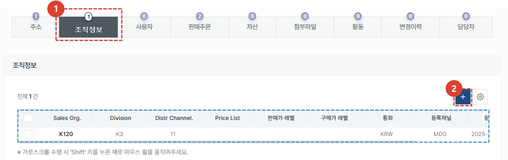
1. **조직정보** 탭을 클릭하여 등록된 조직 정보를 확인 할 수 있습니다.
1. 조직 정보의 추가가 필요한 경우 **+** 버튼을 클릭하여 추가합니다. 
    :::info
    조직 정보 추가 시 등록해야 하는 항목은 MDG와 동일합니다.  
    :::
 
 

### 추가 정보 - 사용자
    :::info
        선택된 고객사의 소속으로 등록된 사용자의 CRM 계정정보를 표시합니다.
    :::

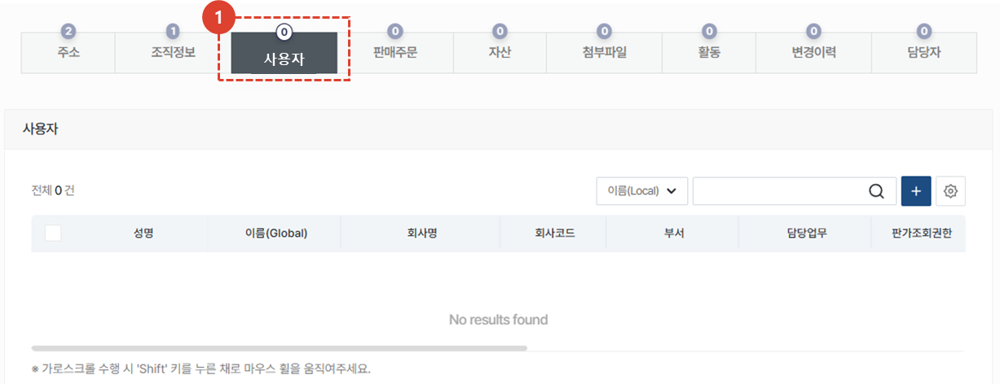
1. **사용자** 탭을 클릭하여 사용자를 확인할 수 있으며, 고객사 담당자는 **+**버튼을 클릭하여 사용자 가입을 대신 수행할 수 있습니다. 

</ValidateTextByToken>
 
 

### 추가 정보 - 판매 주문

<ValidateTextByToken dispTargetViewer={false} dispCaution={true} validTokenList={['head', 'branch']}>
:::info
    선택된 고객사를 대상으로 발행된 판매주문 목록을 표시합니다.
:::
:::warning 권한 알림
    **판매주문 조회** 권한이 있는 사용자만이 해당 탭을 조회할 수 있습니다. 권한과 관련하여 문의가 있으신 경우, CRM 담당자에게 문의 부탁드립니다.
:::
 
 

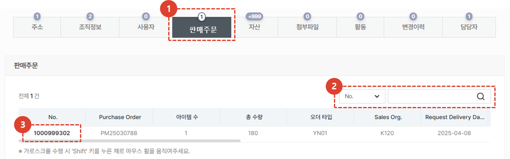

1. **판매주문** 탭을 클릭하여 해당 고객사를 대상으로 발행된 판매주문 목록을 확인 할 수 있습니다. 
1. No.(판매번호) / Purchase Order(주문번호)로 검색을 할 수 있습니다.
1. 판매번호를 클릭하여 주문 상세페이지로 이동이 가능합니다.
    :::warning
        판매주문 상세페이지로의 이동은 별도 권한이 필요합니다.
    :::
</ValidateTextByToken>
 
 

### 추가 정보 - 자산

<ValidateTextByToken dispTargetViewer={false} dispCaution={true} validTokenList={['head', 'branch', 'seller', 'agent']}>
:::info
    선택된 고객사가 보유하고있는 자산 목록을 표시합니다.
:::

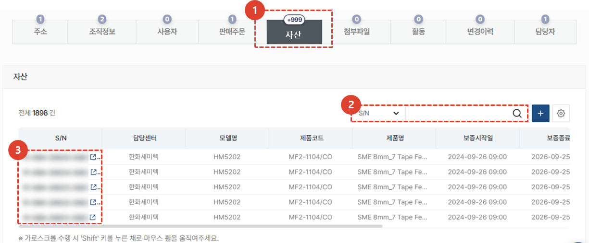
1. **자산** 탭을 클릭합니다. 
1. 자산을 검색 할 수 있습니다.
    :::tip 자산 검색 필터 리스트
    S/N / 모델명 / 모델명(G) / 제품코드 / 제품명 / 제품명(G) / 고객사명 / 고객사명(G) / 고객사 코드 / 고객사 대표자명 / 담당 센터명 / 담당 센터명(G) / 담당 센터 코드 / 보증기간(개월) / NC No. / 수주번호 / 등록자 / 변경자 / 모자산
    :::
1. 자산의 **S/N를 클릭**하여 **상세페이지로 이동**이 가능합니다.
 
 

### 추가 정보 - 첨부 파일

1. **첨부파일** 탭을 클릭하여 관련된 파일을 첨부하거나 조회할 수 있습니다.
 
 

### 추가 정보 - 활동
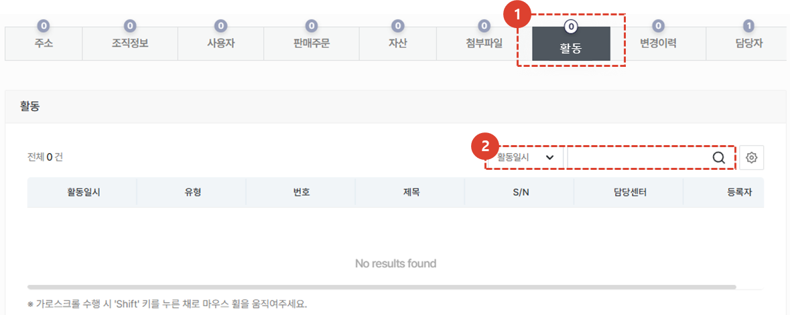
1. **활동** 탭을 클릭하여 해당 고객사를 대상으로 진행된 서비스 활동 내역을 조회 할 수 있습니다. 
1. 활동을 검색 할 수 있습니다. 
    :::tip 활동 검색 필터 리스트
    활동일시 / 유형 / 번호 / 제목 / S/N / 담당센터 / 등록자
    :::
 
 

### 추가 정보 - 변경이력
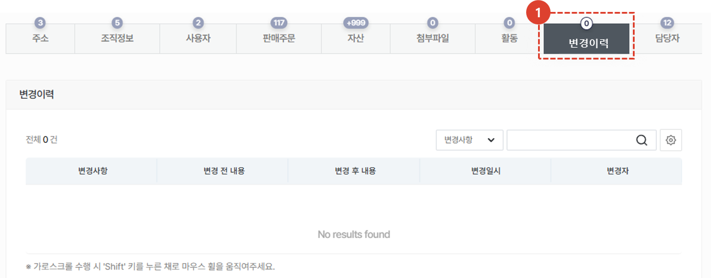
1. **변경이력** 탭을 클릭하여 고객사의 정보 등 변경 히스토리 조회가 가능합니다. 
 
 

### 추가 정보 - 담당자
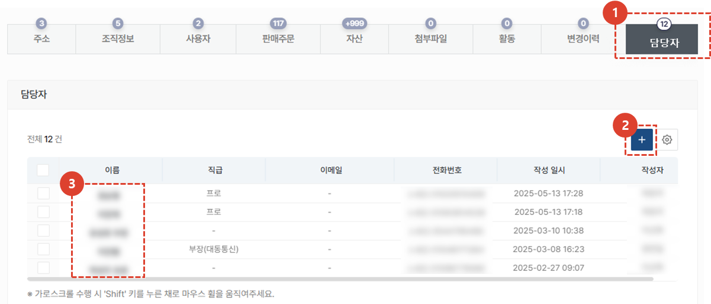
1. **담당자**탭을 클릭하여 고객사 담당자 정보를 조회하거나 추가할 수 있습니다. 
1. **추가**버튼을 눌러 고객사 담당자 정보를 추가합니다.
1. 이름을 클릭하면 담당자 상세정보의 조회 및 수정이 가능합니다.
</ValidateTextByToken>
