import ValidateTextByToken from "/src/utils/getQueryString.js";
import filterList from "./img/002.png";
import searchList from "./img/017.png";
import tableFilter from "./img/006.png";
import createLabor from "./img/013.png";
import filter1 from "./img/056.png";
import filter2 from "./img/057.png";
import filter3 from "./img/058.png";
import filter4 from "./img/059.png";
import table1 from "./img/060.png";
import table2 from "./img/061.png";
import popup1 from "./img/064.png";
import popup2 from "./img/066.png";
import popup3 from "./img/070.png";
import popup4 from "./img/074.png";

# 센터

서비스를 제공하는 대리점, 법인 등을 센터로 등록하여 관리하는 방법을 안내합니다.

<ValidateTextByToken dispTargetViewer={true} dispCaution={false} validTokenList={['head', 'branch']}>

## 목록 페이지
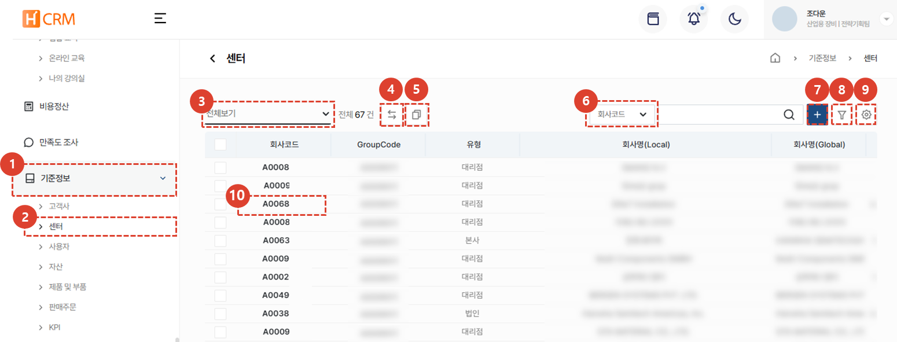
1. **기준정보** 메뉴를 클릭합니다. 
1. **센터** 메뉴 클릭 시 센터 목록이 나타납니다. 
1. [**목록 필터링**](#목록-필터링)을 이용하여 특정 조건의 센터만 표시할 수 있습니다.
1. (오픈 준비 중)선택된 센터에 의해 관리되고 있는 자산 등을 타 센터로 **이관**할 수 있는 기능입니다. 
1. 같은 센터가 여러개 생성되어 있는 경우 [**센터 연결**](#센터-연결)을 할 수 있습니다.
1. [**검색**](#검색)어를 입력해서 원하는 데이터를 검색할 수 있습니다. 
1. [**신규 센터를 생성**](#센터-등록)할 수 있습니다. 
1. [**복수개의 필터**](#상세검색)를 등록하여 데이터를 검색할 수 있습니다. 
1. [**엑셀 출력**](#엑셀출력), [**테이블 관리**](#테이블관리) 및 센터 정보를 **삭제** 할 수 있습니다. 
1. [**센터의 회사코드**](#상세-페이지)를 클릭하여 센터의 상세 정보를 조회 할 수 있습니다.
</ValidateTextByToken>
 
 

### 목록 필터링
:::tip
사용자/부서별 또는 최근 작성 건을 필터링하는 방법을 안내합니다. 
:::
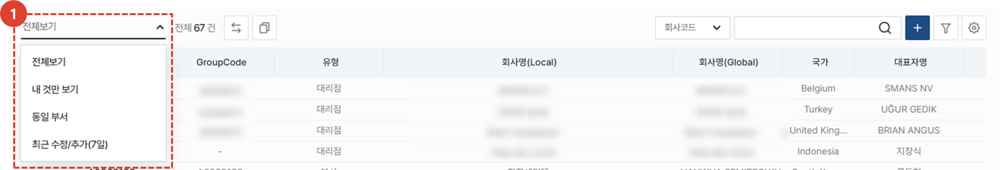
1. 원하는 필터링 방법을 선택합니다. 선택 즉시 해당하는 목록이 리스트에 표시됩니다. 
 
 

<ValidateTextByToken dispTargetViewer={false} dispCaution={true} validTokenList={['head']}>

### 검색
:::tip
테이블 검색 방법을 안내합니다.
:::

1. 검색 필터를 **선택**한 뒤 검색합니다. 
 
 

### 상세검색
:::tip
**복수**개의 검색 필터 적용 방법을 안내합니다. 
:::
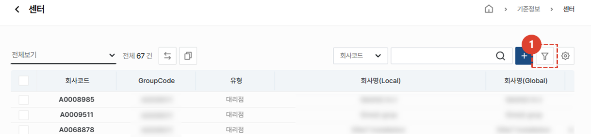
1. **필터 버튼**을 클릭합니다. 
 
 

1. 필터를 선택합니다. 
1. 검색어를 입력합니다. 
1. **+** 버튼을 클릭하여 검색 항목을 추가합니다. 
1. **검색** 버튼을 클릭하여 결과를 확인합니다. 
 
 

### 엑셀출력
:::tip
목록의 엑셀 출력 방법을 안내합니다.
:::

1. 엑셀 출력 버튼을 클릭합니다. 
 
 

1. **출력 옵션**을 선택합니다. 
1. **확인** 버튼을 누른 뒤 [**시스템관리 > 엑셀다운로드**](/docs/SEMI/tutorial-07-system-management/03-export-data.md) 메뉴에 접속하여 엑셀을 다운로드할 수 있습니다. 
 
 
 
### 테이블관리
:::tip
열의 표시 여부와  표시할 열과 순서 변경 방법을 안내합니다. 
:::

1. **테이블관리**를 클릭하여 테이블에 보여질 항목 및 순서를 변경할 수 있습니다. 
 
 

1. 테이블에 보일 항목의 토클 버튼을 클릭하여 파란색이 되도록 합니다. 
1. 리스트 아이콘을 드래그하여 열 위치를 변경 할 수 있습니다. 
1. **닫기**를 클릭하면 선택된 내용으로 테이블이 변경됩니다. 
 
 

## 센터 등록
:::warning
센터 등록을 위해서는 먼저 벤더로서 **고객사 등록이 선행**되어야 합니다. 
신규 센터 등록 시, 기존에 등록된 센터가 없는 지 확인하여 중복 등록되지 않도록 주의하시기 바랍니다.
:::

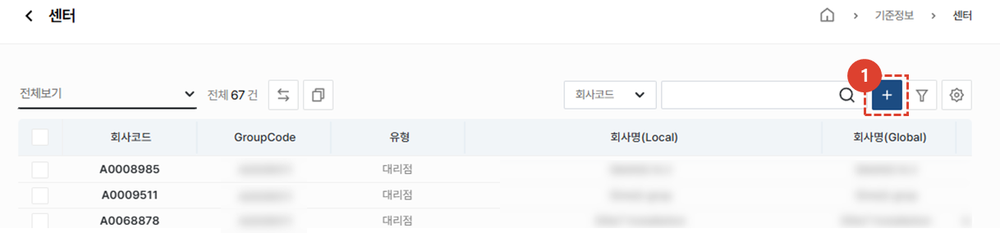
1. **+** 버튼을 클릭합니다. 
 
 

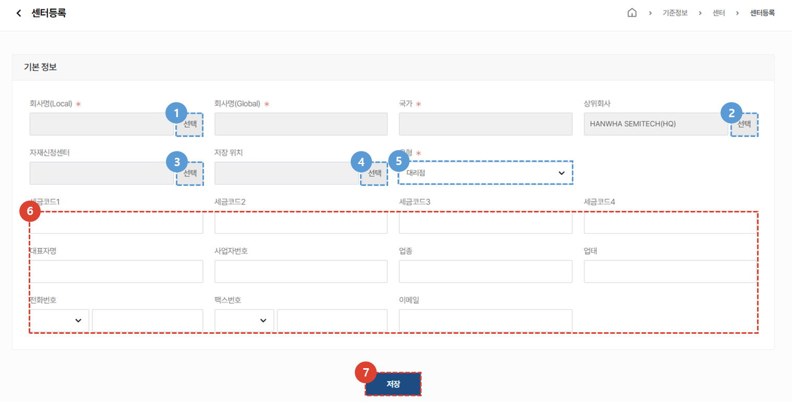
1. 등록할 **회사명**을 선택합니다. 
    :::info
    회사명 선택 시 고객사로 입력되어있는 정보가 자동 입력됩니다. 
    :::
1. 센터의 **상위회사**를 선택합니다. 
1. **자재신청센터**를 선택합니다. 
1. 자재의 **저장위치**를 선택합니다. 
1. 해당 센터의 **유형**을 선택합니다. 유형의 선택 항목안 아래와 같습니다. 
    :::tip 유형 리스트
    - 본사
    - 법인
    - 대리점 
    - 대리점 거점
    :::
1. 그 외 센터의 정보를 입력합니다.  회사선택 시 입력되어있는 정보가 자동 기입되며, 수정이 필요한 경우 직접 수정이 가능합니다. 
1. 입력 완료 후 **저장** 버튼을 클릭하여 센터 등록을 완료합니다. 
 
 

## 센터 연결
:::tip
**동일한 센터가 여러개 등록**되어 있는 경우 **한 개의 센터로 묶는 방법을 안내합니다.** 
 이는 여러개로 등록되어있어 주문 내역이나 자산이 산재되어 있는 문제를 방지 할 수 있습니다. 
 

- 비슷한 이름의 다른 코드로 채번된 센터가 있는 경우, **그룹화** 기능을 통해 그룹을 지정할 수 있습니다. 이 경우 각 코드를 기준으로 생성된 아래의 서비스 데이터들이 통합되어 표시됩니다. 
    - 판매 주문
    - 활동 이력
        - 서비스 이력
        - 부품 주문 이력
        - VOC 등
    - 문의 이력
    - CRM 사용자 및 고객담당자 계정
    - 센터 주소
    - 관리 자산
:::

### 목록 페이지에서
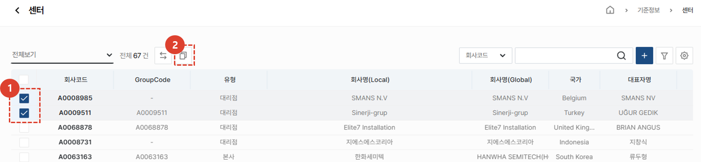
1. 묶음이 필요한 **복수개의 센터를 체크**합니다.
1. **복사 아이콘**을 클릭합니다. 
 
 

1. **확인** 버튼을 클릭하여 고객사 연결을 완료합니다.
 
 

### 상세 페이지에서
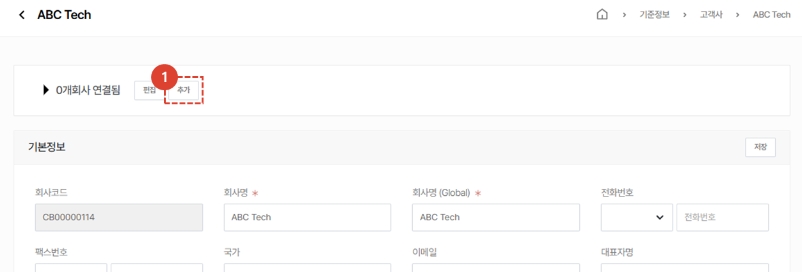
1. 연결할 고객사 선택을 위해 **추가**버튼을 클릭합니다. 
 
 

1. 연결할 고객사를 검색합니다.
1. 검색된 내역이 맞는지 확인한 후, **저장** 버튼을 클릭합니다. 
:::tip
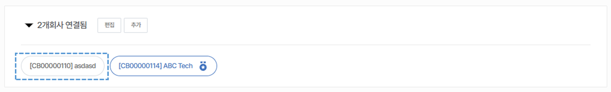
고객사 연결이 완료되면 위와 같이 표시됩니다. 
:::
 
 

### 대표회사 변경
:::info
연결 회사 중 대표로 표시할 회사희 변경 방법을 안내합니다. 
:::
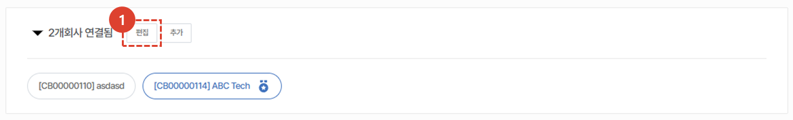
1. **편집** 버튼을 클릭합니다. 
 
 

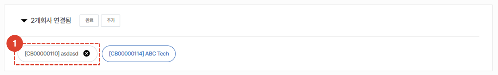
1. 대표 회사를 **선택**합니다.
 
 

1. **변경** 버튼을 클릭합니다. 
 
 

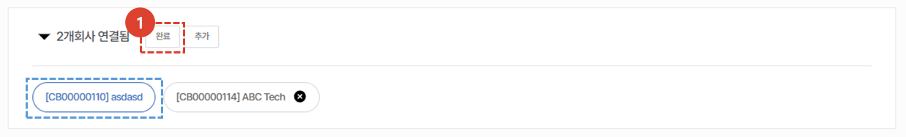
1. **완료** 버튼을 클릭합니다. 
:::info
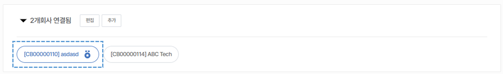
대표로 지정된 고객사는 위 이미지와 같이 표시됩니다.
:::

 
 

## 상세 페이지
### 기본 정보
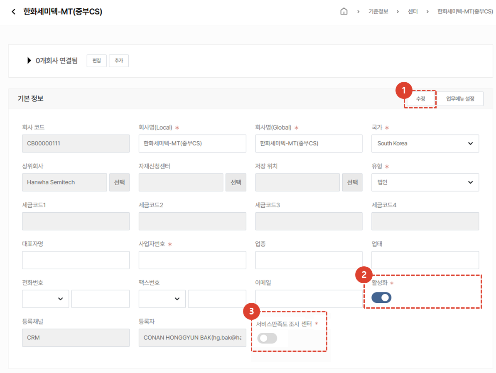
1. 수정 내용이 있는 경우, 입력 후 **수정** 버튼을 눌러 저장해야 합니다. 
    :::info
    - **상위 회사**를 센터 목록에서 **선택**하여 설정합니다.
        - 서비스 센터는 상하위 계층을 가진 트리 구조를 가지고 있습니다.
        - 하위 센터의 서비스 자산은 상위 센터에게 공유됩니다.
    - 서비스 부품 주문 시에 주문을 처리하게될 **서비스 부품 주문 전용의 상위 센터를 설정**합니다.
    - 선택된 센터의 **서비스 부품 창고 번호**를 지정 또는 추가합니다. 이 곳에 설정된 서비스 창고 번호에 따라, 재고 수량이 관리됩니다.
        - 목록에서 보관 위치를 선택하는 경우: 사내 시스템에서 가용 가능한 재고 수량이 자동으로 연동됩니다.
        - 직접 입력하는 경우: 재고 수량 관리를 직접 CRM 시스템에서 합니다.
    - **회사의 유형**을 선택합니다. **본사, 법인, 대리점, 거점, 고객사 중에서 선택**할 수 있습니다. 대리점의 경우 지사가 지역별로 있는 경우 아래와 같이 등록하여 사용할 수 있습니다. 
        - 둘리 대리점(HQ) **[대리점]**  
            └ 둘리대리점(중부) **[거점]**  
            └ 둘리대리점(남부) **[거점]**
    :::
1. **활성화**가 체크되어있는 경우에만 CRM에서 서비스, VOC 등을 등록 할 수 있습니다. 
1. **서비스만족도조사센터**가 체크되어있는 경우, 센터에서 설치시운전과 같은 서비스를 수행하면 고객사에게 서비스만족도 조사가 자동 발송 됩니다. 
 
 

### 추가 정보 - 주소
:::warning
    중국지역의 도메인으로 접속한 경우, 지도 UI가 표시되지 않습니다.
:::
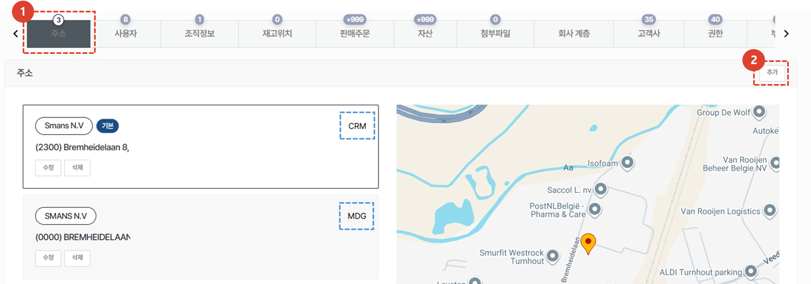
1. 추가정보의 **주소** 탭을 클릭하면 고객사에 등록된 주소 정보가 표시됩니다. 
    :::tip
    주소의 등록채널이 파란박스와 같이 표시됩니다. 
    :::
1. **추가** 버튼을 클릭하여 고객사 주소를 신규 추가 할 수 있습니다. 
    :::info 고객사 주소 신규 추가 방법
    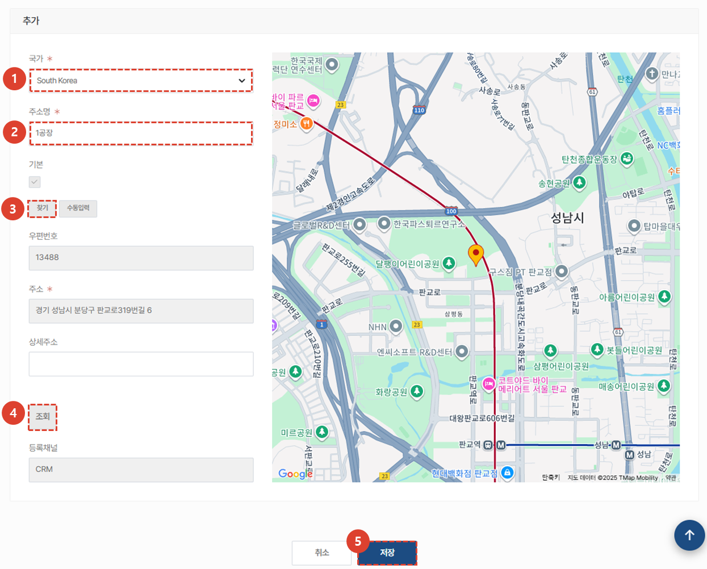
    1. 등록할 주소의 **국가**를 추가합니다. 
    1. **주소명**을 입력합니다. 
    1. **찾기** 버튼을 클릭하여 주소를 검색 할 수 있습니다. 
    1. 찾기 혹은 수동입력 후 **조회** 버튼을 클릭하면 지도를 확인 할 수 있습니다. 
    1. **저장** 버튼을 클릭하면 주소 등록이 완료됩니다. 
    :::
 
 

### 추가 정보 - 사용자 
:::info
    선택된 고객사의 소속으로 등록된 사용자의 CRM 계정정보를 표시합니다.
:::
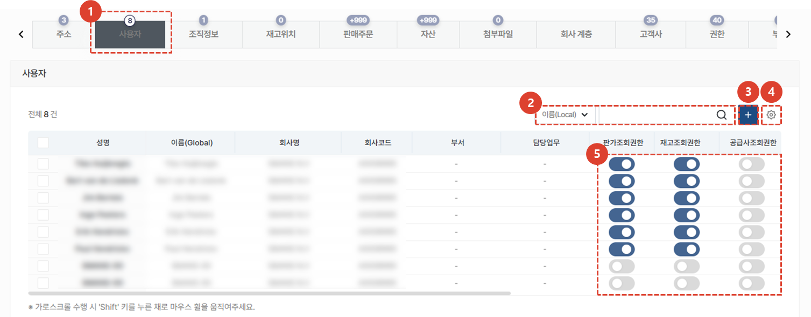
1. 추가정보의 **사용자** 탭을 클릭하면 CRM에 가입된 센터의 사용자 정보가 표시됩니다. 
1. 필터를 사용하여 사용자 검색을 할 수 있습니다. 
1. 해당 센터의 관리자는 **+** 버튼을 클릭하여 사용자 계정을 생성 할 수 있습니다. 
1. **톱니바퀴**버튼을 클릭하여 사용자의 **삭제** 또는 **테이블관리**를 할 수 있습니다. 
1. 각각의 사용자별로 **권한 부여**가 가능합니다. 권한을 제공하고 싶은 경우 토글 버튼을 클릭하여 **파란색**이 되도록 수정합니다. 
    :::tip 권한 종류
    - 판가 조회 권한
    - 재고 조회 권한
    - 공급사 조회 권한 
    - 판매 이력 조회 권한
    :::
 
 

### 추가 정보 - 조직 정보
:::info
   서비스 부품의 판매 가격과 구매가격의 테이블을 설정하는 메뉴입니다.
:::
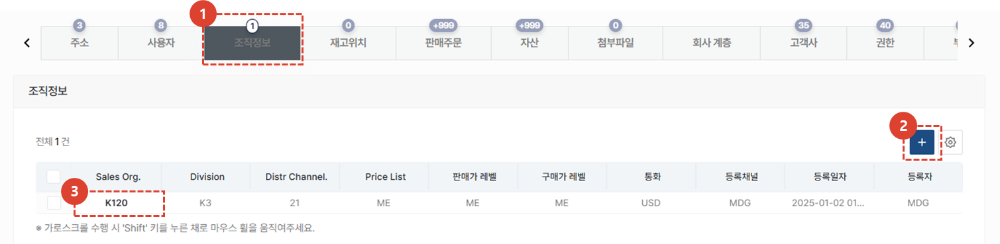
1. 추가정보의 **조직정보** 탭을 클릭합니다.
1. **+** 버튼을 눌러 조직정보를 추가할 수 있습니다.
1. 조직정보의 상세 페이지를 확인 / 편집이 가능합니다.
 
 

#### 조직정보 추가 및 수정
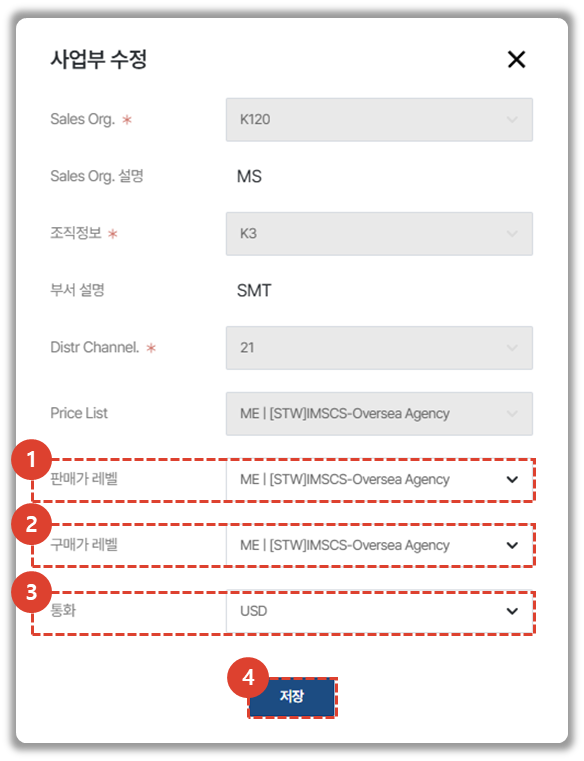
:::info
조직정보 신규 등록시에는 아래 모든 항목을 입력해야 합니다. 
- Sales Org.
    - K120: 한화정밀기계 본사를 포함한 USD로 거래하는 모든 조직
    - K603: 한화정밀기계 중국법인을 포함한 CNY로 거래하는 모든 조직
- 조직정보
    - K3: 산업용장비사업부
    - KB: 공작기계사업부
    - KD: 반도체장비사업부
- Distribution Channel
    - 11: 내수
    - 21: 수출
- Price List
    - 서비스 담당 부서의 별도 기준에 따라 선택
- 판매가 레벨: 선택된 센터가 서비스 부품을 판매할 때 사용하는 가격 레벨이며 Price List의 항목 중에서 선택합니다.
- 구매가 레벨: 선택된 센터가 서비스 부품을 자재승인센터로부터 구매할 때 사용하는 가격 레벨이며 Price List의 항목 중에서 선택합니다.
:::
1. **판매가 레벨** 수정이 가능합니다. 
1. **구매가 레벨** 수정이 가능합니다. 
1. **통화** 수정이 가능합니다.
 
 

### 추가 정보 - 재고위치
:::info
센터의 재고위치 리스트를 추가하고 관리할 수 있습니다. 
:::
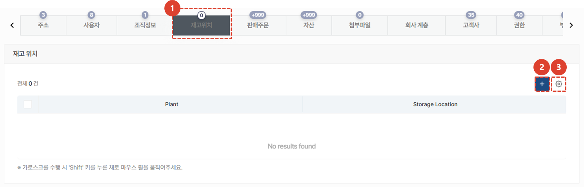
1. 추가정보의 **재고위치** 탭을 클릭합니다.
1. 재고위치의 신규 등록은 **+** 버튼을 클릭하여 진행합니다. 
1. **톱니바퀴** 버튼을 ㅋ르릭하여 재고 위치의 삭제를 할 수 있습니다. 
 
 

### 추가 정보 - 판매 주문
:::info
    선택된 고객사를 대상으로 발행된 판매주문 목록을 표시합니다.
:::

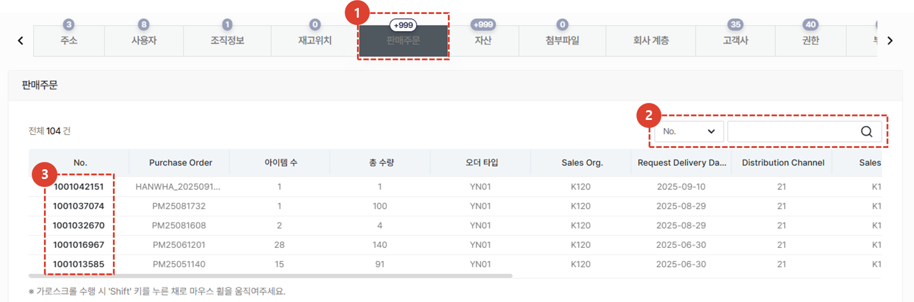
1. 추가정보의 **판매주문** 탭을 클릭합니다.
1. 판매주문 번호로 검색을 할 수 있습니다.
1. 판매주문 상세페이지로 이동이 가능합니다.
    :::warning
        판매주문 상세페이지로의 이동을 위해서는 별도 권한이 필요합니다.
    :::
</ValidateTextByToken>
 
 

<ValidateTextByToken dispTargetViewer={false} dispCaution={true} validTokenList={['head', 'branch', 'seller', 'agent']}>

### 추가 정보 - 자산
:::info
선택된 고객사를 대상으로 발행된 판매주문 목록을 표시합니다.
:::
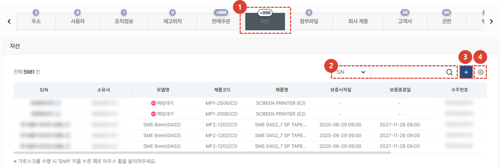
1. 추가정보의 **자산** 탭을 클릭합니다.
1. 자산의 S/N 등의 정보로 검색 할 수 있습니다.  S/N를 클릭하면 자산 상세 페이지를 확인 할 수 있습니다. 
1. 별도로 센터가 보유하고 있는 자산이거나 관리 중인 고객사 소유의 자산을 추가할 수 있습니다.
1. **톱니바퀴** 버튼을 클릭하여 테이블에 보여지는 항목이나 순서를 수정 할 수 있습니다. 
 
 

### 추가 정보 - 첨부파일
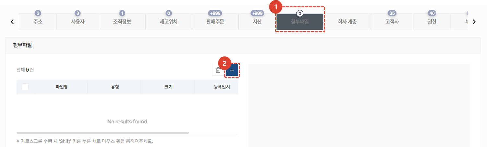
1. 추가정보의 **첨부파일** 탭을 클릭합니다. 관련된 파일을 첨부하고 조회할 수 있습니다.
1. **+** 버튼을 클릭하여 첨부파일을 추가 할 수 있습니다.
</ValidateTextByToken>
 
 
<ValidateTextByToken dispTargetViewer={false} dispCaution={true} validTokenList={['head']}>

### 추가 정보 - 회사 계층
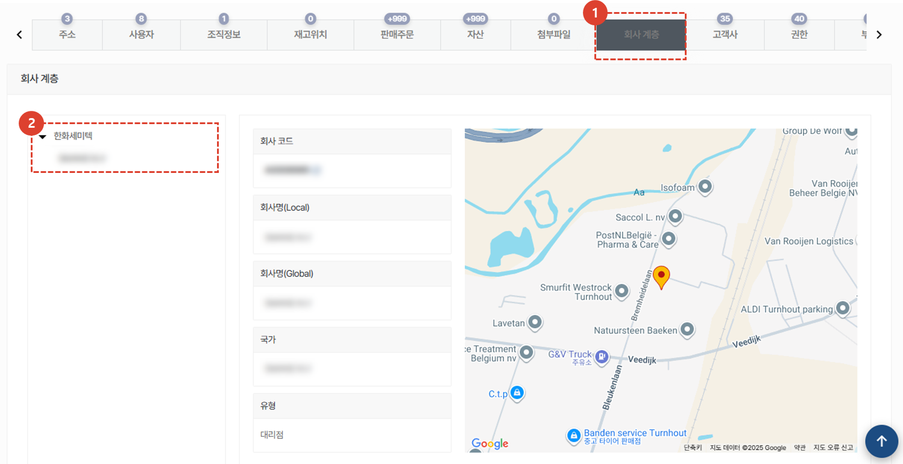
1. 추가정보의 **회사 계층** 탭을 클릭합니다. 
2. 해당 부분에서 계층 구조를 확인할 수 있습니다.
</ValidateTextByToken>
 
 
<ValidateTextByToken dispTargetViewer={false} dispCaution={true} validTokenList={['head', 'branch', 'seller', 'agent']}>

### 추가 정보 - 고객사
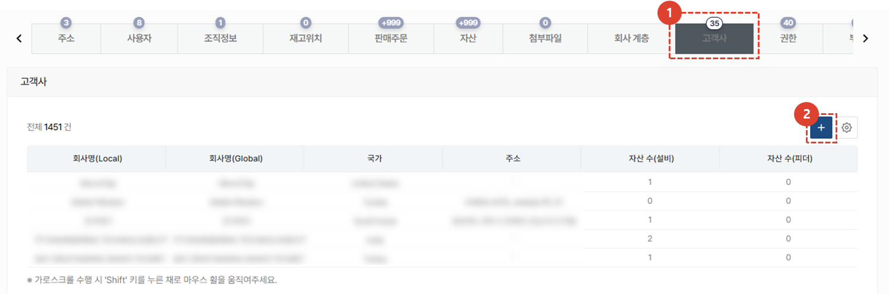
1. 추가정보의 **고객사** 탭을 클릭하면 다음의 고객사가 표시됩니다.
    - 선택된 센터가 관리중인 고객사
    - 선택된 센터의 하위 레벨의 센터가 관리중인 고객사 
1. **+** 버튼을 클릭하여 고객사를 추가 할 수 있습니다. 
 
 

### 추가 정보 - 권한
:::info
센터 내부에서 활용 가능한 권한 리스트가 표시됩니다. 
:::
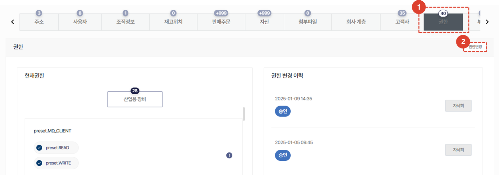
1. 추가정보의 **권한** 탭을 클릭합니다.
1. 권한 변경이 필요한 경우 **권한변경** 버튼을 클릭하여 수정합니다. 
    :::warning 
    **권한 변경**은 **권한 관리** 권한 보유자(시스템관리자)만 접근 가능합니다. 
    :::
 
 

### 추가 정보 - 부서
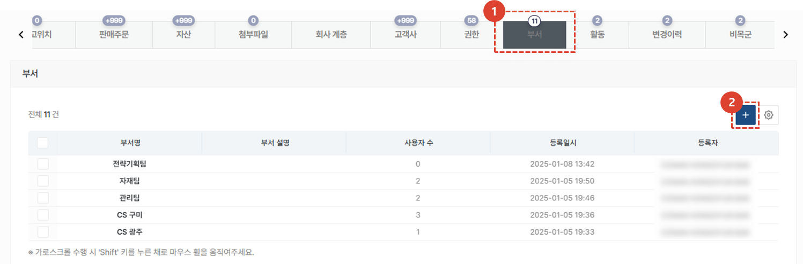
서비스 업무를 효율적으로 수행하기 위해서 '부서'를 관리할 수 있습니다. 
1. 추가정보의 **부서** 탭을 클릭합니다.
1. **+** 버튼을 클릭하여 부서 추가가 가능합니다. 
 
 

### 추가 정보 - 활동
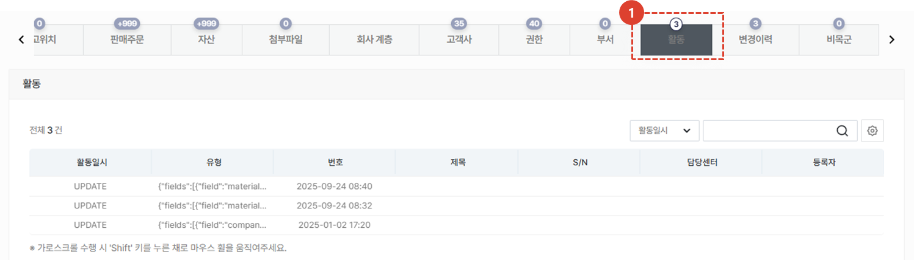
1. 추가정보의 **활동** 탭을 클릭하여 해당 센터에 대한 업데이트 정보를 확인 할 수 있습니다. 
 
 

### 추가 정보 - 변경이력
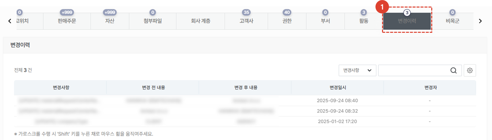
1. 추가정보의 **변경이력** 탭을 클릭합니다. 해당 센터에 대한 변경사항을 확인 할 수 있습니다. 
 
 

### 추가 정보 - 비목군
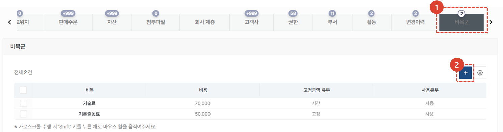
1. 추가정보의 **비목군** 탭을 클릭합니다. 기술료 또는 기본 출동료 등 비목군을 등록하여 사용 할 수 있습니다. 
1. 비목군 추가는 **+** 버튼을 클릭하여 등록합니다. 
</ValidateTextByToken>
