import ValidateTextByToken from "/src/utils/getQueryString.js";
import PopUp1 from "./img/010.png";
import PopUp2 from "./img/018.png";
import PopUp3 from "./img/036.png";
import PopUp4 from "./img/038.png";
import PopUp5 from "./img/045.png";
import PopUp6 from "./img/047.png";
import PopUp7 from "./img/048.png";
import PopUp8 from "./img/049.png";
import PopUp9 from "./img/050.png";
import PopUp10 from "./img/051.png";
import Tabs from '@theme/Tabs';
import TabItem from '@theme/TabItem';

# 이슈 등록
고객사에서 일어나는 이슈를 등록하고, 유관부서에 이슈의 심의 요청 방법을 안내합니다.
<ValidateTextByToken dispTargetViewer={true} dispCaution={false} validTokenList={['head', 'branch']}>

## 이슈 접수

1. **신규 등록** 버튼을 클릭합니다. 
 
 

### 기본 정보
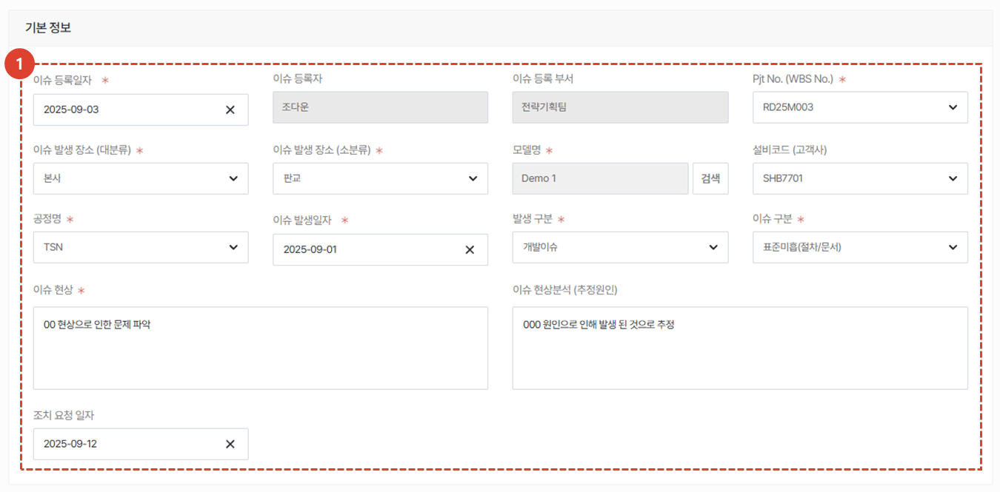
1. 이슈의 기본 정보를 등록합니다. 조치 요청 납기를 제외한 **모든 항목은 필수 입력사항**입니다.  각 항목의 리스트 및 입력방법은 다음과 같습니다. 
    <Tabs>
    <TabItem value="Pjt No." label="Pjt No." default>
        - RD25M003_DEMO 3호기 Ti/TiN 운영(2025)
        - RD25M002_DEMO 2호기 Ti/TiN 운영(2025)
        - RD25M001_JDEP 1호기 운영(2025)
        - RD24M016_차세대 DRA向 P-TiN용 JDP 설비 제작
        - RD24M015_(설비개발 D-1), D0a, Single, P-TiN CH 제작
        - RD24M011_JDP 2호기 운영(2025)
        - RD24M008_(설비개발 D-5) D1d, Single, Co
        - RD24M007_(설비개발_D-2) D0a, Single, Pre-Clean
        - RD24M005_(수주_JDP 2) D0a, Single, Ti/TiN
        - RD24M004_(설비개발_D_4) 차세대(베타), 4-Station, SiO/SiN
    </TabItem>
    <TabItem value="이슈 발생 장소(대분류)" label="이슈 발생 장소">
        - 삼성전자(기흥)
        - 삼성전자(평택)
        - 본사
    </TabItem>
    <TabItem value="이슈 발생 장소 (소분류)" label="이슈 발생 장소 (소분류)">
        - 창원 
        - NRD-K 
        - P3D 
        - 아산 
        - 판교
    </TabItem>
    <TabItem value="모델명" label="모델명">
    **모델 검색 방법**은 다음과 같습니다. 
        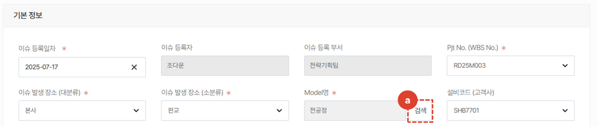
        1. **검색** 버튼을 클릭합니다. 
         
         
        

        1. **반도체사업부**를 선택합니다. 
        1. 반도체사업부의 **전공정**을 선택합니다.
        1. 해당되는 **모델**을 선택합니다. 
        1. **저장** 버튼을 클릭합니다.  
         
         
        

         **등록이 완료**되면 위 그림과 같이 모델명이 표시됩니다.  **수정**이 필요한 경우 **검색** 버튼을 클릭하여 모델명을 **재선택** 합니다.
    </TabItem>
    <TabItem value="설비코드 (고객사)" label="설비코드 (고객사)">
        - SHC7701
        - SHB7701 
        - SHBD701
    </TabItem>
    <TabItem value="공정명" label="공정명">
        - TSN
        - Etch
        - PE TiN
        - CC TiN 
        - DC TiN
        - MC TiN 
        - DC Ti 
        - MC Ti 
        - SiO/SiN 
        - Prd Clean 
        - Co Pre-clean 
        - Cobalt 
        - SiN 
        - SiO 
        - Ti/TiN 
        - P-TiN 
        - TiN 
        - Ti
    </TabItem>
    <TabItem value="발생 구분" label="발생 구분">
        - 필드이슈 
        - 셋업이슈 
        - 생산이슈 
        - 개발이슈 
    </TabItem>
    <TabItem value="이슈 구분" label="이슈 구분">
        - 풀림
        - 유량(헌팅/드롭) 
        - 연결 Miss 
        - Uniformity 
        - Leak 
        - 막힘 
        - 휴먼에러 
        - 아킹 
        - 단선/단락 
        - 파손 
        - 온도(헌팅/드롭/발열) 
        - 통신오류 
        - 눈관리 
        - 오염 
        - 막질 
        - Particle 
        - 표준부재(절차/문서) 
        - 표준미흡(절차/문서) 
        - Software 
        - Hardware 
    </TabItem>
    </Tabs>
 
 

### 관련부품
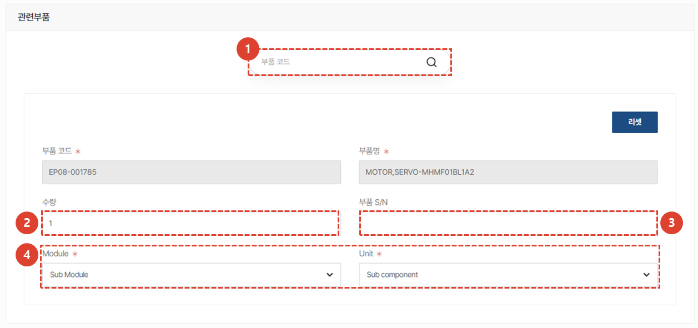
이슈와 관련하여 부적합 발생 부품 정보를 등록 할 수 있습니다. 
1. **부품 코드를 검색**하여 등록합니다. 조회가 불가한 부품은 직접 입력합니다.  
1. **부적합 발생 부품 정보**를 입력합니다. 
1. 부품의 **Serial Number**가 존재한다면 입력합니다. 
1. 해당되는 **Module** 및 **Unit**을 선택합니다. Module 및 Unit 리스트는 아래와 같습니다. 
<Tabs>
    <TabItem value="Module" label="Module" default>
        - Sub Module
        - PM6 
        - PM5 
        - PM4 
        - PM3 
        - PM2 
        - PM1 
        - Platform 
        - System
    </TabItem>
    <TabItem value="Unit" label="Unit">
        - Sub component
        - MPB
        - Gas Line Unit 
        - Vacuum Unit 
        - Elec. Unit 
        - Source Box Unit  
        - Gas Box Unit
        - Chamber Unit 
        - Lid Unit 
        - Moving Unit 
        - Frame Unit 
        - TM Chamber Unit 
        - L/L Chamber Unit 
        - EFEM Unit 
        - 공통
    </TabItem>
</Tabs>
 
 

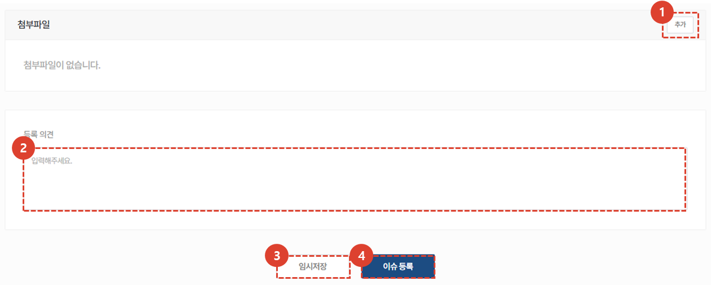
1. 관련 **첨부파일**을 등록하기위해 **추가** 버튼을 클릭합니다. 첨부파일 등록 방법은 다음과 같습니다. 
    :::tip 첨부파일 등록 방법
    

    첨부할 파일을 Drag하거나 **파일선택**을 클릭하여 추가합니다. 
     
     
    

    등록된 파일은 그림 오른쪽과 같이 표시되며, 동일한 방식으로 파일을 추가할 수 있습니다. 
     파일 추가가 완료된 후에는 창을 닫습니다.
    :::
1. 이슈 등록자는 해당 이슈에 대한 **의견**을 상세히 입력합니다. 
1. 이슈 등록 내용을 **임시저장** 할 수 있습니다. 
1. 이슈 등록을 위한 내용 입력이 완료되면 **이슈 등록** 버튼을 클릭합니다. 
 
 

1. **결재 승인자**를 등록합니다. 
    :::tip
    

    - 이슈 등록을 위해 결재자 외에 합의가 필요한 경우 **합의**를 클릭하여 해당 임직원을 등록합니다. 
    

    - 이슈 등록 내용을 공유하는 목적으로 수신처를 등록해야 하는 경우 **통보**를 클릭하여 해당 임직원을 등록합니다. 
    :::
1. **상신 의견**을 입력합니다. 
1. **확인** 버튼을 클릭하여 이슈 등록에 대한 결재 상신을 완료합니다. 
 
 

## 이슈 등록 중
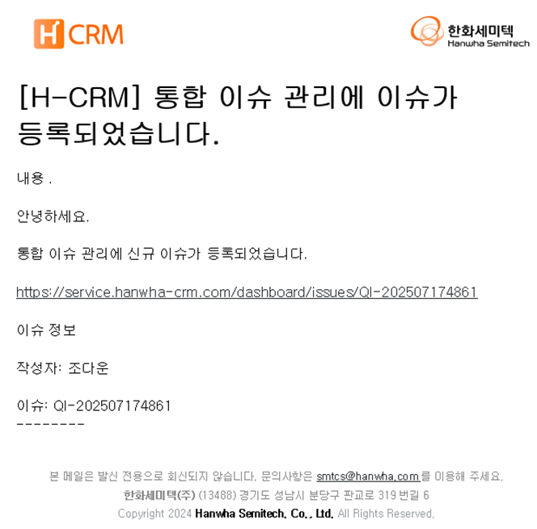
1. 결재가 진행중인 이슈는 관련자들에게 위와같은 **이메일이 발송**됩니다. 결재자는 Circle 알림 외에도 해당 이메일을 통해 등록하고자 하는 이슈의 내용을 확인 할 수 있습니다. 
 
 

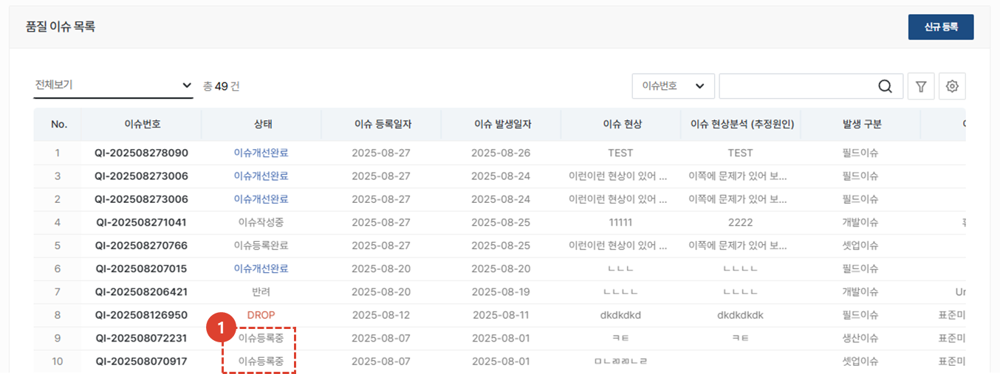
1. 결재가 진행중인 이슈는 **이슈등록중** 상태로 표시됩니다. 
 
 

## 이슈 등록 완료

1. 이슈 관리자는 상신된 결재 내역을 확인하고 결재형태를 선택합니다. 
:::info
- 승인 : 문서의 실행을 허락하여 이슈 등록이 완료되고 이슈 심의를 진행 할 수 있는 상태가 됩니다. 
- 반려 : 문서의 실행이 거부되며 기안자에게 반려 사유가 전달됩니다. 
- 보류 : 승인 또는 반려 결정을 내리기 어려운 상황에서 결재를 일시적으로 중단시킬 수 있습니다. 보류 상태인 경우 이슈는 등록 중 상태로 유지됩니다. 
- 전결 : 부득이하게 상위 결재자의 결재를 대신 해야 하는 경우 선택합니다. 
:::
1. 필요 시 의견을 작성한 뒤 **확인**을 클릭합니다. 
 
 

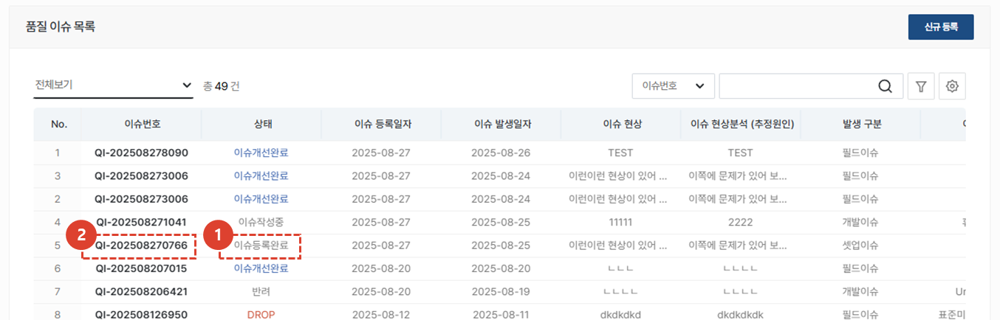
1. 이슈 등록이 완료되면 상태값이 **이슈등록완료**로 표시됩니다. 
1. 이슈 **No. 를 클릭**하여 이슈 상세 내용 확인 및 심의, 대책 수립 등 관리를 수행 할 수 있습니다.
 
 

### 이슈 수정 및 취소
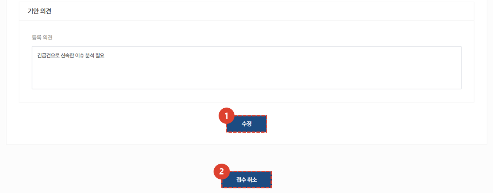
이슈 수정 및 취소가 필요한 경우, 상세 화면 하단의 버튼을 클릭하여 진행합니다. 
1. **수정** 버튼을 클릭하여 이슈 수정이 가능합니다. 
    :::info
        이슈 등록 결재가 진행 중인 경우에도 문서 수정이 가능합니다.
    :::
1. **접수 취소**를 할 경우, 접수가 취소되며 되살릴 수 없으니 유의하여 진행하시기 바랍니다. 
 
 

### 이슈 심의 요청
:::info
**주관부서**에서 검토 담당자를 지정하고 검토 의견을 요청하는 부분입니다.
:::

등록된 이슈에 대한 심의를 진행하고 조치 담당자를 지정하는 단계입니다. 
1. **이슈심의** 탭을 클릭합니다. 
1. **검토자 추가** 버튼을 클릭하여 이슈를 검토할 검토자를 등록합니다. 
    :::info
    검토자는 **여러명 등록이 가능**합니다.
    :::
 
 

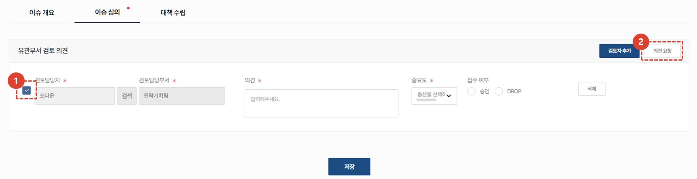
1. 검토 의견 요청을 위해 요청할 **검토 담당자를 체크** 합니다. 
1. **의견 요청** 버튼을 클릭합니다. 
    :::info
    

    1. 팝업창의 **확인** 버튼을 클릭해야지만 의견요청 이메일이 전송됩니다. 
     
     
    

    검토 담당자에게 의견 요청 메일이 발송되면 위와같은 토스트 알림을 확인 할 수 있습니다.
    :::
 
 

### 이슈 심의 의견 등록 - 유관부서
:::tip 담당부서
**유관부서**가 이슈에 대한 의견을 등록하는 부분입니다. 
:::
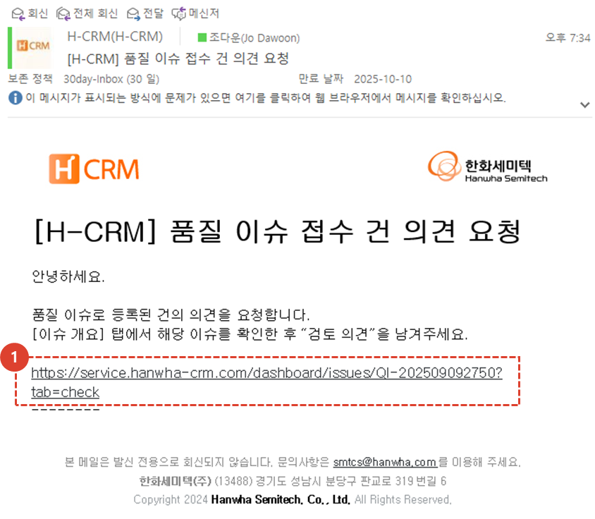
1. 유관부서 검토 담당자는 위와같은 **이메일**을 수신받습니다.  **링크를 클릭**하면 이슈 검토 페이지로 연결됩니다. 
 
 

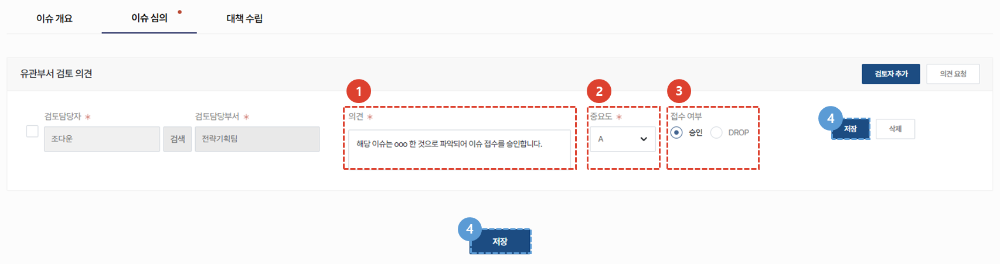
1. 검토 담당자가 **의견**을 작성하는 란 입니다.  
1. 검토 담당자는 이슈 현상의 **심각도(Severity)**, **발생도(Occurrence)**, **난이도(Difficulty)** 를 고려하여 A, B, C 등급으로 중요도를 분류합니다.
    - 심각도 : 장비 성능, 고객 생산, 안전 등에 미치는 영향의 정도 
    - 발생도 : 동일 또는 유사 이슈가 밣생한 빈도 및 반복성
    - 난이도 : 문제 해결에 필요한 기술적 복잡성, 시간, 자원 소요 정도
   :::warning 이슈 등급 분류표
        <Tabs>
        <TabItem value="A(상)" label="A(상)" default>
            - **심각도** : 고객 양산 중단, 장비 운영 불가, 안전사고 가능성 등 치명적 영향 (즉시 대응 필요)
            - **발생도** : 반복 발생 또는 다수 장비에서 동시 발생
            - **난이도** : 장시간 분석 및 고난도 기술 필요 
             
            - **이슈현상 예시** 
                - 주요 모듈 불량으로 장비 작동 불가
                - 고객사 양산 라인 중단 유발
                - 반복되는 전원 이상 또는 통신 오류
                - 전기/화재/가스누출 등 안전 관련 이슈 
        </TabItem>
        <TabItem value="B(중)" label="B(중)">
            - **심각도** : 장비 성능 저하, 일부 기능 오류, 고객 불편 유발 (단기 대응 필요)
            - **발생도** : 간헐적 발생 또는 특정 모델/조건에서만 발생
            - **난이도** : 단일 원인 추정 가능, 개선에 일정 시간 소요
             
            - **이슈현상 예시** 
                - 비정상 동작이나 설정 오류
                - 반복적인 알람 발생
                - 고객사 요청에 의한 기능 개선 필요
                - Setup 및 공정평가 지연 유발 요소
        </TabItem>
        <TabItem value="C(하)" label="C(하)">
            - **심각도** : 장비 운영에는 영향 없음, 단순 불편 또는 개선 제안 (경미/지속적 관리 필요)
            - **발생도** : 단발성
            - **난이도** : 원인 명확, 단시간 내 개선 가능
             
            - **이슈현상 예시** 
                - UI 불편사항
                - 문서 오류, 매뉴얼(SOP 등) 누락/미흡
                - 작업 프로세스 비효율/미흡
                - 단순 오류(작업자, 설계 등)
        </TabItem>
        </Tabs>
   :::
1. 검토담당자는 해당 이슈의 접수 여부를 **승인**하거나 **Drop**하여야 합니다. 
1. 의견, 중요도 및 접수 여부를 확정한 뒤 **저장** 버튼을 눌러 입력한 사항을 저장합니다.  
 
 

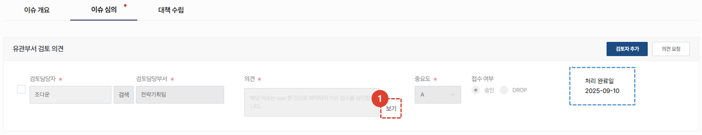
1. 등록된 이슈는수정이 불가하며 처리 완료일이 표시됩니다. **보기 버튼**을 클릭하여 의견의 상세 내용을 확인 할 수 있습니다. 
 
 

### 이슈 심의 의견 등록 - 주관부서
:::tip 담당 부서
**주관부서**가 이슈에 대한 최종 의견을 등록하는 부분입니다. 검토 담당자들의 의견을 종합하여 **최종 의견을 등록하고 이슈 심의를 완료** 합니다. 
:::

1. 이슈에 대한 종합적인 **중요도**를 선택합니다. 이슈 현상의 **심각도(Severity)**, **발생도(Occurrence)**, **난이도(Difficulty)** 를 고려하여 A, B, C 등급으로 중요도를 분류합니다.
    - 심각도 : 장비 성능, 고객 생산, 안전 등에 미치는 영향의 정도 
    - 발생도 : 동일 또는 유사 이슈가 밣생한 빈도 및 반복성
    - 난이도 : 문제 해결에 필요한 기술적 복잡성, 시간, 자원 소요 정도
    :::warning 이슈 등급 분류표
        <Tabs>
        <TabItem value="A(상)" label="A(상)" default>
            - **심각도** : 고객 양산 중단, 장비 운영 불가, 안전사고 가능성 등 치명적 영향 (즉시 대응 필요)
            - **발생도** : 반복 발생 또는 다수 장비에서 동시 발생
            - **난이도** : 장시간 분석 및 고난도 기술 필요 
             
            - **이슈현상 예시** 
                - 주요 모듈 불량으로 장비 작동 불가
                - 고객사 양산 라인 중단 유발
                - 반복되는 전원 이상 또는 통신 오류
                - 전기/화재/가스누출 등 안전 관련 이슈 
        </TabItem>
        <TabItem value="B(중)" label="B(중)">
            - **심각도** : 장비 성능 저하, 일부 기능 오류, 고객 불편 유발 (단기 대응 필요)
            - **발생도** : 간헐적 발생 또는 특정 모델/조건에서만 발생
            - **난이도** : 단일 원인 추정 가능, 개선에 일정 시간 소요
             
            - **이슈현상 예시** 
                - 비정상 동작이나 설정 오류
                - 반복적인 알람 발생
                - 고객사 요청에 의한 기능 개선 필요
                - Setup 및 공정평가 지연 유발 요소
        </TabItem>
        <TabItem value="C(하)" label="C(하)">
            - **심각도** : 장비 운영에는 영향 없음, 단순 불편 또는 개선 제안 (경미/지속적 관리 필요)
            - **발생도** : 단발성
            - **난이도** : 원인 명확, 단시간 내 개선 가능
             
            - **이슈현상 예시** 
                - UI 불편사항
                - 문서 오류, 매뉴얼(SOP 등) 누락/미흡
                - 작업 프로세스 비효율/미흡
                - 단순 오류(작업자, 설계 등)
        </TabItem>
        </Tabs>
    :::
1. 이슈가 종전 발생 이력이 있는지 **재발여부**를 선택합니다. 
1. 이슈 **승인** 혹은 **Drop** 여부를 선택합니다. 
1. 이슈에 대한 **종합 의견**을 입력합니다. 
1. **심의 완료** 버튼을 클릭하여 이슈 심의를 완료합니다. 
     등록 버튼을 클릭한 시점이 **처리 이력에 표시**됩니다. 
 
 

### 이슈 심의 승인
:::info 이슈 심의 승인
이슈 심의가 승인된 경우 위와같은 담당자에게 **이메일이 전송**됩니다. 
:::
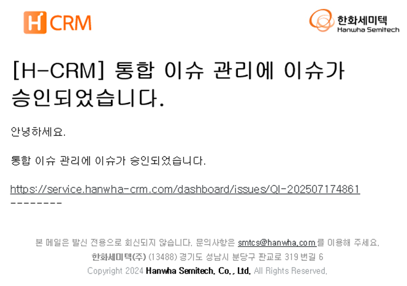
 
 

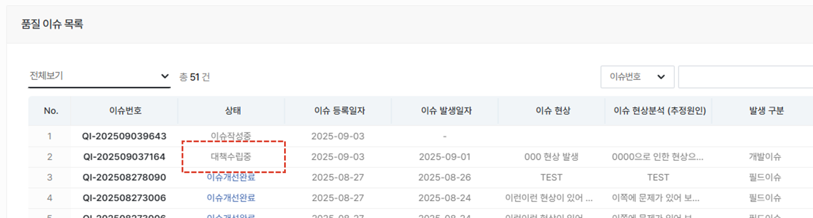
이슈 심의가 승인처리되면 목록의 상태 값이 **대책수립중**으로 변경됩니다. 이슈가 **Drop**된 경우, 상태값이 **Drop**으로 표시됩니다.  

</ValidateTextByToken>
