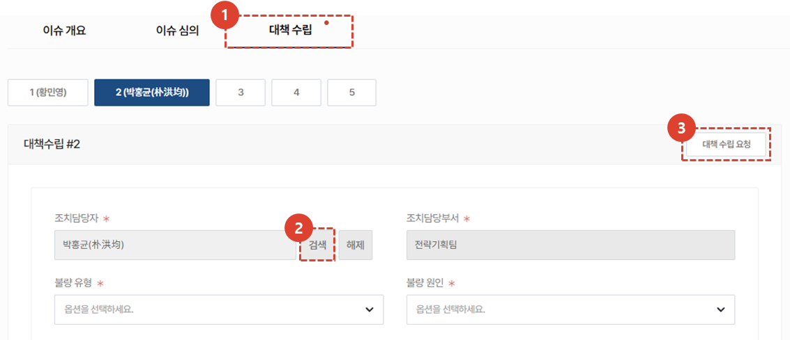
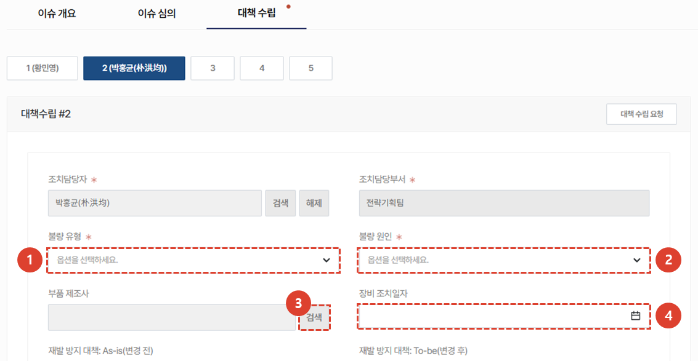
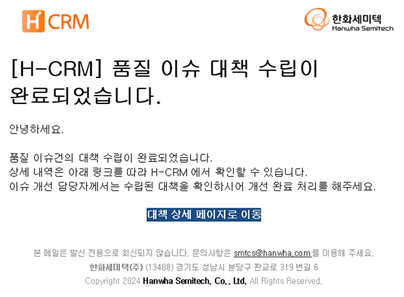
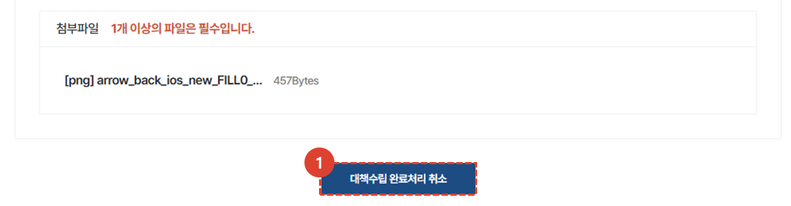
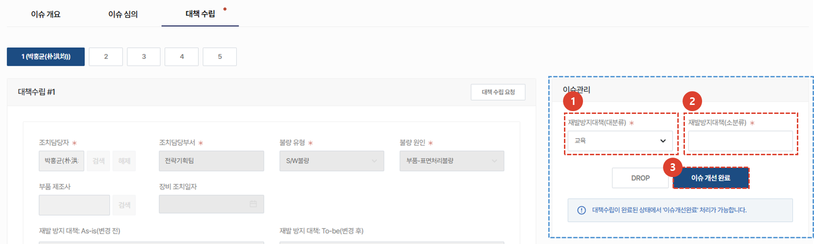
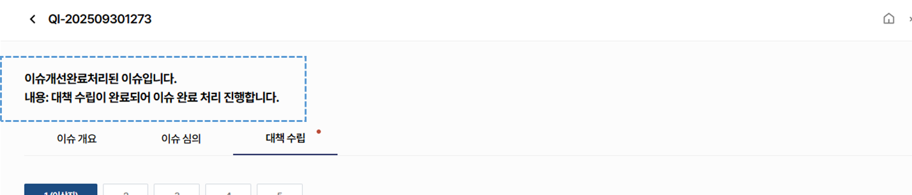
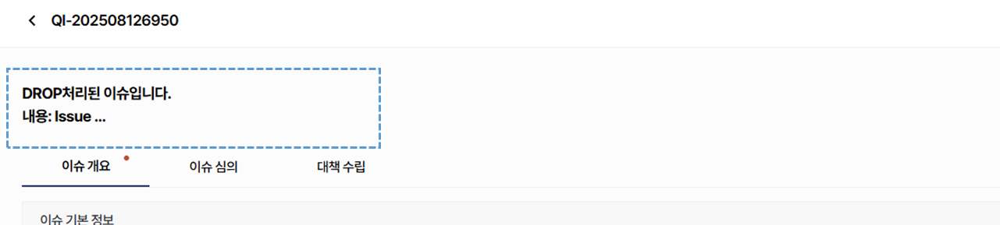

import ValidateTextByToken from "/src/utils/getQueryString.js";
import PopUp3 from "./img/024.png";
import PopUp4 from "./img/029.png";
import PopUp5 from "./img/042.png";
import PopUp6 from "./img/052.png";
import PopUp7 from "./img/054.png";
import Tabs from '@theme/Tabs';
import TabItem from '@theme/TabItem';

# 이슈 대책 수립
이슈의 대책 수립을 등록하고 이슈 완료 처리 방법을 안내합니다. 
<ValidateTextByToken dispTargetViewer={true} dispCaution={false} validTokenList={['head', 'branch']}>

## 이슈 대책 수립 중
:::info
**조치 담당자**가 조치와 관련된 내용을 등록하는 부분입니다. 
:::

### 대책수립 등록

1. **대책 수립** 탭을 클릭합니다. 
1. **검색** 버튼을 눌러 대책을 입력할 조치 담당자를 등록합니다. 
    :::info
    대책수립은 **최대 5명**에게 요청 가능합니다.
    :::
1. **대책수립요청** 버튼을 클릭하면 조치담당자에게 **대책수립요청 메일이 발송**됩니다. 
 
 

1. 대책수립을위한 조치 담당자는 위와같은 **이메일**을 수신받습니다.  **링크를 클릭**하면 대책 수립 페이지로 연결됩니다. 
 
 

### 대책수립 상세 내용 등록

1. 대책수립 과정에 파악된 **불량 유형** 및 **불량 원인**을 선택합니다.
    :::tip 불량 유형 및 원인 리스트
    <Tabs>
    <TabItem value="불량 유형" label="불량 유형" default>
    - 공정불량
    - S/W불량
    - H/W불량
    - 기능불량
    - 조립불량
    - 외관불량
    - 표준불량
    </TabItem>
    <TabItem value="불량 원인" label="불량 원인">
    - 부품-소재불량
    - 부품-표면처리불량
    - 부품-용접불량
    - 부품-가공불량
    - 장비-S/W기능오류
    - 장비-S/W기능부재
    - 장비&부품-표준미흡
    - 장비&부품-자재불량
    - 장비&부품-관리불량
    - 장비&부품-Test불량
    - 장비&부품-설계불량
    - 장비&부품-원인불명
    - 장비&부품-포장불량
    - 장비&부품-취급불량
    - 장비&부품-세정불량
    - 장비&부품-작업불량
    </TabItem>
    </Tabs>
    :::
1. **부품 제조사**를 검색하여 선택 할 수 있습니다. 
    :::info 부품 제조사 선택 방법
    

    1. 부품 제조사를 **검색**합니다.  부품 제조사가 검색되지 않는 경우 고객사 등록 후 사용바랍니다. 
    1. **저장** 버튼을 클릭하여 부품 제조사 선택을 완료합니다. 
    :::
1. **장비 조치일자**를 등록합니다. 이슈 해결을 위해 장비에 조치를 진행한 일자를 입력합니다. 
    :::warning
    대책 수립 완료일은 **하단** 대책수립완료일에 입력하시기 바랍니다.
    :::
 
 

1. **재발 방지 대책 As-is**를 입력합니다. 재발 방지 대책을 세우기 전 기존 상태에 대한 내용을 구체적으로 작성합니다. 
    :::tip
    수립된 재발방지 대책은 **재발 방지 대책 : To-be**란에 입력합니다.  
    :::
1. **재발 방지 대책 : To-be**를 입력합니다.
1. **대책 수립 완료일**을 등록합니다. 
    :::warning
    장비 조치일자는 **상단** 장비 조치일자에 입력하시기 바랍니다.
    :::
1. ECR No. 입력이 필요한 경우에만 해당 번호를 입력합니다. 
1. 조치담당자 **의견**을 상세히 입력합니다. 
 
 

1. 관련 첨부자료는 추가 버튼을 클릭하여 등록합니다. 
    :::warning
    첨부파일은 **필수값**입니다. 관련된 파일을 1개 이상 등록해야 합니다.
    :::
1. **대책 수립 완료** 버튼을 클릭합니다. 
    :::info
    

     다음과 같은 팝업창이 추가로 나타나며 **대책수립완료** 버튼 클릭 시 유관부서 및 주관부서 담당자에게 대책 수립 완료 메일이 전송됩니다. 
    :::
 
 

## 이슈 대책 수립 완료

### 완료 상태 확인

 조치 담당자가 대책수립을 완료하면 위와같은 **이메일이 전송**됩니다. 
 **대책 상세 페이지로 이동**을 클릭하여 CRM의 해당 페이지로 이동 할 수 있습니다. 
 
 

 품질 이슈 목록에서 **대책수립완료** 상태를 확인 할 수 있습니다.
 
 

### 완료처리 취소

1. 완료된 대책 수립의 **취소** 혹은 **수정**이 필요한 경우 버튼을 클릭하여 진행합니다. 
 
 

## 이슈 개선 완료
:::tip
**주관부서**는 최종적인 **이슈 개선 완료를 위하여** 재발방지대책을 검토하고 등록해야 합니다.  
:::
 
 

    :::info
    이슈 대책 수립이 완료된 건이 있으면, 대책수립탭에 오른쪽과같은 **이슈관리 항목이 활성화**됩니다.  
    이슈 개선 완료를 진행 할 경우 이슈 개요/이슈 심의/대책 수립 탭의 수정 및 취소가 불가하므로 모든 대책 수립이 완료된 후에 진행하시기 바랍니다.
    :::

1. **재발방지대책**(대분류)를 선택합니다. 재발방지대책(대분류) 리스트는 다음과 같습니다. 
    - 성능 개선
    - 교육
    - 대책 미수립
    - 설계개선
    - 절차개선
    - 표준문서 제/개정
1. 재발방지대책을 직접 입력하는 란 입니다. 대책의 상세 내용을 요약하여 입력합니다.
    :::note 예시
    Concept 개선, 도면개선, Shipment Check Sheet, Production Sheet, Packing List, P&ID Check Sheet, Leak Check 절차, 도면관리절차, 현장작업관리, 파트관리기준서, 장비 품평회, System 장비 반입 SOP, System Docking SOP, Design Check Sheet, 설계 Check Sheet,Hook up 사양서, Bolt Map, Inspection Sheet, 대책 미 수립, 교육 등 
    :::
1. **이슈 개선 완료** 버튼을 클릭합니다. 
 
 

1. 이슈 처리 완료에 대한 내용을 입력한 후, **이슈 처리 완료** 버튼을 클릭합니다. 
    :::warning
    완료 처리 후 되돌릴 수 없으므로 유의하여 진행하시기 바랍니다.
    :::
 
 

- 이슈 **상세페이지 상단에** 이슈 처리 완료에 대한 **내용이 표시**됩니다.  
 
 

 완료된 이슈는 품질이슈목록에서 **이슈개선완료** 상태로 변경됩니다. 
 
 

## 이슈 DROP
:::info
심의가 완료되어 대책수립 완료 후 재발방지대책을 검토하는 단계에서 이슈를 취소하는 방법입니다.  
**대책 수립 완료 후**, 해당 이슈에 잘못된 사항이 인지된 경우 Drop을 통해 취소가 가능합니다. **DROP된 이슈는 되살릴 수 없으니** 유의하여 사용하시기 바랍니다.
:::
 
 

1. 이슈관리 영역의 **DROP 버튼**을 클릭합니다. 
 
 

1. Drop **사유**를 상세히 입력합니다. 
1. **Drop** 버튼을 클릭합니다. 
    :::info
    
    - 이슈 **상세페이지 상단에** Drop **사유가 표시**되어 Drop처리 된 후에도 내용 확인이 가능합니다. 
    :::
</ValidateTextByToken>
